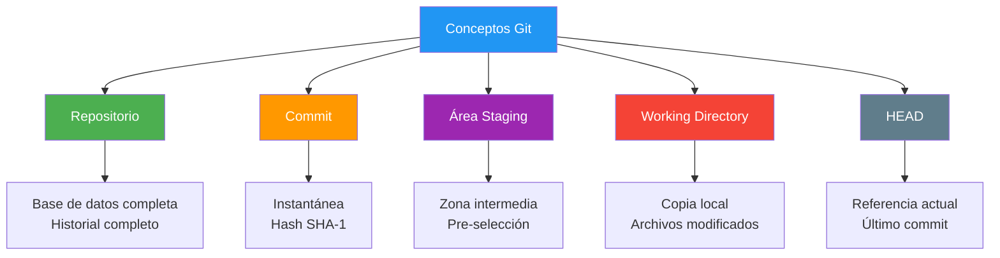
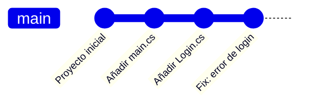
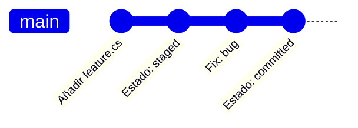
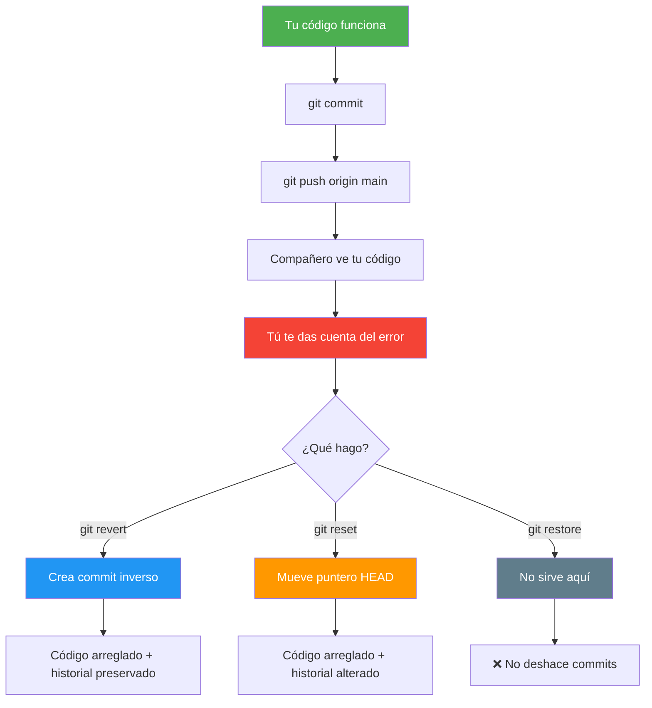
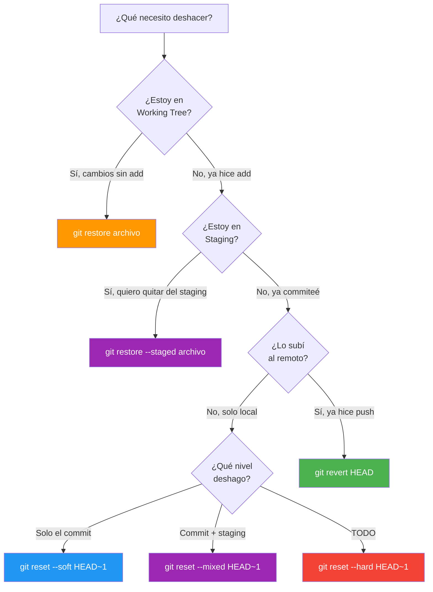
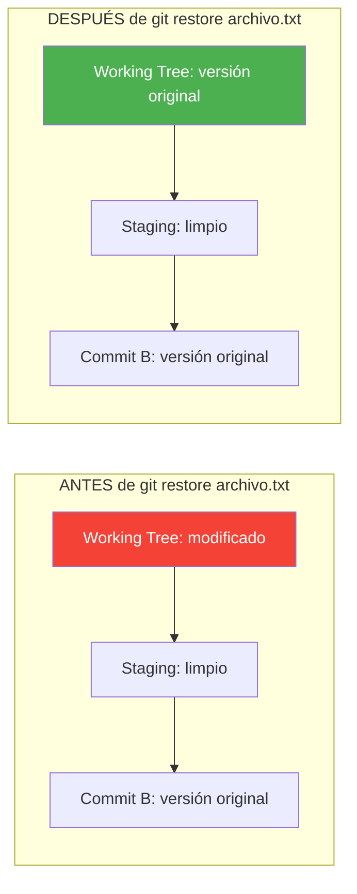
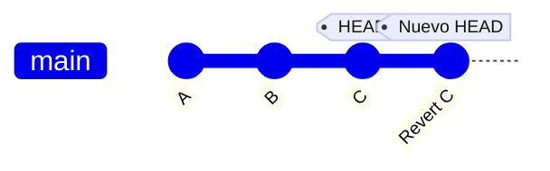
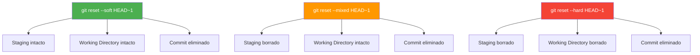
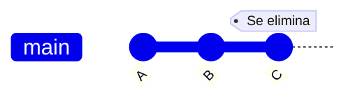
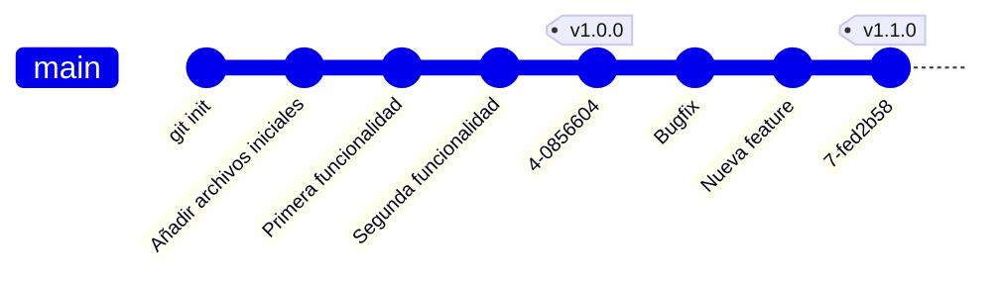

- [1. Git Inicial](#1-git-inicial)
  - [1.1. Introducción a Git](#11-introducción-a-git)
    - [1.1.1. Git vs Sistemas Centralizados](#111-git-vs-sistemas-centralizados)
  - [1.2. Conceptos Clave en Git](#12-conceptos-clave-en-git)
    - [1.2.1. Repositorio (Repository)](#121-repositorio-repository)
    - [1.2.2. Commit (Confirmación)](#122-commit-confirmación)
    - [1.2.3. Área de Preparación (Staging Area)](#123-área-de-preparación-staging-area)
    - [1.2.4. Directorio de Trabajo (Working Directory)](#124-directorio-de-trabajo-working-directory)
    - [1.2.5. HEAD](#125-head)
  - [1.3. Ciclo de Vida de los Archivos en Git](#13-ciclo-de-vida-de-los-archivos-en-git)
    - [1.3.1. Los tres estados de Git](#131-los-tres-estados-de-git)
  - [1.4. Comandos Git Esenciales](#14-comandos-git-esenciales)
    - [1.4.1. Configuración Inicial](#141-configuración-inicial)
    - [1.4.2. Creación y Clonación de Repositorios](#142-creación-y-clonación-de-repositorios)
    - [1.4.3. Gestión de Cambios](#143-gestión-de-cambios)
    - [1.4.4. Commit](#144-commit)
    - [1.4.5. Diff](#145-diff)
    - [1.4.6. Historial](#146-historial)
    - [1.4.7. Deshacer Cambios](#147-deshacer-cambios)
      - [1.4.7.1. git restore: Deshacer cambios locales](#1471-git-restore-deshacer-cambios-locales)
      - [1.4.7.2. git revert: Crear commit que deshace](#1472-git-revert-crear-commit-que-deshace)
      - [1.4.7.3. git reset: Mover el puntero HEAD](#1473-git-reset-mover-el-puntero-head)
      - [1.4.7.4. Trucos: Eliminar el Último Commit](#1474-trucos-eliminar-el-último-commit)
      - [1.4.7.5. git reflog: Tu salvavidas](#1475-git-reflog-tu-salvavidas)
      - [1.4.7.6. git commit --amend: Modificar el último commit](#1476-git-commit---amend-modificar-el-último-commit)
      - [1.4.7.7. Tabla Comparativa: ¿Cuándo usar cada comando?](#1477-tabla-comparativa-cuándo-usar-cada-comando)
      - [1.4.7.8. Casos Prácticos Detallados](#1478-casos-prácticos-detallados)
    - [1.4.8. Eliminar Archivos](#148-eliminar-archivos)
    - [1.4.9. Ignorar Archivos](#149-ignorar-archivos)
    - [1.4.10. Etiquetado (Tags)](#1410-etiquetado-tags)
  - [1.5. Guardar Cambios Temporales](#15-guardar-cambios-temporales)
  - [1.6. Resumen de Comandos Básicos](#16-resumen-de-comandos-básicos)


# 1. Git Inicial

> 💡 **Punto de partida:** ¿Alguna vez has borrado un archivo por accidente y has deseado poder volver atrás en el tiempo? Git es exactamente eso: una máquina del tiempo para tu código.

> 💡 **¿Por qué me importa?**
> El control de versiones es la habilidad más importante que dominarás como desarrollador. Sin él, perderás código, no podrás colaborar en equipo y cada error será un desastre. Con él, cada cambio es una oportunidad de mejora sin miedo.
> 
> 🔗 **Conexión con otros puntos:** El Punto 02 verás ramas y fusiones para trabajar en equipo. El Punto 03 verás GitHub y los repositorios remotos. El Punto 04 aprenderás Pull Requests y colaboración. El Punto 05 conocerás las herramientas gráficas.

En este punto aprenderás los conceptos fundamentales de Git: qué es un repositorio, cómo se guardan los cambios con commits, y los comandos esenciales para empezar a trabajar con control de versiones.

**Objetivos de aprendizaje:**

- Entender qué es el control de versiones y por qué Git es el estándar
- Conocer los conceptos clave: repositorio, commit, staging area, HEAD
- Dominar los comandos esenciales: init, add, commit, status, log, diff
- Aprender a deshacer cambios de forma segura
- Configurar .gitignore y usar etiquetas (tags)

El **control de versiones** es un sistema que registra los cambios realizados en un archivo o conjunto de archivos a lo largo del tiempo. Permite recuperar versiones específicas, rastrear la evolución del software y coordinar el trabajo en equipo.

> **💡 Analogía:** El control de versiones es como un "guardar partida" en un videojuego. Si cometes un error, puedes volver a una partida anterior. Pero en lugar de una partida, tienes miles.

> 📝 **Nota del Profesor:** El control de versiones es la habilidad más importante que deben dominar. Es su "carnet de conducir" profesional.

## 1.1. Introducción a Git

**Git** es un sistema de control de versiones distribuido, diseñado por Linus Torvalds en 2005 para gestionar el desarrollo del núcleo Linux.

> **💡 Dato histórico:** Linus Torvalds desarrolló Git porque el sistema anterior (BitKeeper) dejó de ser gratuito para el proyecto Linux. Necesitaba algo rápido, eficiente y distribuido.

### 1.1.1. Git vs Sistemas Centralizados

| Aspecto | Git (Distribuido) | SVN (Centralizado) |
|---------|------------------|-------------------|
| **Copias** | Cada desarrollador tiene TODO el historial | Solo tiene la última versión |
| **Trabajo sin conexión** | ✅ Completo | ❌ Limitado |
| **Velocidad** | Rápido (local) | Más lento (servidor) |
| **Integridad** | SHA-1 (40 caracteres) | Checksum simple |

> **💡 Ventaja distribuida:** Si el servidor central cae, todos los desarrolladores pueden seguir trabajando porque tienen una copia completa.

> 💡 **Metáfora: Máquina del tiempo vs Fotocopiadora**
> - **Git (distribuido)** es como una **máquina del tiempo**: cada desarrollador tiene una copia completa de todo el historial. Puedes "viajar" a cualquier punto del pasado, crear una rama paralela y volver sin problemas. Si se destruye una máquina, las demás siguen teniendo todo el historial.
> - **SVN (centralizado)** es como una **fotocopiadora central**: todos trabajan sobre la misma copia. Si la fotocopiadora se rompe, nadie puede acceder al historial. Solo tienes la última copia en tu escritorio.

> ⚠️ **Error común:** Pensar que "distribuido" significa que cada uno tiene una versión diferente. No: todos tienen la **misma información completa**, pero de forma independiente.

**Ventajas e inconvenientes de cada modelo:**

| Aspecto | Git (Distribuido) ✅ | SVN (Centralizado) ⚠️ |
|---------|------------------|-------------------|
| **Copias** | Cada desarrollador tiene TODO el historial | Solo tiene la última versión |
| **Trabajo sin conexión** | ✅ Completo — puedes hacer commits, ver logs, crear ramas sin internet | ❌ Limitado — necesitas conexión al servidor para casi todo |
| **Velocidad** | Rápido (operaciones locales) | Más lento (cada operación va al servidor) |
| **Integridad** | SHA-1 (40 caracteres) — detecta cualquier manipulación | Checksum simple — menos garantías |
| **Ramificación** | Muy rápida y ligera | Lenta y costosa |
| **Colaboración** | Merge y rebase muy potentes | Merges a veces problemáticos |
| **Riesgo de pérdida** | Mínimo — cada copia es un backup completo | Alto — si el servidor cae sin backup, pierdes todo |
| **Complejidad inicial** | Más conceptos que aprender (HEAD, staging, branches) | Más sencillo de entender al principio |
| **Recta de aprendizaje** | Pronunciada al principio, plana después | Suave al principio, problemática después |

> 📝 **Conclusión del profesor:** Git es más complejo al principio, pero una vez que lo dominas, te da una libertad total. SVN es más fácil de empezar, pero te limita mucho a largo plazo. Por eso la industria entera usa Git.

## 1.2. Conceptos Clave en Git





### 1.2.1. Repositorio (Repository)

Es el corazón del proyecto. Donde se almacenan todos los datos actualizados y el historial completo.

> **💡 Analogía:** El repositorio es como una caja fuerte donde guardas todas las versiones organizadas y comprimidas.

> 📝 **Dato técnico:** El directorio `.git` contiene toda la información. Si lo borras, pierdes el historial.

> 💡 **Metáfora del repositorio:** Un repositorio es como una **biblioteca infinita**. Cada commit es un libro que guarda la historia completa del proyecto hasta ese momento. El directorio `.git` es el catálogo de la biblioteca: contiene todos los índices, los resúmenes y las conexiones entre libros. Si pierdes el catálogo (`.git`), la biblioteca sigue ahí pero ya no sabes dónde está nada.

### 1.2.2. Commit (Confirmación)

Un `commit` es un punto de control. Es una "instantánea" del proyecto en un momento específico.

> **📝 Anatomía de un commit:**
> ```
> commit 7cff591a2b3c4d5e6f7a8b9c0d1e2f3a4b5c6d7e
> Author: José Luis González <joseluis@email.com>
> Date:   Thu Jan 8 10:00:00 2025 +0100
>     Añadida funcionalidad de login
> ```

> 💡 **El hash SHA-1** es como la huella dactilar del commit. Dos commits idénticos tendrían el mismo hash. Garantiza la integridad del historial.

> 💡 **Metáfora del commit:** Un commit es como una **fotografía con timbre y fecha**. Capturas exactamente cómo está el proyecto en ese momento: qué archivos, qué cambios, quién lo hizo y cuándo. La huella SHA-1 es como el número de serie de la foto: si alguien intenta manipularla, el número deja de coincidir y se detecta el fraude.

### 1.2.3. Área de Preparación (Staging Area)

Zona intermedia donde se seleccionan los cambios que se incluirán en el próximo `commit`.

> **💡 Analogía del fotógrafo:** Es como preparar la escena antes de tomar una foto. Decides qué incluir, cómo encuadrar... y cuando todo está listo, "disparas" (haces el commit).

> 📝 **Error común:** Muchos principiantes hacen `git add .` y luego se arrepienten. Pueden usar `git reset` para quitar archivos del staging sin perder cambios.

> 💡 **Metáfora del staging area:** El área de staging es como un **escaparate de una tienda**. Tienes muchos productos (archivos modificados) en el almacén (working directory), pero solo pones algunos en el escaparate (staging) para la próxima apertura (commit). Puedes añadir, quitar y reorganizar lo que quieres mostrar antes de que se haga la foto del escaparate.

### 1.2.4. Directorio de Trabajo (Working Directory)

Es la copia de los archivos del proyecto en tu máquina local. Aquí realizas las modificaciones directamente.

> **📝 Estados de un archivo:**
> - **No rastreado (Untracked):** Nuevo archivo, Git no lo conoce
> - **Modificado (Modified):** Cambiaste el archivo, no está preparado
> - **Preparado (Staged):** Listo para el próximo commit
> - **Commiteado (Committed):** Guardado en el repositorio

> 💡 **Metáfora del directorio de trabajo:** El working directory es tu **mesa de trabajo**. Es donde tienes los papeles, los borradores y las cosas a medias. Puedes mover, borrar y cambiar lo que quieras, pero nada está "guardado oficialmente" hasta que lo metes en el cajón seguro (commit).

### 1.2.5. HEAD

Es un puntero a la referencia de rama actual, que a su vez es un puntero al último `commit`.

> **💡 HEAD en acción:**
> ```
> HEAD → main → commit más reciente
> ```

> 📝 **Concepto:** HEAD es tu "dedo señalando" el commit actual. Cuando avanzas, tu dedo se mueve al siguiente commit.

> 💡 **Metáfora de HEAD:** HEAD es como un **marcador de página** en un libro enorme. El libro es tu historial de commits. HEAD señala en qué página estás ahora. Si creas una nueva rama, es como si sacaras una copia de la página actual y empezaras a escribir una historia alternativa. HEAD se mueve con tu marcador a la nueva historia.

## 1.3. Ciclo de Vida de los Archivos en Git


1. **Modificar archivos**: Realizas cambios en tu **directorio de trabajo**
2. **Preparar archivos**: Añades los cambios al **área de preparación**
3. **Confirmar cambios**: Realizas un `commit`, guardando la instantánea permanentemente

### 1.3.1. Los tres estados de Git

| Estado | Descripción |
|--------|-------------|
| **Confirmado (Committed)** | Los datos están almacenados en tu base de datos local |
| **Modificado (Modified)** | Has modificado un archivo, pero aún no lo has preparado |
| **Preparado (Staged)** | Has marcado un archivo modificado para el próximo commit |

> 💡 **Metáfora de los tres estados:**
> - **Modified (Modificado)** → Escribes un borrador en tu cuaderno. Nadie más lo ve. Es tu trabajo privado.
> - **Staged (Preparado)** → Pasas el borrador a una libreta limpia y la dejas sobre la mesa del profesor. Estás listo para entregar.
> - **Committed (Confirmado)** → El profesor recoge la libreta, la archiva y le pone un sello con fecha. Ya no puedes cambiarla sin hacer un "documento suplementario" (nuevo commit o revert).



## 1.4. Comandos Git Esenciales

### 1.4.1. Configuración Inicial

```bash
# Configurar nombre y email (obligatorio)
git config --global user.name "Tu Nombre"
git config --global user.email "tu.email@ejemplo.com"

# Configurar editor por defecto
git config --global core.editor "code --wait"  # VS Code
git config --global core.editor "vim"          # Vim

# Activar coloreado de la salida
git config --global color.ui auto

# Ver la configuración actual
git config --list
git config user.name    # Ver solo el nombre
```

> 📝 **Configuración por proyecto:** Sin `--global`, la configuración solo aplica al proyecto actual.

> 💡 **Metáfora de la configuración:** `git config` es como rellenar tu **ficha de socio** en la biblioteca. Sin tu nombre y email, no pueden saber quién ha cogido qué libro (quién hizo cada commit). Es el primer paso obligatorio.

> ⚠️ **Errores comunes de configuración:**
> - Olvidar poner el email correcto → tus commits aparecerán con un email fantasma
> - Usar `--global` sin querer → afecta a todos tus proyectos
> - No configurar el editor → Git abrirá vim por defecto (y si no lo conoces, no sabrás salir)

**Pros:**
- Configuración una sola vez y olvidarte
- Puedes tener configuración por proyecto (sin `--global`)

**Contras:**
- Si no configuras el email, GitHub no vincula tus commits a tu perfil

### 1.4.2. Creación y Clonación de Repositorios

```bash
# Inicializar un nuevo repositorio
mkdir mi-proyecto
cd mi-proyecto
git init
# Salida: Initialized empty Git repository in /ruta/a/mi-proyecto/.git/

# Ver el directorio .git (oculto)
ls -la .git
```

> 💡 **El directorio .git** es el "corazón" de Git. Contiene commits, ramas, configuración. Si lo borras, pierdes el historial.

> 💡 **Metáfora de `git init`:** `git init` es como **instalar una caja fuerte** en una habitación. Antes de init, tu carpeta es una habitación normal. Después, tiene un cajón secreto (`.git`) donde todo lo que pase quedará registrado. Sin la caja fuerte, no hay control de versiones.

**Pros de `git init`:**
- Creas un repositorio local en segundos
- Puedes trabajar sin conexión desde el primer momento
- Es reversible: si borras la carpeta `.git`, vuelves a ser una carpeta normal

**Contras:**
- Si ejecutas `git init` en una carpeta que ya tiene un repositorio, puedes liarte
- Olvidar que `.git` está ahí puede hacer que subas cosas que no debes

> ⚠️ **Error común:** Ejecutar `git init` dentro de un repositorio ya existente. Git te avisará: `Reinitialized existing Git repository`. No es peligroso, pero confunde.

```bash
# Clonar desde HTTPS
git clone https://github.com/usuario/repositorio.git

# Clonar y renombrar la carpeta
git clone https://github.com/usuario/repositorio.git mi-proyecto-local

# Clonar desde SSH
git clone git@github.com:usuario/repositorio.git

# Clonar solo el último commit (más rápido)
git clone --depth 1 repositorio
```

> 📝 **Después de clonar:** Ya estás dentro del repositorio. No necesitas hacer `git init`.

> 💡 **Metáfora de `git clone`:** `git clone` es como **fotocopiar toda la biblioteca** y llevártela a casa. No solo copias los libros actuales (archivos), sino también todo el catálogo de cuándo se añadió cada libro (historial). Tienes una copia idéntica y completa.

**Pros de `git clone`:**
- Tienes todo el historial de la proyecto
- Puedes trabajar sin conexión
- Puedes crear ramas, hacer commits y fusionar sin afectar a nadie

**Contras:**
- Si el repositorio es muy grande, la clonación tarda
- Ocupa más espacio en disco que una descarga simple
- Clonar por HTTPS pide usuario y contraseña (mejor usar SSH o tokens)

### 1.4.3. Gestión de Cambios

```bash
# Ver estado del repositorio
git status

# Ver estado resumido
git status -s
# Salida: M archivo.txt  (Modified)
#        ?? nuevo_archivo.java  (Untracked)

# Añadir un archivo específico al staging
git add archivo.txt

# Añadir todos los cambios
git add .

# Añadir todos los archivos modificados (no nuevos)
git add -u

# Añadir con patrón
git add *.java      # Todos los .java
git add docs/*.md   # Todos los .md en docs/

# Quitar del staging (mantener cambios)
git reset archivo.txt
git reset .         # Quitar todo
```

> 💡 **Metáfora de `git status`:** `git status` es como **mirar por el cristal del escaparate**. Te dice qué hay dentro (staged), qué está en el almacén esperando (modified) y qué es nuevo y nadie ha visto (untracked). Es el comando que más vas a ejecutar.

> 💡 **Metáfora de `git add`:** `git add` es como **pasar productos del almacén al escaparate**. Coges los archivos que quieres incluir en el próximo commit y los pones en la zona de preparación. `git add .` es como vaciar todo el almacén al escaparate de golpe (cuidado con lo que incluyes).

**Pros de `git status`:**
- Te da una visión completa de todo lo que pasa
- `git status -s` es rápido y conciso

**Contras:**
- En repositorios muy grandes, puede ser un poco lento

**Pros de `git add`:**
- Control fino: puedes añadir solo lo que quieres
- Puedes usar patrones (`*.cs`) para añadir grupos de archivos

**Contras de `git add`:**
- `git add .` puede añadir archivos que no querías (basura, temporales)
- Si añades un archivo de configuración con secretos, quedan expuestos en el commit

> ⚠️ **Error común:** `git add .` sin revisar antes. Puede meter archivos `.env`, `bin/`, `obj/`, credenciales... Siempre revisa con `git status` antes de commitear.

### 1.4.4. Commit

```bash
# Commit con mensaje
git commit -m "Añadida funcionalidad de login"

# Commit con mensaje largo (se abre editor)
git commit

# Commit y editar mensaje en una línea
git commit -m "Titulo corto

Descripción más detallada..."

# Añadir al último commit (si olvidaste algo)
git add archivo-olvidado.txt
git commit --amend
```

> **💡 Regla del mensaje de commit:**
> - Línea 1: Resumen en menos de 50 caracteres
> - Línea 2: Vacía
> - Líneas 3+: Explicación detallada

> 💡 **Metáfora de `git commit`:** `git commit` es como **sellar un sobre con una foto dentro**. Una vez sellado (commit), el contenido queda registrado permanentemente con una fecha, un autor y una descripción. No puedes abrir el sobre y cambiar la foto sin crear un nuevo sobre (nuevo commit).

> ⚠️ **Errores comunes con commits:**
> - Mensajes vagos: `git commit -m "fix"` → Nadie entenderá qué arreglaste
> - Commits demasiado grandes: meters 50 archivos a la vez → imposible hacer revert limpio
> - Olvidar `git add` antes del commit → el commit queda vacío
> - Commitear archivos sensibles (contraseñas, `.env`) → quedan en el historial para siempre

**Pros de `git commit`:**
- Cada commit es una instantánea recuperable
- Puedes volver a cualquier punto con `git checkout`
- El historial completo te ayuda a entender la evolución del proyecto

**Contras:**
- Si el mensaje no es claro, el historial no sirve de nada
- `--amend` cambia el historial, no usar si ya está compartido

### 1.4.5. Diff

```bash
# Ver cambios NO preparados
git diff

# Ver cambios PREPARADOS
git diff --staged
git diff --cached    # Sinónimo

# Ver cambios entre dos commits
git diff commit1 commit2

# Ver cambios en un archivo específico
git diff archivo.txt

# Ver diff resumido
git diff --stat
```

> 💡 **Metáfora de `git diff`:** `git diff` es como **poner dos fotos una al lado de la otra** y señalar con un lápiz rojo lo que ha cambiado. Te muestra línea por línea qué se ha añadido, borrado o modificado. Es tu "detective privado" antes de hacer commit.

> ⚠️ **Error común:** Olvidar que `git diff` solo muestra cambios NO preparados. Para ver los cambios preparados, usa `git diff --staged`.

**Pros de `git diff`:**
- Te permite revisar exactamente qué cambia antes de commitear
- `git diff --stat` es un resumen rápido (cuántos archivos, cuántas líneas)
- Puedes comparar cualquier par de commits

**Contras:**
- En repositorios grandes, la salida puede ser enorme
- No muestra archivos binarios (imágenes, PDFs) solo texto

### 1.4.6. Historial

```bash
# Ver historial completo
git log

# Cada commit en una línea
git log --oneline

# Ver últimos N commits
git log -5
git log --oneline -10

# Ver commits de un archivo específico
git log --oneline archivo.txt

# Ver cambios en cada commit
git log -p archivo.txt
```

> 💡 **Metáfora de `git log`:** `git log` es como la **bitácora de un capitán de barco**. Cada commit es una entrada en el diario: cuándo se hizo, quién lo hizo, y qué pasó. Puedes recorrer el diario desde el primer día hasta ahora.

> ⚠️ **Errores comunes con `git log`:**
> - `git log` sin opciones en un proyecto grande → te sale un wall of text infinito
> - No saber que puedes filtrar con `--oneline`, `-5`, o por archivo

**Pros de `git log`:**
- Historial completo y detallado
- Puedes filtrar por archivo, autor, fecha, rango de commits
- `git log --oneline` es perfecto para un resumen rápido

**Contras:**
- Sin opciones, la salida es muy verbosa
- No es fácil de leer si no usas `--oneline` o `--graph`

### 1.4.7. Deshacer Cambios

Deshacer cambios en Git puede hacerse de varias formas, dependiendo de lo que quieras lograr.

#### Las tres zonas de Git

Antes de entender los comandos, necesitas visualizar las **tres zonas** donde vive tu código:


| Zona | Qué es | Equivalente |
|------|--------|-------------|
| **Working Tree** | Archivos en tu disco duro, editándolos | Tu cuaderno de borradores |
| **Staging Area** | Archivos preparados para el siguiente commit | La mesa donde pones lo que vas a fotocopiar |
| **Historial** | Commits confirmados (base de datos local) | El archivador con copias certificadas |
| **Remoto** | Repositorio en GitHub/GitLab | La nube donde comparten los archivos |

> 💡 **Punto de partida:** ¿Por qué tres zonas y no solo "antes y después del commit"? Porque a veces quieres deshacer UNA COSA: borrar cambios del disco, quitar archivos del staging, o borrar commits. Cada zona necesita su propio comando.

> 🔗 **Conexión:** Antes viste `git add` y `git commit`. Ahora veremos qué pasa cuando algo sale mal y necesitas marcha atrás.

**¿Qué comando afecta a cada zona?**

```mermaid
graph TD
    A[Comando] --> B[git restore]
    A --> C[git restore --staged]
    A --> D[git reset --soft]
    A --> E[git reset --mixed]
    A --> F[git reset --hard]
    A --> G[git revert]

    B --> H[Afecta: Working Tree]
    C --> I[Afecta: Staging]
    D --> J[Afecta: Historial]
    E --> K[Afecta: Historial + Staging]
    F --> L[Afecta: Historial + Staging + Working Tree]
    G --> M[Afecta: Historial (añade commit inverso)]

    style H fill:#FF9800,color:#fff
    style I fill:#9C27B0,color:#fff
    style J fill:#2196F3,color:#fff
    style K fill:#9C27B0,color:#fff
    style L fill:#f44336,color:#fff
    style M fill:#4CAF50,color:#fff
```

> 💡 **Analogía:** Piensa en tres cajones. `git restore` vacía el cajón de arriba (Working Tree). `git restore --staged` vacía el cajón del medio (Staging). `git reset` vacía el cajón de abajo (Historial). `git reset --hard` vacía LOS TRES.

#### Escenario real: "Commiteé y subí algo mal"

Este es el escenario que más miedo da a los desarrolladores:



> ⚠️ **Regla de oro:** Si ya hiciste `push` y hay gente trabajando contigo → **USA `git revert`**. Nunca `git reset` en código compartido.

📌 **Ejemplo real:** En GitHub, cuando ves un commit que dice "Revert 'Add feature X'", es un `git revert`. El commit original sigue ahí, pero el revert lo invalida. Así funciona todo el equipo de Netflix, Google y cualquier empresa con Git.

**Flujo de decisión: ¿Qué comando uso?**



#### 1.4.7.1. git restore: Deshacer cambios en Working Tree

```bash
# Deshacer cambios en un archivo (volver al último commit)
git restore archivo.txt

# Deshacer cambios en todos los archivos
git restore .

# Quitar del staging (sin perder cambios)
git restore --staged archivo.txt
```

> 💡 **Metáfora de `git restore`:** `git restore` es como **tirar el borrador al papelera y sacar una copia limpia del archivador**. Si has escrito algo mal en tu cuaderno, lo tiras y sacas una copia nueva del armario.

**git restore: ¿Qué zona afecta?**


| Comando | Zona afectada | ¿Borra commits? | ¿Borra cambios? |
|---------|---------------|-------------------|------------------|
| `git restore archivo` | Working Tree | ❌ No | ✅ Sí, los cambios locales |
| `git restore --staged archivo` | Staging | ❌ No | ❌ No, se mueven a Working Tree |
| `git restore --source=HEAD~1 archivo` | Working Tree | ❌ No | ✅ Sí, coge versión del commit anterior |



> ⚠️ **Error común:** Usar `git restore .` sin querer → pierdes todos tus cambios locales. Siempre revisa qué hay sin commit antes de ejecutarlo.

#### 1.4.7.2. git revert: Crear commit que deshace

```bash
# Revertir el último commit (crea nuevo commit)
git revert HEAD

# Revertir un commit específico
git revert 7cff591

# Revertir sin crear commit (solo preparar)
git revert -n HEAD

# Revertir rango de commits
git revert 7cff591~2..7cff591
```

> 💡 **Ventaja de revert:** Es seguro para trabajo compartido porque no borra commits, crea nuevos que deshacen los cambios.

> 💡 **Metáfora de `git revert`:** `git revert` es como **añadir una página suplementaria al libro** que dice "lo que se puso en la página anterior estaba mal, haced como si no existiera". No arrancas la página anterior (el commit sigue ahí), pero añades una nueva que la invalida.

**git revert: ¿Qué zona afecta?**



| Comando | Zona afectada | ¿Borra commits? | ¿Historial limpio? |
|---------|---------------|-------------------|---------------------|
| `git revert HEAD` | Historial | ❌ No, crea commit inverso | ✅ Sí |
| `git revert -n HEAD` | Ninguna (prepara) | ❌ No | Pendiente de commit |
| `git revert HEAD~2..HEAD` | Historial | ❌ No, crea commits inversos | ✅ Sí |

> 📌 **Ejemplo real:** Cuando un deploy a producción falla, el equipo usa `git revert` para deshacer el último commit sin perder nada del historial. Así puede haber un "papel" de qué pasó y por qué se revirtió.

#### 1.4.7.3. git reset: Mover el puntero HEAD

Git reset tiene tres modos que afectan diferentes áreas:



**git reset --soft: Solo mueve HEAD**

```bash
git reset --soft HEAD~1
```



| Zona | ¿Qué pasa? |
|------|------------|
| Working Tree | ✅ Intacto (tus cambios siguen ahí) |
| Staging | ✅ Intacto (los archivos siguen preparados) |
| Historial | ❌ Se elimina el commit, pero los cambios vuelven al staging |

**git reset --mixed (por defecto): Deshace commit y staging**

```bash
git reset HEAD~1
# Equivale a: git reset --mixed HEAD~1
```

| Zona | ¿Qué pasa? |
|------|------------|
| Working Tree | ✅ Intacto (tus cambios siguen ahí) |
| Staging | ❌ Se borra (tienes que volver a hacer `git add`) |
| Historial | ❌ Se elimina el commit |

**git reset --hard: ¡TODO BORRADO!**

```bash
git reset --hard HEAD~1
```

| Zona | ¿Qué pasa? |
|------|------------|
| Working Tree | ❌ Se borra (los archivos vuelven al estado del commit anterior) |
| Staging | ❌ Se borra |
| Historial | ❌ Se elimina el commit |

> ⚠️ **ADVERTENCIA:** `git reset --hard` es **irreversible**. Los cambios se borran del disco. Solo usar si estás completamente seguro.

> 💡 **Metáfora de `git reset`:** `git reset` es como **mover el marcador de página hacia atrás** en un libro. Según cuánto tires del marcador:
> - `--soft`: Solo mueves el marcador. La página que estabas sigue ahí, y el texto que habías escrito queda en tu cuaderno.
> - `--mixed` (por defecto): Mueves el marcador Y borras el cuaderno. Tienes que volver a copiar lo que quieras.
> - `--hard`: Mueves el marcador, borras el cuaderno Y tiras el original al fuego. No hay vuelta atrás.

#### 1.4.7.4. Trucos: Eliminar el Último Commit

```bash
# OPCIÓN 1: Conservar los cambios en staging (recomendado)
git reset --soft HEAD~1
# El commit se elimina pero los cambios están listos para otro commit

# OPCIÓN 2: Conservar cambios sin staging
git reset HEAD~1
# El commit se elimina, cambios quedan sin stagiar

# OPCIÓN 3: ¡BORRAR TODO! (peligroso)
git reset --hard HEAD~1
# Todo desaparece. No hay vuelta atrás.

# OPCIÓN 4: Usar revert (seguro para repos compartidos)
git revert HEAD
# Crea un nuevo commit que deshace el anterior
```

> 📝 **Nota sobre `git reset --hard`:** Si ejecutas `git reset --hard HEAD~1` por error, **no todo está perdido**. Usa `git reflog` para encontrar el commit eliminado y `git reset --hard [hash]` para recuperarlo. `git reflog` guarda todos los movimientos de HEAD durante 90 días.

#### 1.4.7.5. git reflog: Tu salvavidas

```bash
# Ver todo el historial de HEAD (incluye resets)
git reflog

# Buscar commit perdido
git reflog | grep "commit:"

# Restaurar el commit encontrado
git checkout [commit-hash]
# O
git reset --hard [commit-hash]
```

> 💡 **Truco profesional:** `git reflog` guarda todos los movimientos de HEAD, incluso después de un `reset --hard`. Úsalo para recuperar commits "perdidos".

#### 1.4.7.6. git commit --amend: Modificar el último commit

```bash
# Cambiar el mensaje del último commit
git commit --amend -m "Nuevo mensaje mejor"

# Añadir archivos olvidados al último commit
git add archivo-olvidado.txt
git commit --amend --no-edit

# Cambiar autor del último commit
git commit --amend --author="Nuevo Autor <email@ej.com>"
```

> 📝 **Nota:** --amend cambia el historial. No usar en commits ya subidos a un remoto compartido.

#### 1.4.7.7. Tabla Comparativa: ¿Cuándo usar cada comando?

| Comando | ¿Qué hace? | ¿Zona afectada? | ¿Seguro en equipo? | Ejemplo de uso |
|---------|-------------|------------------|---------------------|----------------|
| `git restore archivo` | Descarta cambios locales | Working Tree | ✅ Sí | "Me equivoqué editando, vuelvo a la versión del commit" |
| `git restore --staged` | Quita del staging | Staging | ✅ Sí | "Commiteé un archivo de más, lo quito del staging" |
| `git revert HEAD` | Crea commit inverso | Historial | ✅ Sí | "Commiteé algo mal en main, lo revierto sin perder nada" |
| `git reset --soft` | Deshace commit, guarda cambios | Historial | ❌ No (local) | "Quiero rehacer el commit con mejor mensaje" |
| `git reset --mixed` | Deshace commit y staging | Historial + Staging | ❌ No (local) | "Quiero rehacer el commit y reorganizar archivos" |
| `git reset --hard` | Borra TODO | Historial + Staging + Working Tree | ❌ No (local) | "Descarto completamente este trabajo" |
| `git commit --amend` | Modifica último commit | Historial | ❌ No (local) | "Olvidé añadir un archivo al commit" |

> 💡 **Regla de oro:** `git restore` = sin historial. `git reset` = solo local. `git revert` = compartido.

> 📌 **Ejemplo real:** Netflix usa `git revert` cuando un feature afecta a producción. En lugar de borrar el historial (que perdería trazabilidad), crean commits inversos que documentan qué se hizo y por qué se deshizo.

#### 1.4.7.8. Casos Prácticos Detallados

**Caso 1: Commiteé un archivo que no debería**

```bash
# El error: commiteé mi contraseña
git add .env
git commit -m "Configuración"

# La solución: quitar del staging y rehacer
git reset --soft HEAD~1        # Deshace el commit, mantiene cambios
git restore --staged .env      # Quita .env del staging
echo ".env" >> .gitignore      # Añadir a .gitignore
git add .gitignore
git commit -m "Configuración sin .env"
```

**Caso 2: Commiteé código con errores en main**

```bash
# El error: el build falla después de mi commit
git log --oneline
# a1b2c3d Fix: arreglé el login (🔴 falla tests)
# e4f5g6h Feature: añadí el sistema de logs

# La solución: revert del commit problemático
git revert a1b2c3d
# Se crea un nuevo commit que deshace los cambios de a1b2c3d
```

**Caso 3: Quiero reorganizar mis últimos 3 commits antes de push**

```bash
# El error: 3 commits desordenados que quiero limpiar
git log --oneline
# c1d2e3f Fix typo
# b2a3c4d WIP: algo que funciona
# a1b2c3d Feature inicial

# La solución: rebase interactivo
git rebase -i HEAD~3
# En el editor, cambia "pick" por "squash" para combinar
# Resultado: un solo commit limpio
```

### 1.4.8. Eliminar Archivos

```bash
# Eliminar archivo del repositorio Y del disco
git rm archivo.txt

# Eliminar solo del repositorio (mantener en disco)
git rm --cached archivo.txt

# Eliminar múltiples archivos
git rm *.log
```

> 💡 **Metáfora de `git rm`:** `git rm` es como **sacar un libro de la estantería y tirarlo a la papelera**. El libro desaparece de la estantería (repositorio) Y de la papelera (disco). `git rm --cached` es como sacarlo de la estantería pero dejarlo en la mesa: ya no está archivado, pero lo tienes a mano.

> ⚠️ **Error común:** `git rm archivo.txt` sin querer. Si el archivo no estaba en el historial, no hay forma de recuperarlo. Usa `git rm --cached` si solo quieres dejar de rastrearlo.

**Pros:**
- Limpia archivos que no deberían estar en el historial
- `--cached` permite dejar de rastrear sin borrar del disco

**Contras:**
- `git rm` borra el archivo del disco (peligro si no tienes backup)
- Si lo haces sin querer y haces commit, el archivo desaparece del historial

### 1.4.9. Ignorar Archivos

El archivo `.gitignore` lista patrones a ignorar:

```bash
# Ejemplo de .gitignore

# Ignorar todos los .log
*.log

# Ignorar directorio node_modules
node_modules/

# Ignorar archivos temporales
*.tmp
*~
.DS_Store    # macOS

# No ignorar lib.a
!lib.a

# Ignorar archivos de build
/build/
dist/

# Ignorar secretos (nunca commear estos!)
.env
*.pem
```

> 💡 **Regla de oro:** Crear `.gitignore` al inicio del proyecto.

> 💡 **Metáfora de `.gitignore`:** `.gitignore` es como una **lista de personas que no pueden entrar a la biblioteca**. Le dices a Git: "estos archivos son privados, temporales o basura, ni los mires". Sin esta lista, Git rastrea todo, incluyendo contraseñas, archivos de compilación y basura del sistema.

> ⚠️ **Error común:** Crear `.gitignore` después de haber commiteado archivos sensibles. Si un archivo ya está en el historial, `.gitignore` no lo borra. Tienes que eliminarlo del historial con `git filter-branch` o BFG Repo Cleaner.

**Pros de `.gitignore`:**
- Evita subir basura, compilados y secretos
- Se crea una vez y funciona siempre
- Soporta patrones muy flexibles

**Contras:**
- Si lo creas tarde, tienes que limpiar el historial manualmente
- Los archivos ya tracked no se ignoran automáticamente

### 1.4.10. Etiquetado (Tags)

```bash
# Ver etiquetas existentes
git tag

# Crear etiqueta ligera
git tag v1.0

# Crear etiqueta anotada (con metadata)
git tag -a v1.0 -m "Versión 1.0 estable"

# Ver detalles de una etiqueta
git show v1.0

# Etiquetar un commit específico
git tag -a v0.5 7cff591

# Subir etiquetas al remoto
git push origin --tags
git push origin v1.0
```

> 📝 **Semantic Versioning:** Las etiquetas siguen MAJOR.MINOR.PATCH (v1.2.3).

> 💡 **Metáfora de los tags:** Los tags son como **llevadores de colores en un libro**. Cada color marca un capítulo importante: el primer capítulo (v1.0), el segundo (v1.1), el tercero (v2.0). Si quieres volver a leer el capítulo 1, solo buscas el marcador amarillo. Los tags no cambian el libro, solo señalan dónde empieza cada parte importante.

> 📝 **Versión semántica (Semantic Versioning):**
> - **MAJOR (1.0.0)**: Cambios grandes, incompatible con versiones anteriores
> - **MINOR (1.1.0)**: Nuevas funcionalidades, compatible
> - **PATCH (1.0.1)**: Corrección de bugs, compatible

**Pros de los tags:**
- Identificar versiones liberadas de un vistazo
- Puedes volver a cualquier versión con `git checkout v1.0`
- Son ligeros: no ocupan espacio extra en el historial
- Útiles para releases, despliegues y documentación

**Contras:**
- Si no los usas, el historial es una secuencia numérica sin sentido
- Tags apuntan a un commit fijo: si el commit se "pierde" (reset --hard), el tag queda huérfano
- No confundir tags con ramas: un tag es estático, una rama es dinámica

**Flujo típico de Git: init → add → commit → tag**



> 📝 **Resumen del workflow:**
> 1. `git init` → Creas la caja fuerte
> 2. `git add` → Pasas archivos al escaparate
> 3. `git commit` → Sellas y archivas
> 4. Repites add → commit tantas veces como necesites
> 5. `git tag` → Marcas los momentos importantes (versiones)
>
> Es como escribir un libro: escribes capítulos (commits), y cuando terminas una parte importante, pones un marcador (tag).

## 1.5. Guardar Cambios Temporales

```bash
# Guardar cambios actuales (sin hacer commit)
git stash

# Guardar con mensaje
git stash save "Trabajo parcial en feature"

# Ver lista de stashes
git stash list

# Recuperar último stash
git stash pop

# Aplicar stash sin eliminarlo
git stash apply

# Eliminar stash
git stash drop
```

> 💡 **Caso de uso:** Tienes cambios sin commit y necesitas cambiar de rama urgentemente. `git stash` los guarda, cambias de rama, y luego `git stash pop` para recuperar.

## 1.6. Resumen de Comandos Básicos

```bash
# Flujo básico
git status          # Ver estado
git add .           # Preparar cambios
git commit -m "msg" # Guardar cambios
git log             # Ver historial

# Deshacer errores
git restore archivo.txt           # Deshacer cambios locales
git restore --staged archivo.txt  # Quitar del staging
git revert HEAD                   # Revertir último commit

# Repositorios remotos
git remote -v              # Ver remotos
git remote add origin url  # Añadir remoto
git push -u origin main    # Subir por primera vez
git push                   # Subir cambios
git pull                   # Bajar y fusionar
```

> 📝 **Nota:** Workflow básico:
> 1. Modificas archivos
> 2. `git add` para prepararlos
> 3. `git commit` para guardarlos
> 4. `git push` para subir al remoto

**Resumen del punto:**

| Concepto | Descripción |
|----------|-------------|
| **Repositorio** | Carpeta que Git vigila para controlar cambios |
| **Commit** | Instantánea guardada con autor, fecha y mensaje |
| **Staging Area** | Zona de preparación antes del commit |
| **HEAD** | Apunta al último commit de la rama actual |
| **Rama** | Línea de desarrollo paralela (main por defecto) |
| **Historial** | Lista ordenada de todos los commits |
| **Deshacer** | `git checkout` o `git restore` para recuperar archivos |

En el siguiente punto veremos ramas y fusiones: cómo crear líneas de desarrollo paralelas, unirlas sin perder trabajo y resolver conflictos cuando dos personas modifican lo mismo.
