- [2. Git Avanzado](#2-git-avanzado)
  - [2.1. Ramas (Branches)](#21-ramas-branches)
    - [2.1.1. Concepto de Rama](#211-concepto-de-rama)
    - [2.1.2. Comandos de Ramas](#212-comandos-de-ramas)
  - [2.2. Fusiones (Merge)](#22-fusiones-merge)
    - [2.2.1. Tipos de Merge](#221-tipos-de-merge)
    - [2.2.2. Comandos de Merge](#222-comandos-de-merge)
    - [2.2.3. Cherry-Pick (Mi Comando Favorito!)](#223-cherry-pick-mi-comando-favorito)
  - [2.3. Rebase](#23-rebase)
    - [2.3.1. Comandos de Rebase](#231-comandos-de-rebase)
    - [2.3.2. Rebase Interactivo](#232-rebase-interactivo)
    - [2.3.3. Merge vs Rebase: ¿Cuándo usar cada uno?](#233-merge-vs-rebase-cuándo-usar-cada-uno)
    - [2.3.4. Ejemplo Rebase Práctico](#234-ejemplo-rebase-práctico)
  - [2.4. Resolución de Conflictos](#24-resolución-de-conflictos)
    - [2.4.1. Pasos para Resolver Conflictos](#241-pasos-para-resolver-conflictos)
    - [2.4.2. Herramientas de Resolución](#242-herramientas-de-resolución)
  - [2.5. Estrategias de Branching](#25-estrategias-de-branching)
    - [2.5.1. Rama por Funcionalidad (Feature Branch)](#251-rama-por-funcionalidad-feature-branch)
    - [2.5.2. Rama por Bugfix](#252-rama-por-bugfix)
  - [2.6. Flujos de Trabajo con Ramas](#26-flujos-de-trabajo-con-ramas)
    - [2.6.1. GitHub Flow](#261-github-flow)
    - [2.6.2. GitFlow](#262-gitflow)
    - [2.6.3. Comandos GitFlow](#263-comandos-gitflow)
    - [2.6.4. Comparativa de Flujos](#264-comparativa-de-flujos)
  - [2.7. Rama Main vs Master](#27-rama-main-vs-master)
  - [2.8. Buenas Prácticas con Ramas](#28-buenas-prácticas-con-ramas)
    - [2.8.1. Recomendaciones](#281-recomendaciones)
    - [2.8.2. Errores a Evitar](#282-errores-a-evitar)
  - [2.9. Resumen de Comandos Avanzados](#29-resumen-de-comandos-avanzados)


# 2. Git Avanzado

> 💡 **Punto de partida:** ¿Te imaginas construir un rascacielos sin poder probar ideas en un planito primero? Sin ramas, cada cambio experimental arriesga todo el proyecto. Las ramas son tu laboratorio seguro.

> 💡 **¿Por qué me importa?**
> En cualquier proyecto real, necesitarás desarrollar funcionalidades nuevas, corregir errores y experimentar sin afectar el código estable. Las ramas te permiten trabajar en paralelo, fusionar cuando esté listo y mantener siempre una versión funcional.
> 
> 🔗 **Conexión con otros puntos:** El Punto 01 vimos los comandos básicos de Git. Este punto profundiza en ramas, fusiones y conflictos. El Punto 03 verás GitHub y los repositorios remotos para compartir tu trabajo.

En el Punto 01 vimos los conceptos básicos de Git: repositorios, commits y comandos esenciales. Ahora veremos ramas, fusiones, rebase y resolución de conflictos: las herramientas que hacen posible el trabajo en equipo.

**Objetivos de aprendizaje:**

- Crear, cambiar y eliminar ramas
- Entender las diferencias entre merge, rebase y cherry-pick
- Resolver conflictos de fusión
- Conocer estrategias de branching (GitHub Flow, GitFlow)
- Aplicar buenas prácticas con ramas

Las ramas permiten trabajar en nuevas funcionalidades, corregir errores o experimentar sin afectar la base de código principal. Es una de las características más potentes de Git.

> 📝 **Concepto clave:** Las ramas en Git son "baratas" (instantáneas) porque Git no copia archivos, solo crea punteros. ¡Úsalas sin miedo!

## 2.1. Ramas (Branches)

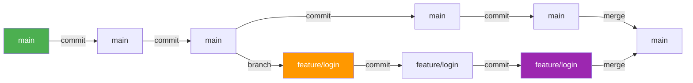

### 2.1.1. Concepto de Rama

Una **rama** es una línea de desarrollo independiente. La rama principal suele llamarse `main` o `master`.

> **💡 Ejemplo visual:**
> ```
> main: ──●──●──●──●    (producción)
>                \
> feature/login:  ●──●──  (trabajando en login)
> ```

> 💡 **Metáfora: Las ramas son universos paralelos**
> Imagina que cada rama es un universo paralelo. En el universo `main`, tu aplicación funciona perfectamente en producción. Pero en el universo `feature/login`, estás experimentando con una nueva pantalla de login. Si el experimento sale mal, simplemente cierras ese universo (eliminas la rama) y el universo principal sigue intacto. Si sale bien, fusionas ambos universos en uno solo.

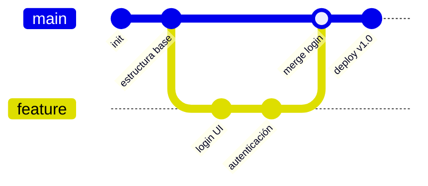

### Ventajas e Inconvenientes de Usar Muchas Ramas

| ✅ Ventajas | ❌ Inconvenientes |
|-------------|-------------------|
| Aislamiento del código principal | Más ramas que gestionar |
| Experimentación sin riesgo | Posible confusión entre ramas |
| Trabajo en paralelo sin interferencias | Conflictos al fusionar muchas ramas |
| Historial claro de cada funcionalidad | Ramas huérfanas que nadie recuerda |
| Facilita las revisiones de código (PR) | Más comandos para mantener sincronización |

### 2.1.2. Comandos de Ramas

```bash
# Listar todas las ramas locales
git branch

# Listar todas las ramas (locales y remotas)
git branch -a

# Listar ramas con su último commit
git branch -v

# Crear una nueva rama
git branch nombre-rama

# Crear y cambiar a la nueva rama
git checkout -b nombre-rama
git switch -c nombre-rama    # Equivalente moderno

# Cambiar a una rama existente
git checkout nombre-rama
git switch nombre-rama

# Volver a la rama anterior
git checkout -
git switch -

# Eliminar una rama (solo si está fusionada)
git branch -d nombre-rama

# Eliminar una rama forzosamente
git branch -D nombre-rama

# Renombrar la rama actual
git branch -m nuevo-nombre

# Descargar y cambiar a una rama remota
git checkout --track origin/nombre-rama
```

> 💡 **checkout vs switch:** `git switch` es más reciente y su sintaxis es más intuitiva. `git checkout` todavía funciona pero está en desuso para cambios de rama.

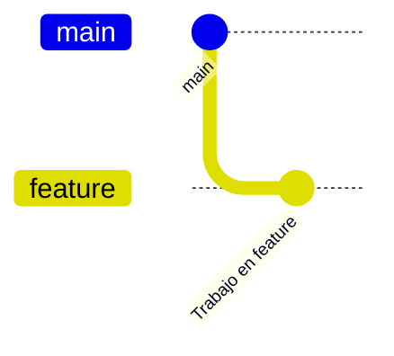

### Metáforas y Errores Comunes por Comando

#### `git branch` — El mapa de universos

> 💡 **Metáfora:** `git branch` es como abrir un mapa y ver todos los universos paralelos disponibles. No viajas a ninguno, solo los enumeras.

```bash
git branch                # Lista ramas locales (tus universos locales)
git branch -a             # Lista todas, incluyendo las del servidor (universos compartidos)
git branch -v             # Muestra el último commit de cada una
```

| ✅ Ventajas | ❌ Errores Comunes |
|-------------|---------------------|
| Veo todas mis ramas de un vistazo | No usar `git branch` antes de crear una nueva → nombre duplicado |
| `-a` muestra ramas remotas también | Olvidar que el `*` indica la rama actual |
| `-v` indica el último commit de cada rama | Confundir ramas locales con remotas |

#### `git checkout` — El viaje entre universos

> 💡 **Metáfora:** `git checkout` es como activar un portal de teletransportación. Te transporta de un universo (rama) a otro instantáneamente.

```bash
git checkout feature/login    # Te transportas al universo feature/login
git checkout -b hotfix/bug    # Abre un NUEVO universo y te transportas ahí
git checkout -                # Vuelves al último universo en el que estabas
```

| ✅ Ventajas | ❌ Errores Comunes |
|-------------|---------------------|
| Cambio rápido entre ramas | `git checkout` también modifica archivos (confuso para novatos) |
| `-b` crea y cambia en un solo paso | Olvidar el `-b` → intenta cambiar a rama que no existe |
| `git checkout -` → último lugar visitado | Modificar archivos sin hacer commit antes → cambios mezclados |

> ⚠️ **Problema clásico:** Si tienes cambios sin commit y haces `checkout` a otra rama, Git intenta mezclar tus cambios. Siempre haz commit o stash antes de cambiar de rama.

#### `git stash` — Guardar cambios temporalmente

> 💡 **Metáfora:** `git stash` es como **poner tus papeles en un cajón temporal** mientras ordenas la mesa para otro trabajo. No los tiras, no los guardas en el archivador — los pones en un cajón aparte y cuando vuelvas, los sacas exactamente como estaban.

```bash
# Guardar cambios actuales
git stash push -m "WIP: refactorizando login"

# Ver lista de stashes guardados
git stash list

# Ver qué hay dentro de un stash
git stash show
git stash show -p  # Ver el diff completo

# Recuperar último stash (y eliminarlo de la lista)
git stash pop

# Aplicar stash sin eliminarlo (útil si quieres usarlo en varias ramas)
git stash apply

# Crear rama desde un stash (útil si hay conflictos)
git stash branch feature/recuperar stash@{0}

# Eliminar un stash específico
git stash drop stash@{0}

# Eliminar todos los stashes
git stash clear
```

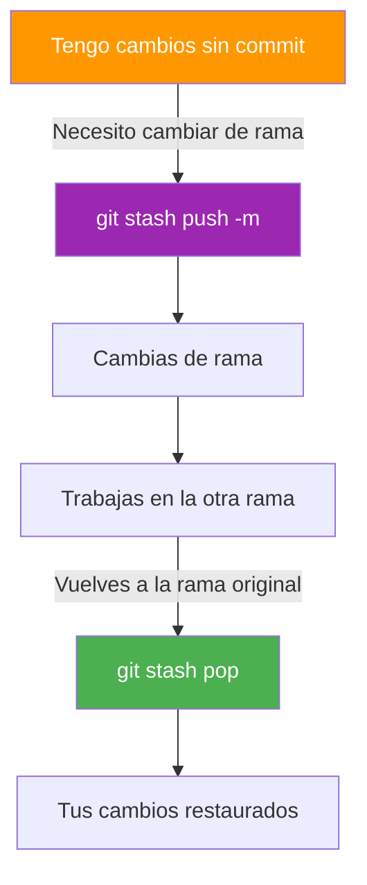

📌 **Ejemplo real:** Estás desarrollando una funcionalidad nueva y tu jefe te pide un hotfix urgente. Sin `stash`, tendrías que hacer commit de medio código, crear la rama del fix, y luego intentar deshacer el commit. Con `stash`: `git stash`, cambias de rama, haces el fix, vuelves y `git stash pop`. Limpio y rápido.

> ⚠️ **Advertencia:** `git stash save` está deprecated. Usa siempre `git stash push -m "mensaje"`.

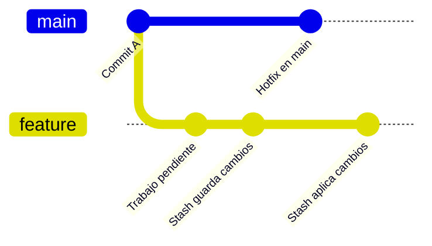

#### `git switch` — La versión moderna del portal

> 💡 **Metáfora:** `git switch` es como el `checkout` pero con un panel de control más intuitivo. Solo cambia de rama, no toca tus archivos.

```bash
git switch feature/login     # Cambia a la rama feature/login
git switch -c hotfix/bug     # Crea y cambia (equivalente a checkout -b)
git switch -                 # Vuelve a la rama anterior
```

| ✅ Ventajas | ❌ Errores Comunes |
|-------------|---------------------|
| Más intuitivo y claro | Olvidar que `switch` no crea ramas sin `-c` |
| No confunde con modificación de archivos | Si hay cambios sin commit, se niega a cambiar (seguro) |
| Recomendado oficialmente | `-` solo funciona para volver a la rama anterior |

#### `git branch -d` / `-D` — El borrador de universos

> 💡 **Metáfora:** Eliminar una rama es como cerrar un universo paralelo. `-d` es el modo seguro (solo cierra si ya está todo integrado). `-D` es el modo fuerza bruta (cierra sin preguntar).

```bash
git branch -d feature/old    # Seguro: solo la cierra si ya está fusionada
git branch -D feature/wip    # Forzado: la cierra aunque tenga commits sin fusionar
```

| ✅ Ventajas | ❌ Errores Comunes |
|-------------|---------------------|
| `-d` protege contra borrado accidental | `-D` elimina commits que pueden perderse |
| Limpia ramas antiguas que ya no necesitas | No verificar con `git branch -d` antes de borrar |
| Mantiene el repositorio organizado | Borrar una rama que tiene commits que nadie tiene localmente |

> ⚠️ **Consejo de supervivencia:** Antes de borrar una rama, haz `git log` para ver si tiene commits que no están en main. Si los tienes, haz cherry-pick o merge antes de borrar.

## 2.2. Fusiones (Merge)

La **fusión** combina los cambios de una rama con otra.

> 💡 **Metáfora: Fusionar es como combinar dos ríos**
> Imagina que `main` es un río caudaloso que fluye constantemente. Tu rama `feature` es un afluente que ha ido recogiendo agua (cambios) por su cuenta. Cuando haces `merge`, ambos ríos se unen en uno solo. Si no hay obstáculos (conflictos), la fusión es automática y fluida. Si ambos ríos modificaron la misma roca (mismas líneas), necesitas decidir cómo unir el cauce.

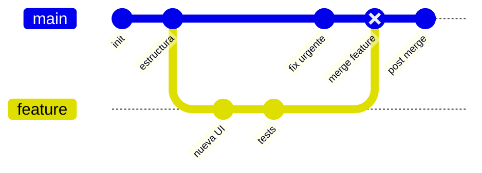

### Fast-Forward vs Merge Commit: Diferencias Visuales

> 💡 **Metáfora:** El fast-forward es como si el río principal no hubiera tenido cambios mientras el afluente crecía — simplemente el puntero se mueve. El merge commit es como construir una presa que une ambos cauces.

**Fast-Forward** — No hay cambios en main desde que creaste la rama:

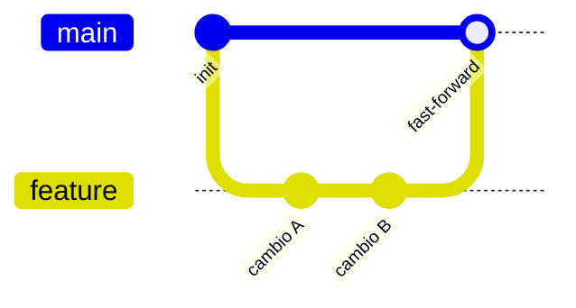

En fast-forward, Git **no crea un commit de merge**. Simplemente mueve el puntero de `main` al último commit de `feature`. Es limpio pero oculta que hubo una rama.

**Merge Commit** — Hay cambios en main desde que creaste la rama:

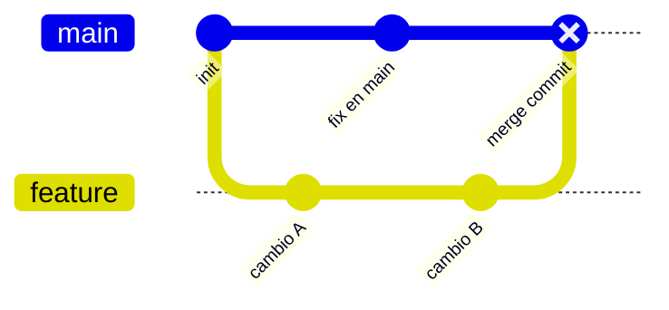

Aquí Git **sí crea un commit de merge** (commit type: REVERSE) porque ambos ríos tuvieron cambios. El commit de merge tiene dos padres: el último de `main` y el último de `feature`.

> 📝 **Regla práctica:** Usa `--no-ff` si quieres que siempre se cree un commit de merge (recomendado para ramas de funcionalidad). Así conservas el historial de ramas.

### 2.2.1. Tipos de Merge

1. **Fast-Forward**: No hay cambios en main desde que creaste la rama
2. **Merge Commit**: Hay cambios en main, Git crea un commit de merge
3. **Merge con conflicto**: Ambos modificaron las mismas líneas

### 2.2.2. Comandos de Merge

```bash
# Fusionar una rama en la actual
git merge nombre-rama

# Fusionar con mensaje personalizado
git merge nombre-rama -m "Mensaje del merge"

# Fusionar abortando si hay conflictos (NO lleva nombre de rama)
git merge --abort

# Fusionar sin fast-forward (siempre crea commit de merge)
git merge --no-ff nombre-rama
```

> 📝 **Merge fast-forward:** Es "limpio" pero puede ocultar la estructura real del desarrollo. Usar `--no-ff` cuando quieras mantener el historial de ramas.

### Estrategias de Merge

Git permite elegir diferentes algoritmos para resolver fusiones:

```bash
# Estrategia "ours": mantener siempre la versión de la rama actual
git merge -s ours feature-branch

# Estrategia "recursive" (por defecto): resolver automáticamente si es posible
git merge -s recursive feature-branch

# Resolver conflictos automáticamente tomando la versión entrante
git merge -X theirs feature-branch

# Resolver conflictos automáticamente manteniendo la versión actual
git merge -X ours feature-branch

# Fusionar sin hacer commit (dejar todo staged)
git merge --no-commit feature-branch
```

| Estrategia | Cuándo usarla |
|------------|---------------|
| **recursive** (por defecto) | Caso general, resuelve automáticamente |
| **ours** | Cuando quieres descartar los cambios de la otra rama |
| **theirs** | Cuando quieres aceptar los cambios de la otra rama |
| **octopus** | Fusionar más de 2 ramas a la vez |

> ⚠️ **Advertencia:** Las estrategias `-s ours` y `-X theirs` son peligrosas si no entiendes qué hacen. Pueden descartar cambios sin avisar. Úsalas solo cuando estés seguro.

| ✅ Ventajas del Merge | ❌ Inconvenientes del Merge |
|------------------------|------------------------------|
| Conserva el historial completo de ramas | El commit de merge puede ensuciar el historial lineal |
| Fácil de entender para el equipo | Conflictos a resolver si hay cambios simultáneos |
| Seguro para ramas compartidas | No reescribe historial (no se puede limpiar después) |
| Auditable: se ve exactamente qué se fusionó cuándo | Historial de ramas puede hacer `git log` más complejo |

### 2.2.3. Cherry-Pick (Mi Comando Favorito!)

El **cherry-pick** permite aplicar un commit específico de otra rama sin fusionar toda la rama.

> 💡 **Metáfora: La cerezita del otro plato**
> Imagina que estás en un buffet (tu rama) y en el plato de tu compañero (otra rama) hay una cereza deliciosa (un commit con un fix importante). No quieres todo el plato de tu compañero, solo esa cerezita. Con `cherry-pick` agarras exactamente ese commit y lo copias a tu plato. ¡Sin más!

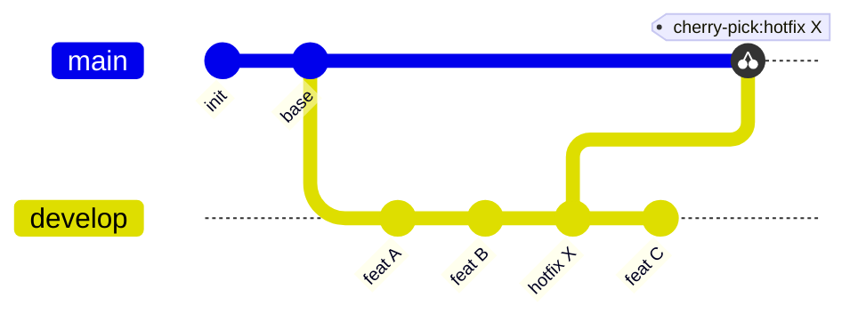

En este ejemplo, solo el commit "hotfix X" se copia a `main`, sin traer "feat A", "feat B" ni "feat C". ¡La cerezita exacta!

```bash
# Aplicar un commit específico a la rama actual
git cherry-pick [commit-hash]

# Aplicar varios commits en orden
git cherry-pick hash1 hash2 hash3

# Cherry-pick con rango de commits
git cherry-pick hash1..hash5

# Cherry-pick sin hacer commit (solo preparar cambios)
git cherry-pick -n [commit-hash]

# Cherry-pick desde otra rama
git checkout main
git cherry-pick develop~3
```

> 💡 **¿Cuándo usar cherry-pick?**
> - Aplicar un hotfix a main sin mergear toda la rama
> - Traer una funcionalidad específica de otra rama
> - Recuperar un commit de una rama eliminada

> ⚠️ **Cuidado:** Cherry-pick crea commits nuevos duplicados. Si aplicas el mismo cherry-pick dos veces, tendrás cambios duplicados.

| ✅ Ventajas del Cherry-Pick | ❌ Inconvenientes del Cherry-Pick |
|------------------------------|------------------------------------|
| Trae solo el commit que necesitas | Crea un commit nuevo con hash diferente |
| Ideal para hotfixes puntuales | Si lo aplicas dos veces, duplicas cambios |
| No contamina la rama con commits innecesarios | No trae el contexto completo de la rama origen |
| Útil para recuperar código de ramas eliminadas | Puede generar conflictos si el commit depende de otros |

## 2.3. Rebase

El **rebase** reaplica los commits de tu rama sobre otra base, creando un historial lineal.

> 💡 **Metáfora: Viaje en el tiempo**
> El rebase es como viajar al pasado. Imagina que estás construyendo una casa (tu rama `feature`) y quieres que las paredes estén perfectamente alineadas con el plano más reciente de la ciudad (`main`). En lugar de construir un puente (merge), retrocedes en el tiempo, te mueves al último punto del plano de la ciudad y vuelves a construir tu casa desde ahí. El resultado es una casa perfectamente alineada, pero el plano antiguo de tu casa ya no existe — se reescribió la historia.


### Merge vs Rebase: Comparación Visual

**CON MERGE** — Historial con ramas y commits de merge:

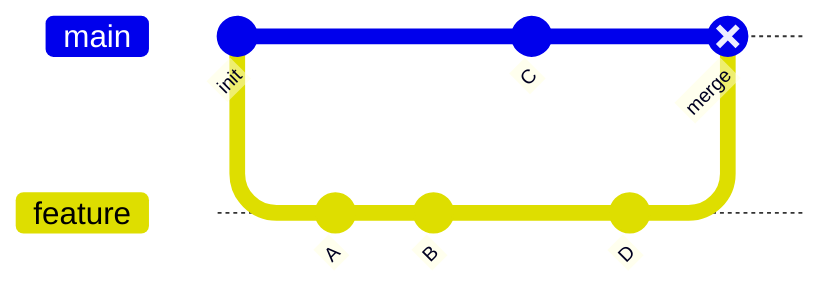

**CON REBASE** — Historial lineal limpio:


> ⚠️ **PELIGRO:** El rebase **reescribe la historia**. Los commits que rebaseas obtienen nuevos hashes. Si alguien más tiene esos commits, todos tendrán problemas de sincronización. **NUNCA rebeases commits que ya han sido compartidos (pushed).

### 2.3.1. Comandos de Rebase

```bash
# Rebase de la rama actual sobre main
git rebase main

# Rebase interactivo (permite editar commits)
git rebase -i main

# Rebase interactivo de los últimos N commits
git rebase -i HEAD~5

# Continuar rebase después de resolver conflictos
git rebase --continue

# Abortar rebase y volver al estado anterior
git rebase --abort

# Rebase saltando un commit (ignorar)
git rebase --skip

# Rebase desde un commit específico
git rebase --onto nueva-base commit-inicial
```

### 2.3.2. Rebase Interactivo

El rebase interactivo permite reorderar, combinar, editar y eliminar commits:

```bash
# Rebase interactivo de los últimos 3 commits
git rebase -i HEAD~3

# Opciones disponibles:
# pick     = usar el commit (orden default)
# reword   = cambiar el mensaje del commit
# edit     = pausar para modificar el commit
# squash   = combinar con commit anterior (fusionar)
# fixup    = combinar, discard mensaje commit
# drop     = eliminar commit
# exec     = ejecutar comando
```

> 💡 **Ejemplo de uso:** Tienes commits "WIP", "fix", "fix2". Usa rebase interactivo para:
> 1. `reword "fix"` → "fix: resolver bug en login"
> 2. `squash "fix2"` → combinar con anterior
> 3. `drop "WIP"` → eliminar commit temporal

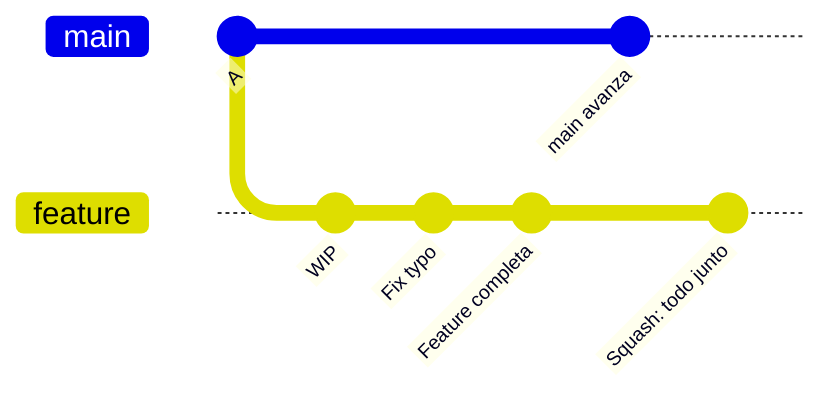

### 2.3.3. Merge vs Rebase: ¿Cuándo usar cada uno?

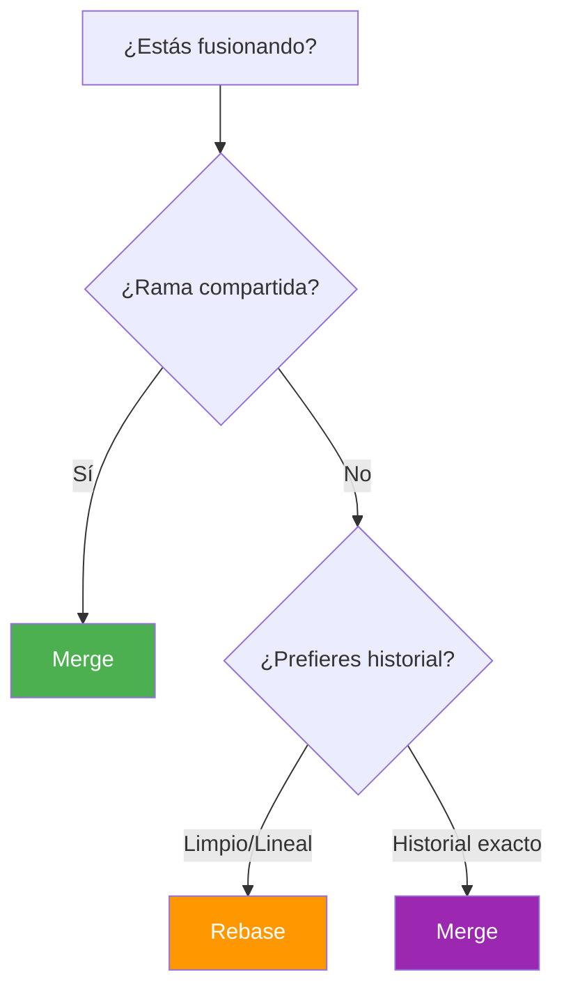

| Aspecto | Merge | Rebase |
|---------|-------|--------|
| **Historial** | Conserva estructura de ramas | Lineal, limpio |
| **Commits** | Commit de merge | Sin commit extra |
| **Conflictos** | Se resuelven una vez | Pueden resolverse por commit |
| **Ramas compartidas** | ✅ Seguro | ❌ Peligroso |
| **Auditoría** | ✅ Completo | ⚠️ Modificado |

> **💡 Regla de oro:**
> - **Rebase** tu rama local antes de fusionar
> - **Nunca** rebasees commits ya pushados
> - **Merge** para ramas compartidas

### 2.3.4. Ejemplo Rebase Práctico

```bash
# 1. Estás en feature, main tiene nuevos commits
git checkout feature
git fetch origin

# 2. Rebase tu rama sobre main (mejor que merge)
git rebase origin/main

# 3. Resolver conflictos si los hay
# 4. Subir cambios (force no necesario si no rebaseaste pushed)
git push origin feature

# 5. Crear Pull Request
```

> ⚠️ **Advertencia:** Nunca rebases commits que ya has empujado a un repositorio compartido. Otros desarrolladores tendrán problemas de sincronización.

> 💡 **Cuándo usar rebase:**
> - Para mantener un historial lineal y limpio
> - Antes de hacer merge a main
> - Nunca en ramas compartidas

| ✅ Ventajas del Rebase | ❌ Inconvenientes del Rebase |
|--------------------------|-------------------------------|
| Historial lineal y fácil de leer | Reescribe la historia (cambia hashes) |
| Sin commits de merge innecesarios | Peligroso en ramas compartidas |
| Más fácil de hacer bisect para bugs | Puede causar problemas al equipo |
| Conflictos resueltos por commit individual | Requiere `--force` si ya se hizo push |
| Ideal antes de un PR limpio | Pierde el contexto de ramas |

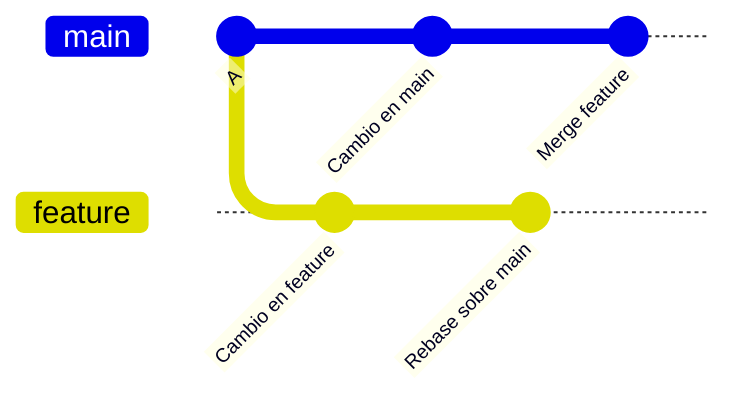

## 2.4. Resolución de Conflictos

Cuando dos personas modifican las mismas líneas, Git no puede fusionar automáticamente.

> 💡 **Metáfora: Dos personas quieren pintar la misma pared**
> Imagina que tú y tu compañero pintáis una pared. Tú pintas la pared de azul en la rama `feature`, y tu compañero la pinta de verde en la rama `main`. Cuando intentáis juntar el trabajo (merge), Git no sabe qué color elegir: ¿azul o verde? Necesitáis sentaros, hablarlo y decidir si pintarla de azul, de verde, o de un color nuevo que combine ambos. Eso es un conflicto: dos cambios incompatibles en el mismo sitio.

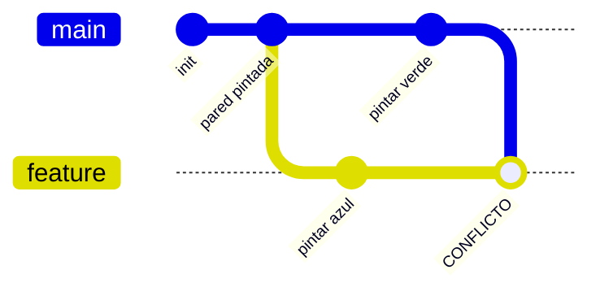

### 2.4.1. Pasos para Resolver Conflictos

> 💡 **Metáfora paso a paso:** Es como un mediador en una discusión. Primero identificáis dónde estáis en desacuerdo (marcadores), luego escucháis ambos lados (contenido), decidís una solución (edición) y firmáis el acuerdo (commit).

```bash
# 1. Actualizar tu rama (traer cambios del río principal)
git fetch origin
git merge origin/main

# 2. Ver qué archivos tienen conflicto (qué paredes están en disputa)
git status
# Salida: "Unmerged paths: both modified: archivo.txt"

# 3. Los conflictos se marcan así en el archivo:
# <<<<<<< HEAD
# contenido de tu rama (azul)
# =======
# contenido de la otra rama (verde)
# >>>>>>> nombre-rama

# 4. Editar el archivo y resolver:
#    - ELIMINAR los marcadores <<<, ===, >>>
#    - DECIDIR qué contenido quedarte (puede ser una mezcla)
#    - GUARDAR el archivo

# 5. Después de resolver, añadir el archivo al staging
git add archivo-resuelto.txt

# 6. Commit del merge (firmar el acuerdo)
git commit -m "Resueltos conflictos de merge"
```

> ⚠️ **Errores comunes al resolver conflictos:**
> - **Olvidar los marcadores** `<<<`, `===`, `>>>`: Si los dejas en el código, el programa fallará al compilar
> - **No hacer `git add` después de resolver**: Git sigue pensando que hay conflicto pendiente
> - **Resolver solo un archivo cuando hay varios**: Comprobar siempre con `git status` cuántos archivos tienen conflicto

### Ejemplo Real: Conflicto en un Proyecto C#

Supongamos que dos desarrolladores modifican `ServicioLogin.cs`:

**Tu rama (feature):**
```csharp
public class ServicioLogin
{
    public bool IniciarSesion(string usuario, string password)
    {
        // Validación simplificada
        return !string.IsNullOrEmpty(usuario) && !string.IsNullOrEmpty(password);
    }
}
```

**Rama principal (main):**
```csharp
public class ServicioLogin
{
    public bool IniciarSesion(string usuario, string password)
    {
        // Validación con hash
        var hash = CalcularHash(password);
        return BaseDatos.Verificar(usuario, hash);
    }
}
```

**El archivo con marcadores de conflicto:**
```csharp
public class ServicioLogin
{
    public bool IniciarSesion(string usuario, string password)
    {
<<<<<<< HEAD
        // Validación con hash
        var hash = CalcularHash(password);
        return BaseDatos.Verificar(usuario, hash);
=======
        // Validación simplificada
        return !string.IsNullOrEmpty(usuario) && !string.IsNullOrEmpty(password);
>>>>>>> feature
    }
}
```

**Resolución:** Decidís que la versión de `main` es la correcta (con hash), y añadís la validación de nulos de la feature:

```csharp
public class ServicioLogin
{
    public bool IniciarSesion(string usuario, string password)
    {
        if (string.IsNullOrEmpty(usuario) || string.IsNullOrEmpty(password))
            return false;

        var hash = CalcularHash(password);
        return BaseDatos.Verificar(usuario, hash);
    }
}
```

> 📌 **Ejemplo real:** En Netflix, cuando dos equipos modifican el mismo servicio de streaming, resuelven los conflictos con una reunión de 15 minutos. El merge conflict es el punto de partida de la conversación, no el final.
> - **No probar que el código compila después de resolver**: Siempre ejecutar `dotnet build` o las pruebas tras resolver

> 💡 **Truco:** Usa un IDE como Rider o VS Code que tiene herramientas visuales para resolver conflictos. Muestra ambos lados y puedes elegir "aceptar actual", "aceptar entrante" o "aceptar ambos".

### 2.4.2. Herramientas de Resolución

```bash
# Usar mergetool
git mergetool

# Cancelar resolución
git merge --abort
```

## 2.5. Estrategias de Branching

### 2.5.1. Rama por Funcionalidad (Feature Branch)

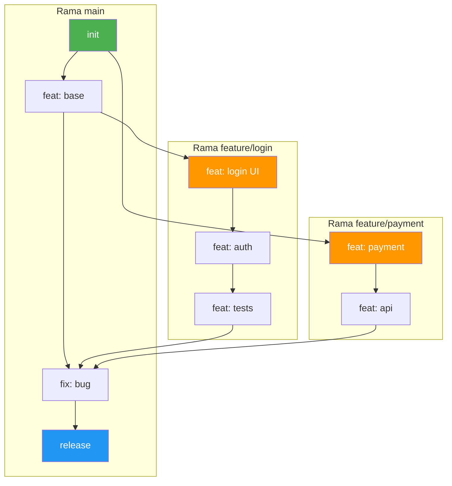

Cada funcionalidad en su propia rama:

```bash
# Workflow típico
git checkout -b feature/nueva-funcionalidad main
# ...trabajar...
git checkout main
git merge feature/nueva-funcionalidad
```

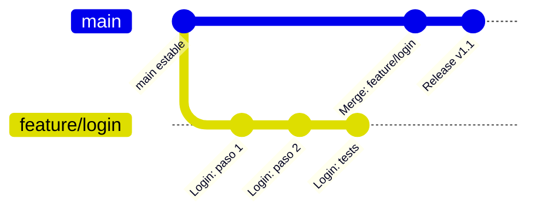

### 2.5.2. Rama por Bugfix

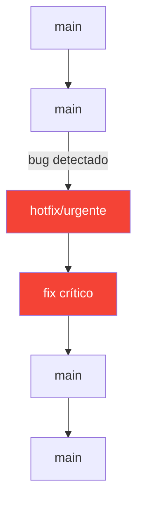

```bash
# Crear hotfix desde main
git checkout -b hotfix/descripcion main
# ...arreglar...
git checkout main
git merge hotfix/descripcion
```

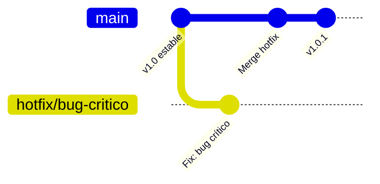

## 2.6. Flujos de Trabajo con Ramas

### 2.6.1. GitHub Flow

Flujo simple centrado en ramas de vida corta y despliegues continuos.

```mermaid
graph LR
    A[main] -->|Crear rama| B[feature]
    B -->|Commit| C[feature]
    C -->|PR & Merge| A
    A -->|Deploy| D[Producción]
    
    style A fill:#4CAF50,color:#fff
    style B fill:#FF9800,color:#fff
    style C fill:#9C27B0,color:#fff
    style D fill:#f44336,color:#fff
```

**GitHub Flow con gitGraph:**

```mermaid
gitGraph
    commit id: "init"
    commit id: "v1 base"
    branch feature/login
    checkout feature/login
    commit id: "login UI"
    commit id: "validación"
    checkout main
    merge feature/login id: "PR #1 merge"
    branch feature/pagos
    checkout feature/pagos
    commit id: "carrito"
    commit id: "pasarela"
    checkout main
    merge feature/pagos id: "PR #2 merge"
    commit id: "deploy v1.1" tag: "v1.1"
```

**Principios:**
1. Todo en `main` está listo para producción
2. Crear rama desde `main` con nombre descriptivo
3. Trabajar y hacer commits
4. Abrir PR cuando esté listo
5. Fusionar tras aprobación
6. Deploy inmediato

> 📝 **Cuándo usar:** Proyectos con despliegue continuo (CD), web apps, startups, equipos pequeños.

### 2.6.2. GitFlow

Metodología estructurada para proyectos con ciclos de release definidos.

```mermaid
graph LR
    A[master] -->|Release| B[v1.0]
    C[develop] -->|Feature| D[nueva-func]
    D --> C
    C -->|Release| E[release-1.1]
    E -->|Hotfix| F[hotfix-urgente]
    F --> A
    F --> C
    
    style A fill:#4CAF50,color:#fff
    style C fill:#2196F3,color:#fff
    style E fill:#FF9800,color:#fff
    style F fill:#f44336,color:#fff
```

**GitFlow con gitGraph:**

```mermaid
gitGraph
    commit id: "init"
    branch develop
    checkout develop
    commit id: "base develop"
    branch feature/login
    checkout feature/login
    commit id: "login"
    checkout develop
    merge feature/login id: "merge login"
    branch feature/pagos
    checkout feature/pagos
    commit id: "pagos"
    checkout develop
    merge feature/pagos id: "merge pagos"
    branch release/1.0
    checkout release/1.0
    commit id: "ajustes finales"
    checkout main
    merge release/1.0 id: "release 1.0" tag: "v1.0"
    checkout develop
    merge release/1.0 id: "sync develop"
    branch hotfix/1.0.1
    checkout hotfix/1.0.1
    commit id: "fix urgente"
    checkout main
    merge hotfix/1.0.1 id: "hotfix" tag: "v1.0.1"
    checkout develop
    merge hotfix/1.0.1 id: "sync hotfix"
```

**Ramas principales:**

| Rama | Propósito |
|------|-----------|
| **`main`** | Producción, versiones estables |
| **`develop`** | Integración de nuevas funcionalidades |
| **`feature-*`** | Nuevas funcionalidades |
| **`release-*`** | Preparación de release |
| **`hotfix-*`** | Correcciones urgentes en producción |

### 2.6.3. Comandos GitFlow

```bash
# Iniciar develop
git checkout -b develop main

# Nueva funcionalidad
git checkout -b feature/login develop
git checkout develop
git merge feature/login --no-ff

# Preparar release
git checkout -b release/1.1 develop
# ...ajustes finales...
git checkout main
git merge release/1.1 --no-ff
git tag -a v1.1 -m "Version 1.1"
git checkout develop
git merge release/1.1 --no-ff

# Hotfix
git checkout -b hotfix/1.1.1 main
# ...arreglo urgente...
git checkout main
git merge hotfix/1.1.1 --no-ff
git tag -a v1.1.1 -m "Hotfix 1.1.1"
git checkout develop
git merge hotfix/1.1.1 --no-ff
```

> 💡 **Cuándo usar GitFlow:** Software con versiones formales, apps móviles, proyectos enterprise, equipos grandes.

### 2.6.4. Trunk-Based Development

Trunk-Based es el flujo más simple: todos escriben en `main` directamente, con ramas muy cortas (1-2 días) o sin ramas. Se usa con **Feature Flags** (variables que activan/desactivan funciones incompletas) para no romper la producción.

📌 **Ejemplo real:** Google y Facebook usan Trunk-Based. Cuando ves una función nueva en Gmail que solo algunos usuarios tienen, es una Feature Flag. Cuando está probada, se activa para todos.

> 💡 **Para tus proyectos de 1DAW:** GitHub Flow es suficiente. Trunk-Based es para equipos grandes con CI/CD maduro.

### 2.6.5. Comparativa de Flujos

| Aspecto | GitHub Flow | GitFlow |
|---------|-------------|---------|
| **Complejidad** | Simple | Complejo |
| **Ramas principales** | Solo `main` | `main` + `develop` |
| **Release branches** | No | Sí |
| **Hotfixes** | Rama desde main | Rama desde main |
| **Ideal para** | CD, despliegue continuo | Proyectos con versiones |
| **Ejemplo uso** | Web apps modernas | Software embebido |

## 2.7. Rama Main vs Master

Históricamente, la rama principal se llamaba `master`. Actualmente, `main` es el nombre recomendado por GitHub.

```bash
# Si tu repositorio usa master, puedes renombrar
git branch -m master main
git push -u origin main
```

> 📝 **Nota:** Los repositorios nuevos en GitHub usan `main` por defecto.

## 2.8. Buenas Prácticas con Ramas

### 2.8.1. ✅ Recomendaciones

1. **Ramas cortas**: Crear, trabajar y fusionar rápidamente
2. **Nombres descriptivos**: `feature/login`, `bugfix/header`, `hotfix/security`
3. **Commits frecuentes**: Cada commit debe hacer una cosa
4. **Mensajes claros**: Explicar el "por qué", no solo el "qué"
5. **Integrar temprano**: Hacer merge a main frecuentemente

### 2.8.2. ❌ Errores a Evitar

| Error | Consecuencia | Solución |
|-------|--------------|----------|
| Trabajar directo en main | Conflicts frecuentes | Siempre usar ramas |
| Ramas muy largas | Merge conflicts grandes | Merge frecuente |
| Commits gigantes | Historial confuso | Commits atómicos |
| No probar antes de merge | Bugs en producción | Tests automatizados |

## 2.9. Resumen de Comandos Avanzados

```bash
# Ramas
git branch                  # Listar
git checkout -b rama        # Crear y cambiar
git switch rama             # Cambiar
git branch -d rama          # Eliminar

# Merge
git merge rama              # Fusionar
git merge --no-ff rama      # Sin fast-forward
git merge --abort           # Cancelar

# Rebase
git rebase main             # Rebasear sobre main
git rebase -i HEAD~3        # Rebase interactivo
git rebase --continue       # Continuar después de conflicto
git rebase --abort          # Cancelar rebase

# Conflictos
git status                  # Ver conflictos
git mergetool               # Herramienta visual
git add archivo             # Marcar resuelto
git commit                  # Commit de merge
```

**Resumen del punto:**

| Concepto | Descripción |
|----------|-------------|
| **Rama** | Línea de desarrollo paralela (instantánea, barata en Git) |
| **Merge** | Fusión que crea un commit de merge (conserva historial) |
| **Rebase** | Reescribe commits sobre otra base (historial lineal) |
| **Cherry-pick** | Copia un commit específico a otra rama |
| **Conflicto** | Cuando dos ramas modifican las mismas líneas |
| **GitHub Flow** | Rama principal + ramas de feature + PR |
| **GitFlow** | Ramas main, develop, feature, release, hotfix |

En el siguiente punto veremos GitHub y los repositorios remotos: cómo subir tu código a la nube, clonar proyectos, sincronizar cambios y trabajar con otros desarrolladores en la misma base de código.

---

### Ejercicio Rápido: Ramas y Merge

> 🎯 **Escenario:** Tu cafetería necesita una página de "Carta" y otra de "Reservas". Vamos a crearlas en ramas separadas.

**En papel (2 min):** Dibuja cómo crees que se ven las ramas `main`, `feature/carta` y `feature/reservas` antes y después del merge.

**Ahora en terminal:**

```bash
# 1. Crear rama para la carta
git checkout -b feature/carta

# 2. Crear el archivo de carta
echo "<h2>Carta de Café</h2><ul><li>Latte - 2.50€</li><li>Cappuccino - 2.80€</li></ul>" > carta.html

# 3. Commitear
git add carta.html
git commit -m "feat: añadir carta de café"

# 4. Volver a main y crear rama de reservas
git checkout main
git checkout -b feature/reservas

# 5. Crear archivo de reservas
echo "<h2>Reservas</h2><form><input type='text' placeholder='Nombre'></form>" > reservas.html

# 6. Commitear
git add reservas.html
git commit -m "feat: formulario de reservas"

# 7. Fusionar carta en main
git checkout main
git merge feature/carta

# 8. Fusionar reservas en main
git merge feature/reservas

# 9. Ver el historial (verás los dos merges)
git log --oneline --graph

# 10. Limpiar ramas ya fusionadas
git branch -d feature/carta
git branch -d feature/reservas
```

> 💡 **¿Qué pasó?** Creaste dos funcionalidades en paralelo sin que se pisaran entre sí. Cada rama era una "versión alternativa" de tu proyecto, y al fusionarlas, Git las unió sin perder nada de cada una.

```mermaid
gitGraph
    commit id: "main: index.html"
    branch feature/carta
    checkout feature/carta
    commit id: "carta.html"
    checkout main
    branch feature/reservas
    checkout feature/reservas
    commit id: "reservas.html"
    checkout main
    commit id: "Merge feature/carta"
    commit id: "Merge feature/reservas"
```
