- [3. Git Remoto](#3-git-remoto)
  - [3.1. Git vs GitHub](#31-git-vs-github)
    - [3.1.1. Alternativas a GitHub](#311-alternativas-a-github)
    - [3.1.2. Comparativa de Plataformas](#312-comparativa-de-plataformas)
  - [3.2. Arquitectura Remota](#32-arquitectura-remota)
  - [3.3. Trabajar con Remotos](#33-trabajar-con-remotos)
    - [3.3.1. git remote](#331-git-remote)
    - [3.3.2. git push](#332-git-push)
    - [3.3.3. git fetch](#333-git-fetch)
    - [3.3.4. git pull](#334-git-pull)
    - [3.3.5. Diferencia entre fetch y pull](#335-diferencia-entre-fetch-y-pull)
  - [3.4. Trabajar con GitHub](#34-trabajar-con-github)
    - [3.4.1. Crear Repositorio en GitHub](#341-crear-repositorio-en-github)
    - [3.4.2. Conectar Repositorio Local](#342-conectar-repositorio-local)
    - [3.4.3. Clonar Repositorio Existente](#343-clonar-repositorio-existente)
    - [3.4.4. Sincronizar Cambios](#344-sincronizar-cambios)
  - [3.5. Tags y Versiones](#35-tags-y-versiones)
    - [3.5.1. Crear y Subir Tags](#351-crear-y-subir-tags)
    - [3.5.2. Semantic Versioning](#352-semantic-versioning)
  - [3.6. SSH Keys](#36-ssh-keys)
    - [3.6.1. Generar Clave SSH](#361-generar-clave-ssh)
    - [3.6.2. Añadir Clave a GitHub](#362-añadir-clave-a-github)
    - [3.6.3. Usar SSH en lugar de HTTPS](#363-usar-ssh-en-lugar-de-https)
    - [3.6.4. Ventajas y Desventajas: SSH vs HTTPS](#364-ventajas-y-desventajas-ssh-vs-https)
    - [3.6.5. Errores Comunes con SSH](#365-errores-comunes-con-ssh)
  - [3.7. Resumen de Comandos Remotos](#37-resumen-de-comandos-remotos)
  - [3.8. Workflow Remoto Completo](#38-workflow-remoto-completo)
  - [3.9. GitHub Pages](#39-github-pages)


# 3. Git Remoto

> 💡 **Punto de partida:** ¿De qué sirve tener el mejor código del mundo si solo vive en tu ordenador? Un disco duro puede fallar, un portátil puede perderse. Los repositorios remotos son tu copia de seguridad en la nube y tu puerta al trabajo en equipo.

> 💡 **¿Por qué me importa?**
> GitHub es donde construyes tu portafolio profesional, colaboras en proyectos reales y demuestras tu experiencia a futuros empleadores. Un buen perfil de GitHub puede abrirte puertas laborales.
> 
> 🔗 **Conexión con otros puntos:** El Punto 01 viste los comandos básicos de Git. El Punto 02 viste ramas y fusiones. Este punto verás cómo compartir tu código en la nube, trabajar con otros desarrolladores y gestionar versiones.

En el Punto 02 vimos ramas, fusiones, rebase y resolución de conflictos. Ahora veremos GitHub y los repositorios remotos: cómo subir tu código a la nube, clonar proyectos, sincronizar cambios y trabajar con otros desarrolladores.

**Objetivos de aprendizaje:**

- Diferenciar entre Git (local) y GitHub (remoto)
- Conocer la arquitectura cliente-servidor de Git
- Dominar los comandos: remote, push, fetch, pull
- Crear y gestionar repositorios en GitHub
- Trabajar con SSH keys para autenticación segura
- Aplicar Semantic Versioning con tags

**GitHub** es una plataforma de alojamiento de repositorios Git que va más allá de ser un simple servidor. Es un centro de colaboración, gestión de proyectos y una red social para desarrolladores.

> **💡 Diferencia clave:** Git es la herramienta de control de versiones (local). GitHub es un servicio de hosting para repositorios Git (remoto).

> 📝 **Nota del Profesor:** GitHub es el "Facebook de los programadores". Es donde construyes tu portafolio profesional. Un buen perfil de GitHub puede abrirte puertas laborales.

## 3.1. Git vs GitHub

> 💡 **Metáfora:** Git es como tu cuaderno personal donde apuntas todo, revisas borradores y organizas tus ideas. GitHub es como la biblioteca pública donde cualquiera puede leer tu cuaderno, hacerte anotaciones en los márgenes (comentarios), proponer cambios (Pull Requests) y compartir tu trabajo con el mundo.

| Git | GitHub |
|-----|--------|
| Herramienta de control de versiones | Plataforma de hosting |
| Local (en tu PC) | Remoto (en la nube) |
| Comandos: add, commit, branch, merge | Interfaz web, PRs, forks |
| Creado por Linus Torvalds (2005) | Creado en 2008 |

📌 **Ejemplo real:** Instagram usa Git internamente para gestionar su código. Cada desarrollador tiene su propio repositorio local (Git), pero todo se sincroniza en servidores centrales (como GitHub) para que el equipo completo pueda colaborar.

### 3.1.1. Alternativas a GitHub

| Plataforma | Características |
|------------|-----------------|
| **GitLab** | CI/CD integrado, auto-hosting |
| **Bitbucket** | Integración con Atlassian |
| **Gitea** | Auto-hosting ligero |
| **Azure DevOps** | Enterprise Microsoft |

### 3.1.2. Comparativa de Plataformas

| Plataforma | Ventajas | Desventajas | Ideal para |
|------------|----------|-------------|------------|
| **GitHub** | Mayor comunidad, excelente documentación, Copilot AI integrado, Actions para CI/CD gratuito | Privado limitado sin plan de pago, puede ser lento | Proyectos open source, portafolios profesionales |
| **GitLab** | CI/CD integrado sin plugins, auto-hosting gratuito, más control de privacidad | Curva de aprendizaje mayor, interfaz menos intuitiva | Equipos que necesitan CI/CD sin configurar |
| **Bitbucket** | Gratis para equipos pequeños (≤5), integración perfecta con Jira/Trello | Menos comunidad, menos funcionalidades sociales | Equipos que ya usan Atlassian |
| **Gitea** | Gratuito, auto-hosted, ligero, sin dependencias externas | Tú lo mantienes, sin CI/CD integrado | Proyectos internos, aprendizaje |

> 💡 **Consejo:** Para empezar, usa **GitHub**. Es donde está la mayor comunidad y donde los empleadores buscan desarrolladores. Cuando tengas experiencia, evalúa otras opciones según tus necesidades.

## 3.2. Arquitectura Remota

> 💡 **Metáfora:** Imagina que tu repositorio local es tu casa. El repositorio remoto (GitHub) es como una bodega en la nube donde guardas copias de seguridad de tus pertenencias. `origin` es simplemente la dirección de esa bodega. Cuando haces `push`, estás enviando cajas a la bodega. Cuando haces `pull`, estás trayendo cajas de vuelta a casa.

### 3.2.1. Diagrama de Arquitectura

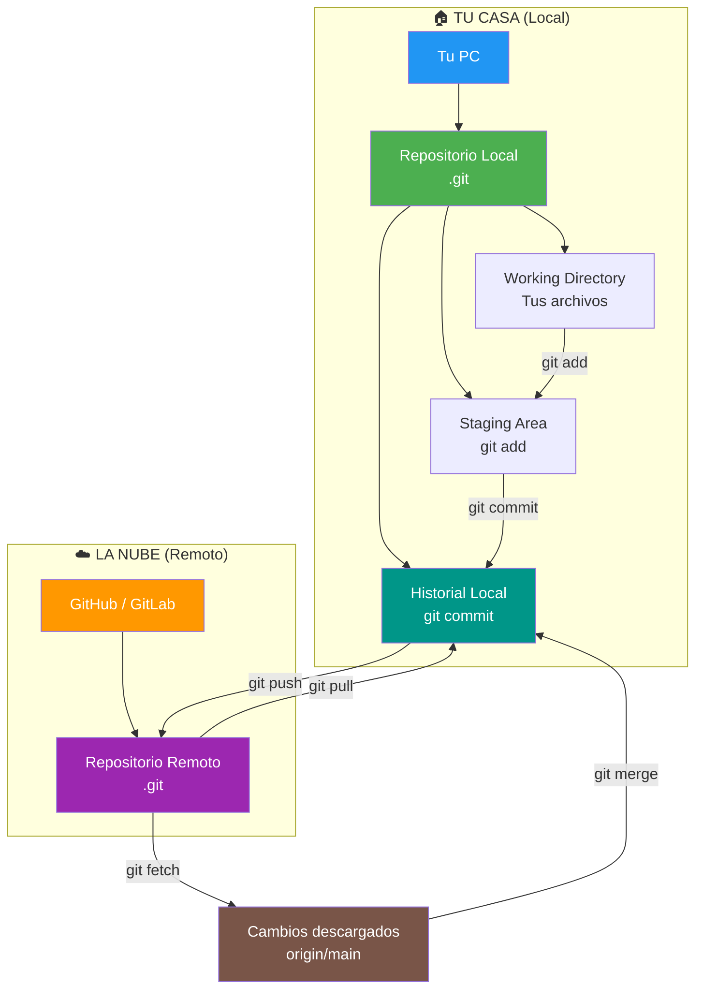

> 📝 **Nota del Profesor:** `origin` es solo un nombre por defecto. Podrías tener varios remotos: `origin` (tu repo principal), `upstream` (repo original del que hiciste fork), `backup` (copia de seguridad). Es como tener varias bóvedas con diferentes direcciones.

## 3.3. Trabajar con Remotos

### 3.3.1. git remote

> 💡 **Metáfora:** `git remote` es como la lista de contactos del móvil. Te permite ver qué repositorios remotos tienes configurados, cuáles son sus direcciones (URLs) y gestionarlos: añadir nuevos, renombrar o eliminar los que ya no usas. `git remote -v` es como abrir la ficha de contacto para ver la dirección exacta.

```bash
# Ver remotos configurados
git remote -v

# Añadir remoto
git remote add origin https://github.com/usuario/repo.git

# Renombrar remoto
git remote rename origin mi-repo

# Eliminar remoto
git remote remove origin

# Ver información detallada del remoto
git remote show origin
```

**Ejemplo de salida:**

```
$ git remote -v
origin  https://github.com/miusuario/mi-proyecto.git (fetch)
origin  https://github.com/miusuario/mi-proyecto.git (push)
upstream  https://github.com/proyecto-original/proyecto.git (fetch)
upstream  https://github.com/proyecto-original/proyecto.git (push)
```

> ⚠️ **Error común:** Si obtienes `fatal: remote origin already exists`, ejecuta `git remote remove origin` y vuelve a añadirlo con la URL correcta.

### 3.3.2. git push

> 💡 **Metáfora:** `git push` es como enviar una caja llena de tus mejores trabajos a la bodega de la nube. Si la caja es la primera que envías a esa bodega, necesitas establecer una "relación" entre tu casa y la bodega (`-u origin main`) para que la empresa de mensajería sepa exactamente a qué dirección enviar.

Sube commits al repositorio remoto.

```bash
# Subir rama al remoto
git push origin main

# Subir y establecer tracking
git push -u origin main

# Subir etiquetas
git push origin --tags

# Subir fuerza (sobrescribir historial - usar con cuidado)
git push --force origin main

# Subir fuerza de forma SEGURA (solo si nadie más ha subido cambios)
git push --force-with-lease origin main

# Subir todas las ramas
git push --all origin

# Subir una rama específica
git push origin nombre-rama

# Eliminar rama remota
git push origin --delete nombre-rama
```

**Ejemplo de salida:**

```
$ git push -u origin main
Enumerating objects: 9, done.
Counting objects: 100% (9/9), done.
Delta compression using up to 8 threads
Compressing objects: 100% (5/5), done.
Writing objects: 100% (5/5), 1.20 KiB | 1.20 MiB/s, done.
Total 5 (delta 3), reused 0 (delta 0), pack-reused 0
remote: Resolving deltas: 100% (3/3), done.
To https://github.com/miusuario/mi-proyecto.git
   e3a1b2c..f4d5e6a  main -> main
branch 'main' set up to track 'origin/main'.
```

> ⚠️ **Error más común:** `! [rejected] main -> main (non-fast-forward)` — significa que el remoto tiene commits que tú no tienes. Solución: `git pull origin main` antes de push.
>
> **Nunca usar push --force en ramas compartidas.** Destruye el trabajo de otros. Usa `--force-with-lease` que verifica que nadie más ha subido cambios antes de sobrescribir.

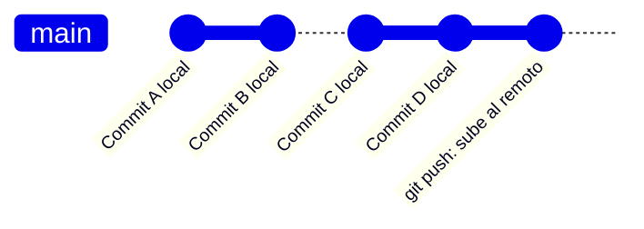

### 3.3.3. git fetch

> 💡 **Metáfora:** `git fetch` es como mirar el menú de un restaurante sin pedir nada. Bajas la información de qué hay disponible (qué cambios hay en el remoto), pero no te tocas nada. Es la forma segura de ver qué han hecho otros antes de decidir si quieres integrarlo.

Descarga cambios sin fusionar.

```bash
# Fetch de todos los remotos
git fetch

# Fetch de un remoto específico
git fetch origin

# Fetch de una rama específica
git fetch origin nombre-rama

# Ver ramas remotas
git remote show origin

# Ver qué ramas remotas existen
git branch -r

# Ver TODAS las ramas (locales + remotas)
git branch -a

# Limpiar ramas remotas obsoletas del tracking local
git remote prune origin

# Fetch + prune en un solo paso
git fetch --prune
```

**Ejemplo de salida:**

```
$ git fetch origin
remote: Enumerating objects: 8, done.
remote: Counting objects: 100% (8/8), done.
remote: Compressing objects: 100% (3/3), done.
remote: Total 6 (delta 4), reused 5 (delta 3), pack-reused 0
Unpacking objects: 100% (6/6), 1.2 KiB | 1.2 MiB/s, done.
From https://github.com/miusuario/mi-proyecto
   e3a1b2c..f4d5e6a  main       -> origin/main
 * [new branch]      feature    -> origin/feature
```

> 💡 **Recuerda:** `fetch` es seguro porque no modifica tu código local. Siempre puedes revisar con `git diff` antes de decidir si fusionas.

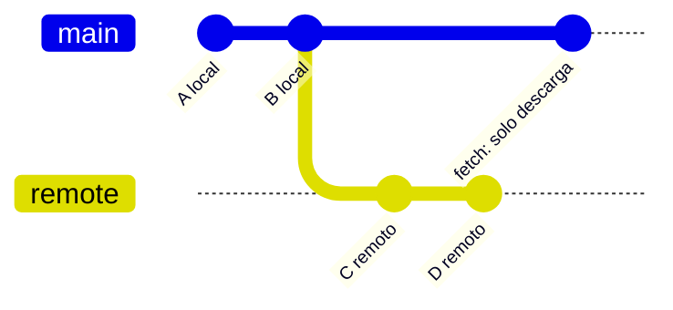

### 3.3.4. git pull

> 💡 **Metáfora:** `git pull` es como ir al restaurante, mirar el menú Y pedir directamente lo que quieras. Traes los cambios del remoto Y los integras automáticamente en tu código. Es como si un mensajero te trajera las cajas de la bodega y las abriera directamente en tu casa, colocando todo donde debe estar.

Descarga y fusiona cambios.

```bash
# Pull (fetch + merge)
git pull origin main

# Pull con rebase en lugar de merge
git pull --rebase origin main

# Pull solo si no hay cambios locales
git pull --ff-only origin main

# Pull de una rama específica
git pull origin nombre-rama

# Pull sin especificar remoto (usa tracking)
git pull
```

**Ejemplo de salida:**

```
$ git pull origin main
remote: Enumerating objects: 5, done.
remote: Counting objects: 100% (5/5), done.
remote: Total 3 (delta 2), reused 3 (delta 2), pack-reused 0
Unpacking objects: 100% (3/3), done.
From https://github.com/miusuario/mi-proyecto
   f4d5e6a..a1b2c3d  main       -> origin/main
Updating f4d5e6a..a1b2c3d
Fast-forward
 src/Program.cs | 12 ++++++++----
 1 file changed, 8 insertions(+), 4 deletions(-)
```

> ⚠️ **Error más común:** `CONFLICT (content): Merge conflict in archivo` — significa que tú y alguien más modificasteis las mismas líneas. Solución: abrir el archivo, resolver el conflicto, `git add .` y `git commit`.
>
> 💡 **Consejo:** Si prefieres tener control total, usa `git fetch` + `git merge` por separado en lugar de `git pull`. Así revisas qué va a cambiar antes de que suceda.

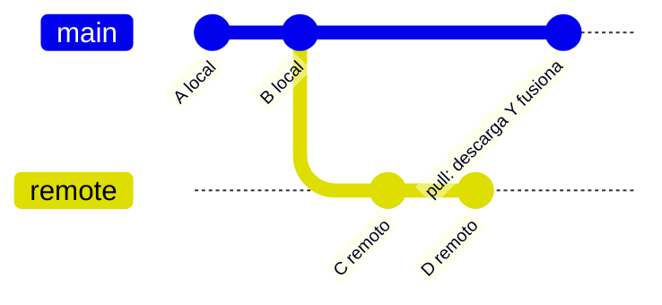

### 3.3.5. Diferencia entre fetch y pull

> 💡 **Metáfora:** Imagina que estás en un restaurante con menú del día.
> - **`git fetch`** = Mirar el menú sin pedir nada. Ves los platos disponibles (cambios en el remoto), pero no comes nada. Tu estómago (código) queda exactamente igual.
> - **`git pull`** = Mirar el menú Y pedir directamente. Traes la comida (cambios) y la comes (fusionas). Si ya tenías algo en tu plato (cambios locales), puede haber un lío.
>
> La diferencia clave: **fetch es seguro, pull puede causar conflictos**.

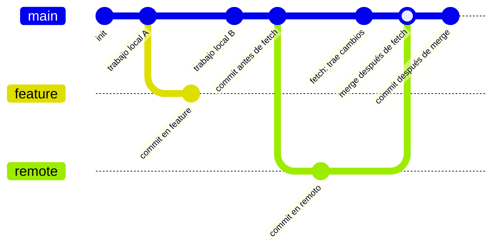

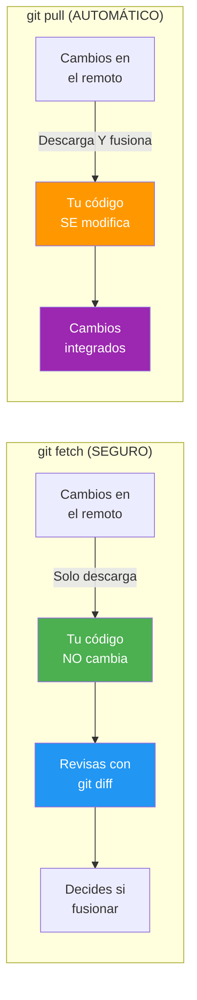

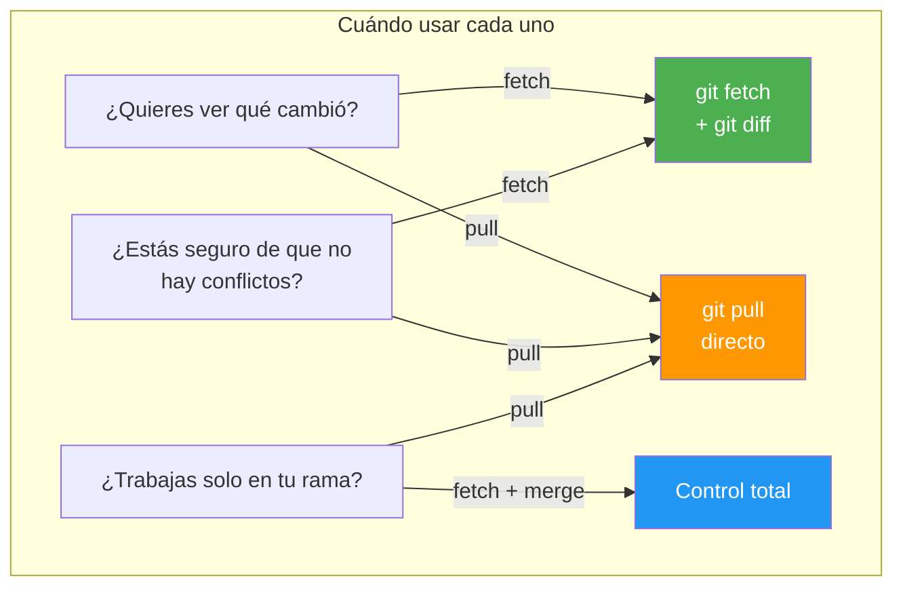

| Aspecto | `git fetch` | `git pull` |
|---------|-------------|------------|
| **¿Qué hace?** | Solo descarga cambios | Descarga Y fusiona |
| **¿Modifica tu código?** | No | Sí |
| **¿Es seguro?** | Sí, siempre | Puede causar conflictos |
| **¿Cuándo usarlo?** | Cuando quieres revisar antes de integrar | Cuando confías en que no hay conflictos |
| **¿Necesita paso adicional?** | Sí (`git merge` o `git rebase`) | No, todo en uno |
| **Nivel de control** | Alto | Bajo |

> 🔧 **Truco:** Si estás aprendiendo, usa SIEMPRE `git fetch` + `git diff` + `git merge` en lugar de `git pull`. Así controlas cada paso y aprendes a detectar conflictos antes de que sucedan.

## 3.4. Trabajar con GitHub

> 💡 **Metáfora:** Trabajar con GitHub es como abrir una cuenta en una plataforma de almacenamiento en la nube. Primero creas tu espacio (repo), luego conectas tu casa (repo local) con ese espacio, y por fin puedes enviar y recibir cajas (commits) de forma fluida.

### 3.4.1. Crear Repositorio en GitHub

> 💡 **Metáfora:** Es como reservar un terreno en la nube. Le pones un nombre, decides si es público o privado (como si tu casa tiene vistas al mar o está en un barrio cerrado), y lo preparas para que otros puedan venir a construir contigo.

1. Ir a [GitHub](https://github.com) y iniciar sesión
2. Clic en "+" → "New repository"
3. Rellenar nombre, descripción, visibilidad
4. Opcional: agregar README, .gitignore, license
5. Clic en "Create repository"

> 💡 **Consejo para .NET:** Selecciona la plantilla **.gitignore** con "VisualStudio" o "Dotnet" al crear el repo. Esto excluye automáticamente `bin/`, `obj/`, `.vs/`, `*.user` y otros archivos de compilación.

**Plantilla .gitignore para proyectos .NET/C#:**

```gitignore
# Compilación
bin/
obj/
out/

# IDEs
.idea/
.vs/
.vscode/
*.sln.iml
*.DotSettings.user

# Archivos temporales
*.user
*.suo
*.userprefs
*.log
*.cache
*.pdb
*.tmp
*.bak

# NuGet
*.nupkg
*.snupkg
packages/
artifacts/

# Publicaciones
publish/
TestResults/
```

📌 **Ejemplo real:** Cuando Netflix creó su primer repositorio en GitHub para Herramientas Open Source, empezaron exactamente así: un repo público con README y .gitignore listos para que la comunidad pudiera contribuir desde el primer día.

### 3.4.2. Conectar Repositorio Local

> 💡 **Metáfora:** Es como conectar tu casa con la bodega de la nube. Le das la dirección exacta (`git remote add origin URL`) y luego empiezas a enviar cajas (`git push`). El primer envío necesita un sello especial (`-u`) para que la empresa de mensajería aprenda la ruta.

```bash
# Si ya tienes código local
cd mi-proyecto
git init
git add .
git commit -m "Initial commit"

# Conectar con remoto (reemplazar URL)
git remote add origin https://github.com/usuario/repo.git

# Subir al remoto
git push -u origin main
```

> ⚠️ **Error común:** `error: src refspec main does not match any` — significa que no tienes commits en tu repositorio. Solución: asegúrate de hacer al menos un `git commit` antes de hacer push.

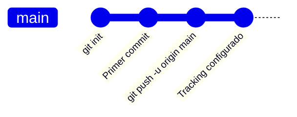

### 3.4.3. Clonar Repositorio Existente

> 💡 **Metáfora:** Clonar es como mudarte a una casa que ya está amueblada. Alguien ya construyó todo (el código, la estructura, los archivos) y tú solo traes una copia exacta a tu ordenador. Es la forma más rápida de empezar a trabajar en un proyecto existente.

```bash
# Clonar desde HTTPS
git clone https://github.com/usuario/repo.git

# Clonar en carpeta específica
git clone https://github.com/usuario/repo.git mi-carpeta

# Clonar desde SSH
git clone git@github.com:usuario/repo.git

# Clonar solo rama específica
git clone --branch nombre-rama --single-branch https://github.com/usuario/repo.git

# Clonar con profundidad (últimos N commits)
git clone --depth 1 https://github.com/usuario/repo.git
```

**Ejemplo de salida:**

```
$ git clone https://github.com/miusuario/mi-proyecto.git
Cloning into 'mi-proyecto'...
remote: Enumerating objects: 47, done.
remote: Counting objects: 100% (47/47), done.
remote: Compressing objects: 100% (28/28), done.
remote: Total 47 (delta 12), reused 45 (delta 10), pack-reused 0
Receiving objects: 100% (47/47), 15.63 KiB | 15.63 MiB/s, done.
Resolving deltas: 100% (12/12), done.
```

📌 **Ejemplo real:** Cuando un nuevo desarrollador se une al proyecto de Glovo, lo primero que hace es `git clone` del repositorio principal. En segundos tiene todo el código en su PC y puede empezar a desarrollar.

### 3.4.4. Sincronizar Cambios

> 💡 **Metáfora:** Sincronizar es como revisar el buzón de tu bodega para ver si ha llegado algo nuevo, y si es así, traerlo a casa y ordenarlo donde debe estar. `fetch` es mirar el buzón, `pull` es traer todo de golpe.

```bash
# Verificar cambios remotos sin traerlos
git fetch origin
git diff main origin/main   # Ver diferencias

# Traer y fusionar cambios
git pull origin main

# Traer sin fusionar
git fetch origin
git merge origin/main

# Traer todos los cambios de todas las ramas
git fetch --all
```

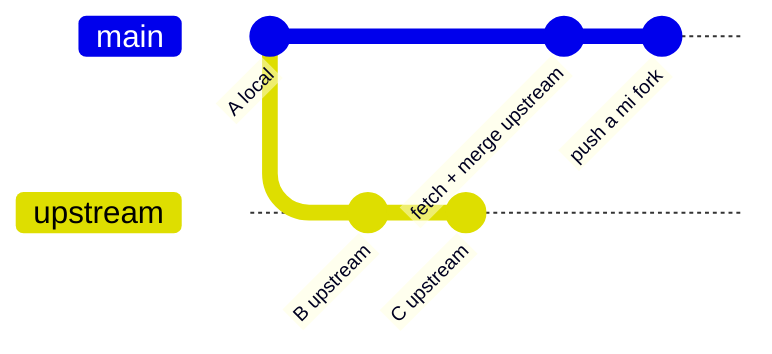

## 3.5. Tags y Versiones

### 3.5.1. Crear y Subir Tags

```bash
# Ver tags existentes
git tag

# Crear tag ligero
git tag v1.0

# Crear tag anotado (recomendado)
git tag -a v1.0 -m "Version 1.0 estable"

# Ver detalles del tag
git show v1.0

# Crear tag en un commit específico
git tag -a v0.5 7cff591

# Subir todos los tags
git push origin --tags

# Subir un tag específico
git push origin v1.0

# Eliminar tag local
git tag -d v1.0

# Eliminar tag remoto
git push origin --delete v1.0
```

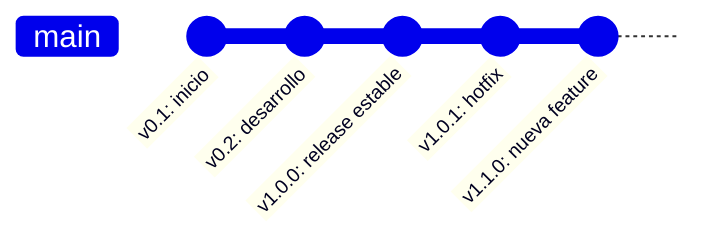

### 3.5.2. Semantic Versioning

> 💡 **Metáfora:** Semantic Versioning es como la dirección de tu casa:
> - **MAJOR** = Cambiar de dirección completa (de Leganés a Madrid) → Cambios incompatibles
> - **MINOR** = Reformar un piso dentro de tu casa (añadir un dormitorio) → Nuevas funcionalidades
> - **PATCH** = Arreglar una gotera en el techo (corrección) → Bug fixes
>
> Si cambias la dirección (MAJOR), tus amigos necesitan buscar una nueva ruta. Si añades un dormitorio (MINOR), pueden seguir usando la dirección antigua. Si arreglas la gotera (PATCH), nadie se entera.

```
MAJOR.MINOR.PATCH

v2.1.3
│ │ │
│ │ └─ PATCH: Correcciones compatibles
│ └─── MINOR: Nuevas funcionalidades compatibles
└───── MAJOR: Cambios incompatibles
```

📌 **Ejemplo real:** Cuando Node.js pasó de v18 a v20 (MAJOR), algunos paquetes dejaron de funcionar y hubo que actualizarlos. Cuando salió v20.1.0 (MINOR), se añadieron nuevas funciones sin romper nada. Cuando salió v20.1.1 (PATCH), solo se corrigieron bugs.

| Tipo | Ejemplo | Significado | ¿Rompe compatibilidad? |
|------|---------|-------------|------------------------|
| **Major** | v1.0 → v2.0 | API incompatible | Sí, puede romper código existente |
| **Minor** | v1.0 → v1.1 | Nueva funcionalidad | No, es retrocompatible |
| **Patch** | v1.0 → v1.0.1 | Corrección de bug | No, solo corrige errores |

**Ventajas:**
- Comunicación clara sobre qué cambia en cada versión
- Dependencias más fiables: si ves un MINOR, sabes que no rompe nada
- Estándar ampliamente aceptado en toda la industria

**Desventajas:**
- Requiere disciplina para mantener el numbering correcto
- No todos los proyectos lo siguen estrictamente
- Puede ser confuso al principio cuándo usar MAJOR vs MINOR

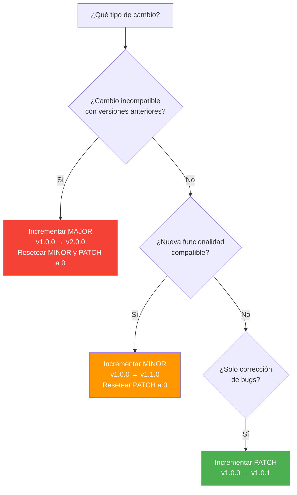

## 3.6. SSH Keys

> 💡 **Metáfora:** SSH Keys son como una llave maestra que abre la puerta de tu casa sin necesitar contraseña cada vez. Generas un par de llaves: una pública (que dejas en la recepción de GitHub) y una privada (que guardas en tu casa, tu PC). Cuando llegas a la puerta de GitHub, ellos reconocen tu llave privada y te dejan pasar sin pedirte usuario ni contraseña.

### 3.6.1. Generar Clave SSH

```bash
# Generar nueva clave SSH
ssh-keygen -t ed25519 -C "tu.email@ejemplo.com"

# O RSA si ed25519 no está disponible
ssh-keygen -t rsa -b 4096 -C "tu.email@ejemplo.com"

# Guardar en ubicación por defecto
# ~/.ssh/id_ed25519

# Añadir clave al agente SSH (primero iniciar el agente)
# Linux/Mac
eval "$(ssh-agent -s)"

# Windows (Git Bash)
eval "$(ssh-agent -s)"

# Añadir clave
ssh-add ~/.ssh/id_ed25519
```

**Ejemplo de salida:**

```
$ ssh-keygen -t ed25519 -C "miemail@ejemplo.com"
Generating public/private ed25519 key pair.
Enter file in which to save the key (/c/Users/miusuario/.ssh/id_ed25519): [Enter]
Enter passphrase (empty for no passphrase): [Enter]
Enter same passphrase again: [Enter]
Your identification has been saved in /c/Users/miusuario/.ssh/id_ed25519
Your public key has been saved in /c/Users/miusuario/.ssh/id_ed25519.pub
The key fingerprint is:
SHA256:abc123def456ghi789jkl012mno345pqr678stu901 miemail@ejemplo.com
```

> ⚠️ **NUNCA compartas tu clave privada** (`id_ed25519`). Solo la pública (`.pub`) se sube a GitHub. Es como dar copias de tu llave pública, pero guardar la llave maestra solo para ti.

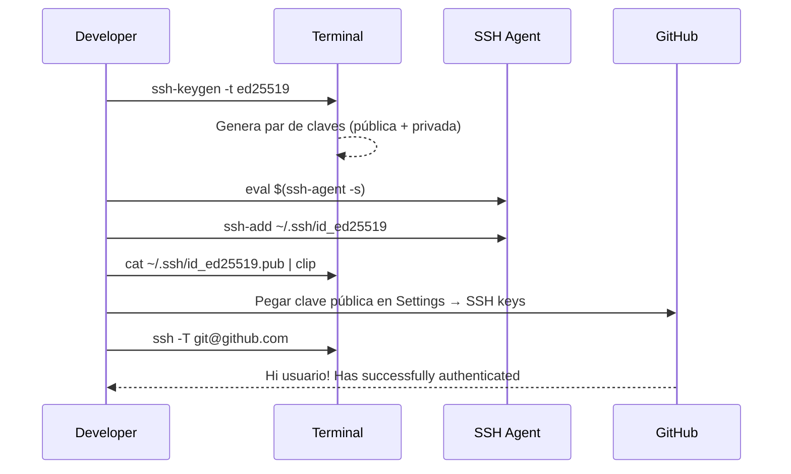

### 3.6.2. Añadir Clave a GitHub

1. Copiar clave pública:
   ```bash
   # Windows (Git Bash)
   cat ~/.ssh/id_ed25519.pub | clip

   # Windows (PowerShell)
   Get-Content ~/.ssh/id_ed25519.pub | Set-Clipboard

   # Linux/Mac
   cat ~/.ssh/id_ed25519.pub | xclip -selection clipboard
   ```

2. Ir a GitHub → Settings → SSH and GPG keys
3. Clic en "New SSH key"
4. Pegar clave y guardar

### 3.6.3. Usar SSH en lugar de HTTPS

```bash
# Ver URL actual del remoto
git remote -v

# Cambiar a SSH
git remote set-url origin git@github.com:usuario/repo.git
```

### 3.6.4. Ventajas y Desventajas: SSH vs HTTPS

| Aspecto | SSH | HTTPS |
|---------|-----|-------|
| **Autenticación** | Llave automática (sin contraseña) | Usuario + contraseña/token cada vez |
| **Velocidad** | Más rápido (sin handshake de autenticación) | Más lento (negociación de credenciales) |
| **Seguridad** | Muy alta (cifrado asimétrico) | Alta (depende del token) |
| **Configuración inicial** | Requiere generar y subir clave SSH | Solo necesitas usuario y contraseña |
| **Firewalls** | Puede estar bloqueado en redes corporativas | Funciona casi siempre |
| **Ideal para** | Uso diario, automación, CI/CD | Acceso rápido, clones temporales |

📌 **Ejemplo real:** Los desarrolladores de Microsoft usan SSH para trabajar en el código de VS Code. Es la forma estándar en entornos profesionales porque evita tener que introducir contraseñas constantemente.

### 3.6.5. Errores Comunes con SSH

| Error | Solución |
|-------|----------|
| `Permission denied (publickey)` | Ejecutar `ssh-add ~/.ssh/id_ed25519` o verificar que la clave está en GitHub |
| `Host key verification failed` | Ejecutar `ssh -T git@github.com` para añadirlo a known_hosts |
| `Bad owner or permissions` | Ajustar permisos del archivo `~/.ssh/config` en tu sistema |

> 🔧 **Truco:** Para verificar que todo funciona, ejecuta `ssh -T git@github.com`. Si ves "Hi usuario! You've successfully authenticated", todo está correcto.

### 3.6.6. .editorconfig: Consistencia en Equipo

> 💡 **Metáfora:** `.editorconfig` es como un **reglamento de estilo** que todos los miembros del equipo firman. Dice: "usamos 4 espacios, UTF-8, y sin espacios al final". Así no importa qué editor uses — el código queda igual.

El archivo `.editorconfig` se coloca en la raíz del repositorio y obliga a todos los editores (Rider, VS Code, IntelliJ) a usar las mismas reglas:

```ini
# Archivo .editorconfig
root = true

[*]
charset = utf-8
end_of_line = lf
indent_style = space
indent_size = 4
insert_final_newline = true
trim_trailing_whitespace = true

[*.cs]
indent_size = 4

[*.{js,ts,html,css}]
indent_size = 2

[*.{json,yml,yaml}]
indent_size = 2

[*.md]
trim_trailing_whitespace = false

[*.sln]
indent_style = tab

[*.csproj]
indent_size = 2
```

📌 **Ejemplo real:** En equipos de 10+ desarrolladores, sin `.editorconfig` cada uno formatea el código de forma diferente. El resultado: diffs enormes que solo cambian espacios. Con `.editorconfig`, los diffs solo muestran cambios reales.

> 🔗 **Conexión:** `.editorconfig` complementa `.gitignore`. Mientras `.gitignore` dice qué archivos NO subir, `.editorconfig` dice CÓMO formatear los archivos que SÍ subes.

## 3.7. Resumen de Comandos Remotos

```bash
# Ver remotos
git remote -v

# Añadir remoto
git remote add origin url

# Eliminar remoto
git remote remove origin

# Traer sin fusionar
git fetch origin

# Traer y fusionar
git pull origin main

# Subir cambios
git push origin main

# Subir tags
git push origin --tags

# Clonar
git clone url

# Cambiar URL del remoto
git remote set-url origin nueva-url

# Ver ramas remotas
git branch -r

# Ver todas las ramas (locales + remotas)
git branch -a

# Limpiar ramas remotas obsoletas
git remote prune origin
```

## 3.8. Workflow Remoto Completo

```bash
# 1. Clonar repositorio
git clone https://github.com/usuario/proyecto.git
cd proyecto

# 2. Crear rama para trabajo
git checkout -b feature/nueva-funcionalidad

# 3. Trabajar y hacer commits
git add .
git commit -m "feat: añadir nueva funcionalidad"

# 4. Subir rama
git push -u origin feature/nueva-funcionalidad

# 5. Actualizar con cambios de otros
git fetch origin
git pull origin main

# 6. Ver diferencias antes de pull
git fetch origin
git diff main origin/main
```

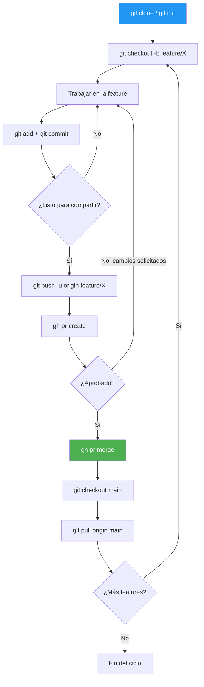

**Resumen del punto:**

| Concepto | Descripción |
|----------|-------------|
| **Git** | Herramienta de control de versiones (local) |
| **GitHub** | Plataforma de hosting para repositorios Git (remoto) |
| **origin** | Nombre por defecto del repositorio remoto |
| **push** | Sube commits del repositorio local al remoto |
| **fetch** | Descarga cambios del remoto sin fusionarlos |
| **pull** | Descarga y fusiona cambios del remoto (fetch + merge) |
| **SSH** | Protocolo de autenticación segura sin contraseñas |
| **Tags** | Marcadores para versiones (v1.0.0, v2.1.3) |

## 3.9. GitHub Pages

> 💡 **Metáfora:** GitHub Pages es como tener tu propia tienda online gratis. Subes tus archivos web (HTML, CSS, JavaScript) a un repositorio y GitHub los publica automáticamente en una URL como `https://tuusuario.github.io/mi-proyecto`.

📌 **Ejemplo real:** Netflix, Google y miles de empresas usan GitHub Pages para documentación de proyectos open source. Es la forma más rápida de desplegar un portfolio de desarrollo web.

### 3.9.1. Configurar GitHub Pages

1. Ir al repositorio en GitHub → **Settings** → **Pages**
2. En **Source**, seleccionar la rama (`main` o `gh-pages`) y la carpeta (`/` o `/docs`)
3. Guardar — GitHub genera una URL pública en unos segundos

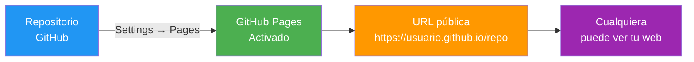

### 3.9.2. Estructura de un Proyecto para GitHub Pages

```
mi-proyecto/
├── index.html          # Página principal (obligatoria)
├── style.css           # Estilos
├── script.js           # JavaScript
├── images/             # Imágenes
└── README.md           # Descripción del proyecto
```

> ⚠️ **Importante:** GitHub Pages solo sirve archivos **estáticos** (HTML, CSS, JS). No ejecuta C#, Python ni bases de datos. Para proyectos .NET, usa Azure o Docker.

### 3.9.3. Desplegar desde una Rama

```bash
# Crear rama gh-pages
git checkout -b gh-pages

# Añadir archivos web
git add index.html style.css script.js
git commit -m "feat: añadir página web"

# Subir a GitHub
git push -u origin gh-pages

# Volver a main
git checkout main
```

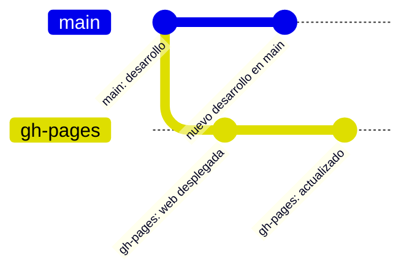

### 3.9.4. Desplegar con GitHub Actions (Automático)

Crea el archivo `.github/workflows/deploy.yml`:

```yaml
name: Desplegar a GitHub Pages

on:
  push:
    branches: [main]

jobs:
  deploy:
    runs-on: ubuntu-latest
    steps:
      - uses: actions/checkout@v4
      - uses: actions/configure-pages@v4
      - uses: actions/upload-pages-artifact@v3
        with:
          path: '.'
      - uses: actions/deploy-pages@v4
```

> 💡 **Consejo:** Con Actions, cada vez que haces push a `main`, tu web se despliega automáticamente. No tienes que hacer nada manual.

> 🔗 **Conexión:** GitHub Pages se conecta directamente con los Actions que verás en la UD04 de Colaboración. Cada push a `main` activa el workflow de despliegue.

En el siguiente punto veremos Pull Requests, Forks y colaboración: cómo proponer cambios en proyectos de otros, revisar código y trabajar en equipo de forma profesional.

---

## Ejercicio Rápido: La Cafetería en la Nube

> 📝 **Escenario:** Tienes un proyecto local para gestionar una cafetería (`cafeteria-web`). Quieres subirlo a GitHub y configurar SSH para no escribir la contraseña cada vez.

**Pasos:**

1. **Crear repositorio en GitHub:**
   - Ve a GitHub → "+" → "New repository"
   - Nómbralo `cafeteria-web`, selecciónalo como público
   - Añade README y .gitignore para .NET

2. **Conectar el repositorio local:**
   ```bash
   cd cafeteria-web
   git init
   git add .
   git commit -m "feat: estructura inicial de la web de la cafetería"
   git remote add origin https://github.com/TU-USUARIO/cafeteria-web.git
   git push -u origin main
   ```

3. **Configurar SSH:**
   ```bash
   # Generar clave
   ssh-keygen -t ed25519 -C "tu.email@ejemplo.com"

   # Copiar clave pública (Windows PowerShell)
   Get-Content ~/.ssh/id_ed25519.pub | Set-Clipboard

   # Pegar en GitHub → Settings → SSH and GPG keys → New SSH key

   # Cambiar URL del remoto a SSH
   git remote set-url origin git@github.com:TU-USUARIO/cafeteria-web.git

   # Verificar
   ssh -T git@github.com
   ```

4. **Probar que funciona:**
   ```bash
   # Ahora push sin pedir contraseña
   echo "# Menú de hoy" >> README.md
   git add README.md
   git commit -m "docs: añadir sección de menú"
   git push
   ```

> 💡 **Consejo:** Si `ssh -T git@github.com` funciona, ya no necesitas escribir tu contraseña nunca más para hacer push.
