- [4. Colaboración](#4-colaboración)
  - [4.1. Pull Requests (PR)](#41-pull-requests-pr)
    - [4.1.1. Flujo de una Pull Request](#411-flujo-de-una-pull-request)
    - [4.1.2. Componentes de una PR](#412-componentes-de-una-pr)
    - [4.1.3. Crear una PR desde Terminal](#413-crear-una-pr-desde-terminal)
    - [4.1.4. Buenas Prácticas para PRs](#414-buenas-prácticas-para-prs)
  - [4.2. Fork (Bifurcación)](#42-fork-bifurcación)
    - [4.2.1. Flujo de Trabajo con Fork](#421-flujo-de-trabajo-con-fork)
    - [4.2.2. Configurar Fork](#422-configurar-fork)
    - [4.2.3. Mantener Fork Actualizado](#423-mantener-fork-actualizado)
    - [4.2.4. Flujo Completo: Dos Usuarios Colaborando](#424-flujo-completo-dos-usuarios-colaborando-ejemplo-práctico)
  - [4.3. Code Review (Revisión de Código)](#43-code-review-revisión-de-código)
    - [4.3.1. Beneficios del Code Review](#431-beneficios-del-code-review)
    - [4.3.2. Proceso de Revisión](#432-proceso-de-revisión)
    - [4.3.3. Comentarios en Revisiones](#433-comentarios-en-revisiones)
    - [4.3.4. Ser un Buen Revisor](#434-ser-un-buen-revisor)
    - [4.3.5. Ser un Buen Autor](#435-ser-un-buen-autor)
  - [4.4. GitHub Actions (CI/CD)](#44-github-actions-cicd)
    - [4.4.1. Comandos para GitHub CLI](#441-comandos-para-github-cli)
  - [4.5. Issues y Projects](#45-issues-y-projects)
    - [4.5.1. Issues](#451-issues)
    - [4.5.2. Projects](#452-projects)
  - [4.6. Convenciones de Mensajes](#46-convenciones-de-mensajes)
    - [4.6.1. Formato Convencional](#461-formato-convencional)
    - [4.6.2. Tipos Comunes](#462-tipos-comunes)
    - [4.6.3. Ejemplos](#463-ejemplos)


# 4. Colaboración

> 💡 **Punto de partida:** ¿Alguna vez has trabajado en un documento con varios compañeros y al final nadie sabe cuál es la versión correcta? En software, esto es un desastre. Git y GitHub resuelven ese problema con Pull Requests, Forks y Code Review.

> 💡 **¿Por qué me importa?**
> El desarrollo profesional es siempre un trabajo en equipo. Saber colaborar con Pull Requests, revisar código y mantener un historial limpio es tan importante como escribir buen código. Es lo que separa a un desarrollador junior de uno senior.
> 
> 🔗 **Conexión con otros puntos:** El Punto 03 viste GitHub y los repositorios remotos. Este punto verás Pull Requests, Forks, Code Review y CI/CD. El Punto 05 verás las herramientas que facilitan toda esta colaboración.

En el Punto 03 vimos GitHub y los repositorios remotos: cómo subir código, clonar proyectos y sincronizar cambios. Ahora veremos Pull Requests, Forks, Code Review y GitHub Actions: las herramientas que hacen posible el desarrollo colaborativo profesional.

**Objetivos de aprendizaje:**

- Crear y gestionar Pull Requests
- Entender el flujo de trabajo con Forks
- Aplicar buenas prácticas de Code Review
- Configurar pipelines básicos de CI/CD con GitHub Actions
- Gestionar Issues y Projects en GitHub
- Aplicar convenciones de mensajes de commit

El trabajo en equipo en Git requiere procesos claros de comunicación, revisión de código y gestión de contribuciones.

## 4.1. Pull Requests (PR)

Una **Pull Request** es una herramienta de comunicación fundamental en el desarrollo colaborativo. Se utiliza para proponer cambios, explicar el trabajo y solicitar revisión antes de fusionar.

> **📝 ¿Por qué se llama "Pull"?** Porque literalmente le pides al proyecto que "tire" (pull) de tus cambios.

> 💡 **Metáfora: La Pull Request como "sugerencia de cambios"**
> Imagina que estás en la oficina y escribes una nota que pones en la puerta de tu compañero: *"Oye, he pensado que si cambiamos esto en el código, quedaría mejor. ¿Qué te parece?"*. Eso es exactamente una Pull Request: **no borras ni cambias nada directamente**, sino que propones una idea y esperas a que alguien la revise, comente y finalmente acepte o rechace la propuesta. Es como dejar un post-it en el código de otro: "Hey, ¿y si lo hiciéramos así?"

📌 **Ejemplo real:** En GitHub, cuando un desarrollador quiere añadir una funcionalidad a un proyecto open source como React, crea una Pull Request. Los mantenedores del proyecto revisan el código, sugieren cambios y finalmente deciden si lo integran o no. Nadie modifica el código directamente en `main`.

**Ventajas de las Pull Requests:**

| Ventaja | Descripción |
|---------|-------------|
| **Revisión previa** | El código se revisa antes de fusionarse, evitando errores en producción |
| **Historial claro** | Cada PR documenta qué se cambió, por qué y quién lo revisó |
| **Colaboración** | Facilita el debate y la mejora del código entre varios desarrolladores |
| **Control de calidad** | Se pueden ejecutar tests automáticos antes de aceptar cambios |
| **Trazabilidad** | Si algo sale después, puedes rastrear qué PR lo introdujo |

**Inconvenientes de las Pull Requests:**

| Inconveniente | Descripción |
|---------------|-------------|
| **Retrasos** | Si el revisor está ocupado, el PR puede quedarse días sin atención |
| **Overhead** | Para cambios pequeños (un typo), crear un PR puede ser demasiado burocrático |
| **Conflictos** | Si otros cambios se fusionan mientras esperas, pueden aparecer conflictos |
| **Dependencia** | Necesitas que alguien más revise tu código; no puedes avanzar solo |
| **Rituales innecesarios** | En equipos pequeños, a veces se abusa del proceso para cambios triviales |

### 4.1.1. Flujo de una Pull Request

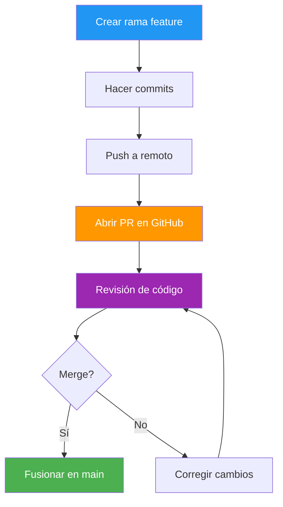

**Flujo visual con gitGraph:**

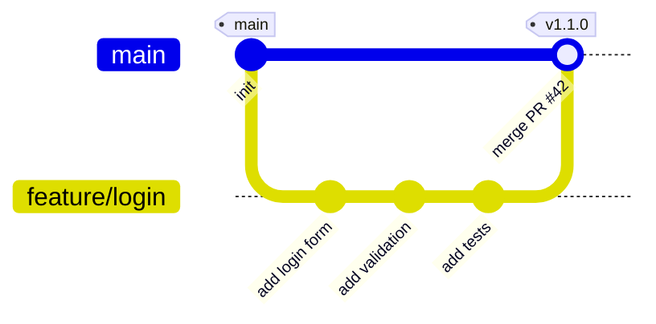

> 📝 **Nota:** En el diagrama anterior puedes ver cómo la rama `feature/login` se crea desde `main`, se trabaja en ella con varios commits, y finalmente se fusiona de vuelta a `main` mediante una PR.

### 4.1.2. Componentes de una PR

| Elemento | Descripción | Ejemplo |
|----------|-------------|---------|
| **Título** | Resumen claro del cambio | "Añadida autenticación OAuth2" |
| **Descripción** | Contexto y motivación | "Implementa login con Google..." |
| **Cambios** | Archivos modificados | 3 archivos, +150 líneas |
| **Revisiones** | Comentarios de revisores | "LGTM", "Cambia esto..." |
| **Checks** | Tests automatizados | ✅ CI passing |

### 4.1.3. Crear una PR desde Terminal

```bash
# 1. Crear y cambiar a nueva rama
git checkout -b feature/nuevo-login

# 2. Hacer cambios y commits
git add .
git commit -m "feat: añadir función de login"

# 3. Subir al remoto
git push -u origin feature/nuevo-login

# 4. Ir a GitHub y crear PR manualmente
# O usar GitHub CLI:
gh pr create --title "feat: login" --body "Implementación..."
```

### 4.1.4. Buenas Prácticas para PRs

> 💡 **Metáfora: Las buenas prácticas como "protocolo de un restaurante"**
> Imagina que trabajas en un restaurante. Antes de servir un plato, revisas que los ingredientes estén frescos (revisión independiente), preparas solo lo necesario para un comensal (PR pequeña), pones el nombre correcto en la carta (título descriptivo), y anotas cada paso de la receta (commits claros). Si saltas alguno de estos pasos, el plato puede salir mal. Con las PRs pasa igual: **seguir un protocolo claro evita errores costosos**.

- **Revisión Independiente**: Antes de crear una PR, revisa tu propio código
  > 💡 *Como un escritor que relee su propio capítulo antes de enviarlo al editor. Si detectas errores tontos antes, el revisor se enfocará en mejorar la lógica, no en corregir faltas de ortografía.*

- **PRs pequeñas**: Más fáciles de revisar
  > 💡 *Es como guardar los deberes en una mochila: si metes todo en un solo saco, el profesor no sabe qué es qué. Si separas por temas, cada uno se revisa rápido. Una PR de 500 líneas es un dolor de cabeza; una de 50 líneas es un placer de revisar.*

- **Títulos descriptivos**: Indicar claramente el propósito
  > 💡 *En vez de poner "cambios" como título de un documento, pon "Añadida validación del formulario de registro". Así el revisor sabe exactamente qué esperar antes de abrir la PR.*

- **Commits claros**: Cada commit debe tener sentido independiente
  > 💡 *Cada commit es como un paso de una receta de cocina: "Cortar la cebolla", "Sofreír la carne", "Añadir especias". Si pones todo junto ("Hacer la cena"), nadie entiende qué hiciste en cada momento.*

> ⚠️ **Error común:** Crear una PR con un solo commit que dice "fix" o "update". Esto no le dice nada al revisor sobre qué se cambió ni por qué. Siempre describe el contexto.

> 📝 **Plantilla de PR profesional:**
> ```
> ## Descripción
> [Explica qué cambios hiciste y por qué]
>
> ## Tipo de cambio
> - [ ] Corrección de bug
> - [ ] Nueva funcionalidad
> - [ ] Cambio breaking
>
> ## Tests
> - [ ] Tests pasaron localmente
> - [ ] Añadidos nuevos tests
>
> ## Checklist
> - [ ] Mi código sigue las guías de estilo
> - [ ] He revisado mi propio código
> - [ ] He documentado mi código
> ```

### 4.1.5. Branch Protection Rules

> 💡 **Metáfora:** Branch protection es como poner un **semáforo en la entrada de main**. Nadie puede entrar directamente — tiene que pasar por el control de calidad (PR, revisiones, tests).

**¿Qué es?** Son reglas que obligan a que ciertos requisitos se cumplan antes de poder fusionar código en ramas protegidas (normalmente `main`). Sin branch protection, las Pull Requests son solo una recomendación opcional.

**Reglas más habituales:**

| Regla | ¿Qué protege? |
|-------|----------------|
| **Require PR** | Nadie escribe directamente en main |
| **Require approvals** | Al menos 1 persona revisa el código |
| **Require status checks** | El código compila y pasa tests |
| **Prohibit force push** | No se puede sobrescribir historial |

**Cómo configurarlo:** Ir a tu repositorio → **Settings** → **Branches** → **"Add branch protection rule"** → Escribir `main` → Activar las reglas deseadas.

📌 **Ejemplo real:** En Telefónica, las reglas de branch protection son obligatorias en todos los proyectos. Sin PR aprobado y tests pasados, el merge es imposible.

## 4.2. Fork (Bifurcación)

Un **Fork** consiste en crear una copia de un repositorio existente en tu propia cuenta de GitHub.

> **💡 Analogía:** Fork es como fotocopiar un libro entero. El libro original sigue intacto, tú tienes tu propia copia.

> 💡 **Metáfora ampliada: El Fork como "fotocopiar el libro de la biblioteca para anotar en tu copia sin ensuciar el original"**
> Imagina que vas a la biblioteca y encuentras un libro que te encanta, pero quieres hacer anotaciones en los márgenes. No puedes escribir en el libro original porque no es tuyo y otros lo necesitan. Así que **sac photocopiadora y haces una copia completa**. Ahora tienes tu propio libro donde puedes subrayar, anotar, tachar y mejorar sin tocar el original. Cuando termines, puedes proponer a la biblioteca que incluya tus mejoras en el libro original. **Eso es un Fork**: tu copia personal donde puedes trabajar libremente.

📌 **Ejemplo real:** Cuando un desarrollador quiere contribuir a Linux o a React, primero hace un fork del repositorio. Trabaja en su copia, y cuando tiene algo listo, envía una Pull Request al proyecto original para que lo revisen.

**Ventajas del Fork:**

| Ventaja | Descripción |
|---------|-------------|
| **Libertad total** | Puedes modificar cualquier cosa sin afectar al original |
| **Sin permisos** | No necesitas ser colaborador del proyecto para contribuir |
| **Experimentación** | Puedes probar ideas locas sin riesgo |
| **Contribución open source** | Es el flujo estándar para contribuir a proyectos públicos |
| **Historial propio** | Tu fork tiene su propio historial de commits |

**Inconvenientes del Fork:**

| Inconveniente | Descripción |
|---------------|-------------|
| **Desactualización** | Si no sincronizas, tu fork se queda atrás respecto al original |
| **Complejidad** | Hay más pasos que con una rama: fork, clone, upstream, PR... |
| **Confusión de remotos** | Puedes confundir `origin` (tu fork) con `upstream` (el original) |
| **Mantenimiento** | Tienes que cuidar dos repositorios: tu fork y el original |
| **Conflictos de merge** | Si el original avanza mucho, puedes tener muchos conflictos al sincronizar |

### 4.2.1. Flujo de Trabajo con Fork

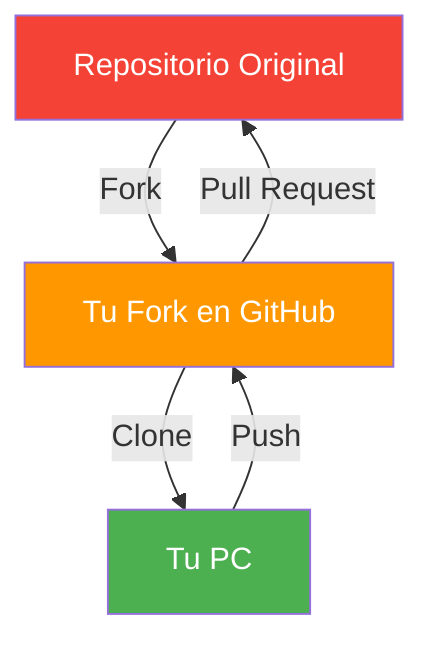

**Flujo visual con gitGraph:**

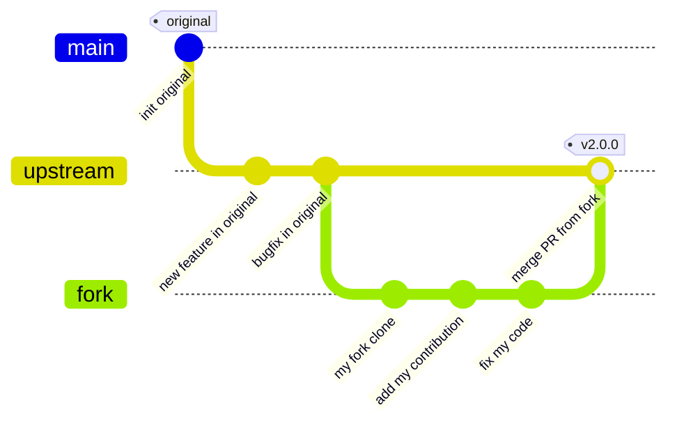

> 📝 **Nota:** En el diagrama se ve cómo el repositorio original (`upstream`) avanza con sus propios commits, mientras que tu fork (`fork`) crea su propio historial. Cuando tu contribución está lista, se propone una PR para fusionar tu trabajo en el original.

### 4.2.2. Configurar Fork

```bash
# 1. Clonar tu fork
git clone https://github.com/tu-usuario/fork.git

# 2. Añadir remoto original (upstream)
git remote add upstream https://github.com/original/repo.git

# 3. Ver remotos configurados
git remote -v
# origin    https://github.com/tu-usuario/fork.git (fetch)
# origin    https://github.com/tu-usuario/fork.git (push)
# upstream  https://github.com/original/repo.git (fetch)
# upstream  https://github.com/original/repo.git (push)
```

### 4.2.3. Mantener Fork Actualizado

> 💡 **Metáfora: El upstream como "la fuente original del agua"**
> Imagina que tu fork es un estanque alimentado por una fuente de montaña (el repositorio original). Si la fuente sigue manando agua limpia pero tu estanque no recibe nada, pronto tendrás agua estancada y sucia. **Mantener el fork actualizado es como abrir la compuerta para que el agua fresca de la fuente entre en tu estanque**. Si no lo haces regularmente, tu copia se queda "pocha" y cuando quieras contribuir, tendrás mil conflictos.

```bash
# Traer cambios del original (sin fusionar aún)
git fetch upstream

# Fusionar a tu main
git checkout main
git merge upstream/main

# Subir a tu fork
git push origin main

# Flujo completo recomendado
git checkout main
git fetch upstream
git merge upstream/main
git push origin main
```

**Flujo visual del fork actualizado:**

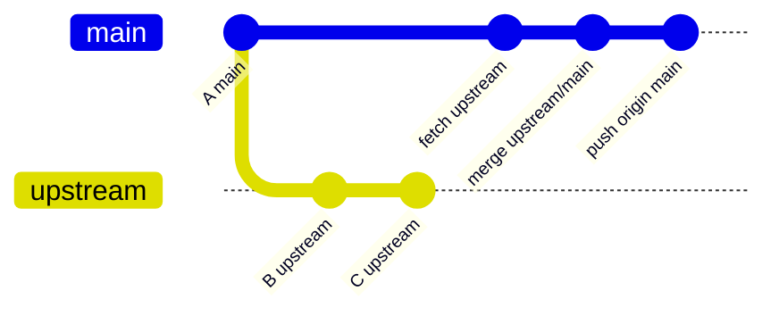

> ⚠️ **Errores comunes al mantener el fork actualizado:**
>
> 1. **Olvidarse de sincronizar**: Si no ejecutas `git fetch upstream` regularmente, tu fork se queda atrás y al enviar una PR tendrás conflictos enormes.
>
> 2. **Trabajar directamente en `main`**: Si modificas `main` en tu fork y luego intentas sincronizar con `upstream/main`, tendrás conflictos. **Siempre trabaja en ramas feature**, nunca en `main` directamente.
>
> 3. **Confundir `origin` con `upstream`**: `origin` es TU fork, `upstream` es el ORIGINAL. Si ejecutas `git pull upstream main` pensando que es tu fork, sobrescribirás tu copia con los cambios del original.
>
> 4. **No hacer push después de sincronizar**: Si haces `git merge upstream/main` pero olvidas `git push origin main`, tu fork en GitHub no se actualiza. El cambio solo queda en tu PC.

> 💡 **Truco:** Programa un recordatorio semanal para sincronizar tu fork. Es como regar las plantas: si lo haces regularmente, todo crece mejor.

### 4.2.4. Flujo Completo: Dos Usuarios Colaborando (Ejemplo Práctico)

Vamos a ver **todos los comandos** del flujo completo de colaboración entre dos desarrolladores: **Ana** (contribuidora) y **Carlos** (mantenedor del repositorio original).

> 💡 **Escenario:** Carlos tiene un repositorio `proyecto-web`. Ana quiere contribuir corrigiendo un bug. Usa `gh` CLI para todo.

---

#### Paso 1: Ana — Configuración Inicial

```bash
# 1. Autenticarse en GitHub CLI
gh auth login
# Seleccionar: GitHub.com → HTTPS → Login con navegador

# 2. Verificar autenticación
gh auth status

# 3. Hacer fork del repositorio de Carlos
gh repo fork carlos/proyecto-web --clone
# Esto clona el fork Y configura el remoto upstream automáticamente

# 4. Verificar remotos configurados
git remote -v
# origin    https://github.com/ana/proyecto-web.git (fetch)
# origin    https://github.com/ana/proyecto-web.git (push)
# upstream  https://github.com/carlos/proyecto-web.git (fetch)
# upstream  https://github.com/carlos/proyecto-web.git (push)
```

#### Paso 2: Ana — Crear Rama y Hacer Cambios

```bash
# 1. Asegurarse de estar en main actualizado
git checkout main
git fetch upstream
git merge upstream/main
git push origin main

# 2. Crear rama para la corrección
git checkout -b fix/corregir-login

# 3. Hacer los cambios (editar archivos)
# ... editar src/ServicioLogin.cs ...

# 4. Ver qué archivos cambiaron
git status
git diff

# 5. Añadir y commitear
git add src/ServicioLogin.cs
git commit -m "fix(auth): corregir validación de password vacío

- Añadir validación de null antes de calcular hash
- Fixes #42"

# 6. Subir la rama a su fork
git push -u origin fix/corregir-login
```

#### Paso 3: Ana — Crear Pull Request

```bash
# 1. Crear PR directamente desde consola
gh pr create \
  --title "fix(auth): corregir validación de password vacío" \
  --body "## Descripción
Corrige el bug #42 donde un password vacío causaba excepción.

## Cambios
- Añadida validación de null en \`ServicioLogin.cs\`
- Añadido test para password vacío

## Testing
- [x] Tests pasan localmente
- [x] Añadido test nuevo

Fixes #42" \
  --reviewer carlos

# 2. Ver la PR creada
gh pr view
# Salida:
# fixes #42 by ana in #87
# Reviewers: @carlos
```

#### Paso 4: Carlos — Recibir Notificación y Revisar

```bash
# 1. Carlos ve las PRs pendientes
gh pr list
# Salida:
# #87  fix(auth): corregir validación...  fix/corregir-login  [Review required]

# 2. Carlos ve el detalle de la PR
gh pr view 87

# 3. Carlos ve los cambios (diff)
gh pr diff 87
# Salida:
# diff --git a/src/ServicioLogin.cs b/src/ServicioLogin.cs
# --- a/src/ServicioLogin.cs
# +++ b/src/ServicioLogin.cs
# @@ -10,6 +10,9 @@
#  public bool IniciarSesion(string usuario, string password)
#  {
# +    if (string.IsNullOrEmpty(usuario) || string.IsNullOrEmpty(password))
# +        return false;
# +
#      var hash = CalcularHash(password);
#      return BaseDatos.Verificar(usuario, hash);
#  }

# 4. Carlos ve el estado de CI/CD
gh pr checks 87
# Salida:
# ✓ build    Successful in 45s
# ✓ tests    Successful in 1m 20s

# 5. Carlos hace comentarios en la PR (abre el navegador)
gh pr view 87 --web
```

#### Paso 5: Carlos — Aprobar o Solicitar Cambios

```bash
# OPCIÓN A: Aprobar la PR
gh pr review 87 --approve --body "¡Buen fix! La validación está correcta."

# OPCIÓN B: Solicitar cambios
gh pr review 87 --request-changes --body "Falta añadir el test para password vacío. Por favor, añade el test en LoginTests.cs"

# Si pidió cambios, Ana los hace y vuelve a subir
git add tests/LoginTests.cs
git commit -m "test(auth): añadir test para password vacío"
git push origin fix/corregir-login
# La PR se actualiza automáticamente con el nuevo commit
```

#### Paso 6: Carlos — Fusionar la PR

```bash
# 1. Fusionar la PR (después de aprobar)
gh pr merge 87 --squash --body "Merge: fix(auth): corregir validación de password vacío"

# 2. Verificar que se fusionó
gh pr list --state merged
# Salida:
# #87  fix(auth): corregir validación...  fix/corregir-login  Merged

# 3. Eliminar la rama remota (se hace automáticamente con squash)
gh pr close 87  # Solo si no se fusionó aún
```

**Flujo visual del squash merge:**

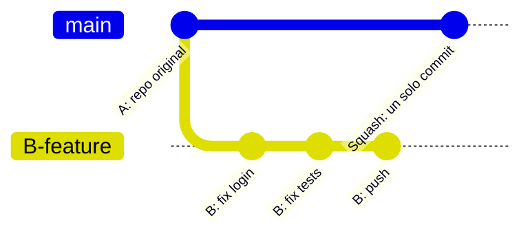

#### Paso 7: Ana — Sincronizar su Fork

```bash
# 1. Volver a main
git checkout main

# 2. Traer cambios del upstream (que ya incluye su PR fusionada)
git fetch upstream
git merge upstream/main

# 3. Subir a su fork
git push origin main

# 4. Eliminar la rama local ya fusionada
git branch -d fix/corregir-login

# 5. Verificar que todo está limpio
git status
# On branch main
# nothing to commit, working tree clean
```

**Flujo visual de la sincronización del fork:**

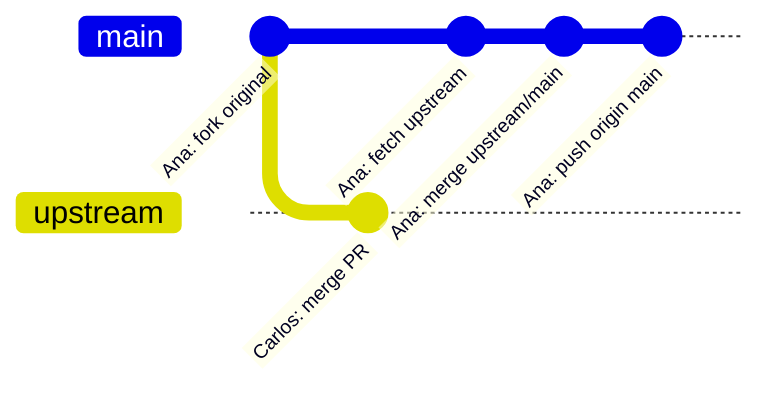

**Flujo visual completo con gitGraph:**

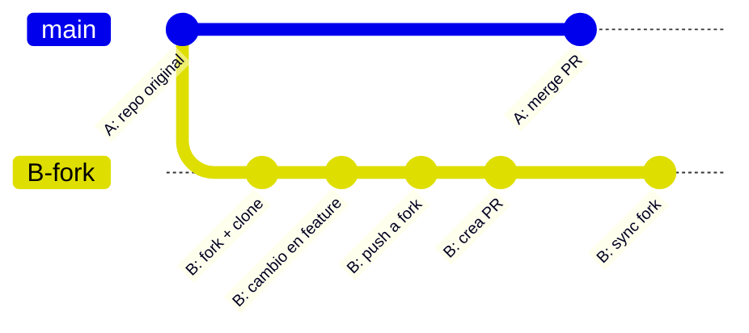

---

#### Resumen Visual del Flujo

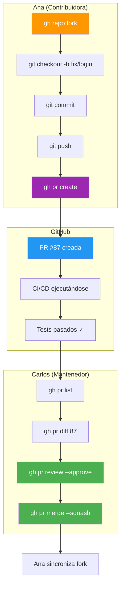

📌 **Ejemplo real:** Este flujo exacto es el que usan miles de desarrolladores en proyectos open source como React, Vue, .NET y Linux. La diferencia es que en empresas privadas, `upstream` suele ser el repositorio de la empresa y no necesitas hacer fork — trabajas directamente en ramas del repositorio original.

> 🔧 **Truco:** Si trabajas en la misma empresa que Carlos (mismo repositorio, no fork), el flujo se simplifica: no necesitas `upstream`, solo `git checkout -b fix/login`, `git push origin fix/login` y `gh pr create`.

> 💡 **Diferencia clave Fork vs Mismo Repositorio:**
> - **Fork**: `origin` = tu copia, `upstream` = original. Necesitas sincronizar.
> - **Mismo repo**: Solo `origin`. Creas rama, push y PR directamente.

## 4.3. Code Review (Revisión de Código)

La revisión de código es una práctica donde otros desarrolladores examinan tu código antes de fusionarlo.

> 💡 **Metáfora: El Code Review como "lector de libros antes de publicar"**
> Imagina que eres escritor y acabas de terminar una novela. Antes de que salga a la venta, un editor (o varios) leen el manuscrito, buscan errores de coherencia, sugieren mejorar diálogos, señalan párrafos confusos y verifican que la gramática sea correcta. **El code review es exactamente eso**: otro desarrollador lee tu código como si fuera un manuscrito, busca bugs, sugiere mejoras y verifica que cumple los estándares del equipo. No es una crítica personal, es una colaboración para que el producto final sea mejor.

📌 **Ejemplo real:** En empresas como Google o Microsoft, todo código pasa por code review antes de integrarse. Un desarrollador senior revisa el código del junior, comenta en líneas específicas y pide cambios si es necesario. Es como un profesor que corrige un examen: señala los errores, explica por qué están mal y te ayuda a mejorar.

**Ventajas del Code Review:**

| Ventaja | Descripción |
|---------|-------------|
| **Detección temprana de bugs** | Errores que el autor no ve, el revisor los detecta antes de producción |
| **Aprendizaje compartido** | El junior aprende del senior y viceversa |
| **Consistencia del código** | Se mantienen estándares de estilo y arquitectura |
| **Documentación viva** | La PR documenta qué se cambió y por qué |
| **Menor bus factor** | Si el autor se va del equipo, otros ya conocen su código |

**Inconvenientes del Code Review:**

| Inconveniente | Descripción |
|---------------|-------------|
| **Retrasos en el flujo** | Si el revisor está ocupado, el código queda bloqueado |
| **Subjetividad** | A veces las opiniones sobre estilo son discusiones eternas |
| **Rechazo doloroso** | Para desarrolladores junior, recibir muchas críticas puede frustrar |
| **Overhead burocrático** | Para cambios pequeños, el proceso puede ser innecesariamente largo |
| **Dependencia** | Necesitas que otros tengan tiempo para revisar tu código |

> ⚠️ **Errores comunes en Code Review:**
>
> 1. **Revisar solo la sintaxis**: No te limites a buscar faltas de ortografía. Revisa la lógica, la arquitectura y las posibles consecuencias.
>
> 2. **Ser demasiado crítico**: Si todo son comentarios negativos, el autor se frustra. Busca también lo positivo: *"Buen uso del patrón Strategy aquí"*.
>
> 3. **No explicar el "por qué"**: Decir *"Cambia esto"* sin explicar por qué no ayuda al autor a aprender. Siempre acompaña el comentario con la razón.
>
> 4. **Revisión superficial**: Si solo miras el diff sin ejecutar el código mentalmente, puedes pasar por alto bugs lógicos.
>
> 5. **Demorar la revisión**: Un PR que lleva 3 días esperando revisión frustra al autor y puede causar conflictos. Revisa en un plazo razonable.

### 4.3.2. Proceso de Revisión

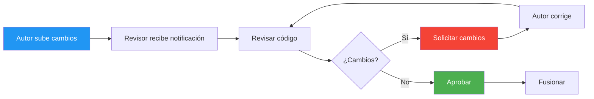

### 4.3.3. Comentarios en Revisiones

| Tipo | Símbolo | Significado |
|------|---------|-------------|
| **Suggestion** | 💡 | Mejora sugerida |
| **Question** | ❓ | Duda o aclaración |
| **Blocking** | 🔴 | Debe resolverse antes de merge |
| **Nitpick** | 📝 | Detalle menor, opcional |
| **Approval** | ✅ | Aprobado |

### 4.3.4. Ser un Buen Revisor

- **Ser constructivo**: Enfocado en el código, no en la persona
- **Explicar el "por qué"**: No solo qué cambiar, sino por qué
- **Ser específico**: Señalar líneas exactas
- **Aprobar rápidamente**: Si está bien, no demorar
- **Separar opiniones**: Estilo vs. funcionalidad

### 4.3.5. Ser un Buen Autor

- **Pequeñas PRs**: Más fáciles de revisar
- **Descripción clara**: Explicar qué y por qué
- **Contextualizar**: Añadir capturas o enlaces
- **Responder**: No tomar críticas como personales
- **Auto-revisar**: Revisa antes de enviar

### 4.3.6. CODEOWNERS: Revisores Automáticos

> 💡 **Metáfora:** CODEOWNERS es como un **sistema de asignación automática**. Cuando alguien toca un archivo, Git sabe automáticamente quién es el "dueño" y le pide revisión.

El archivo `.github/CODEOWNERS` define qué persona o equipo es responsable de qué archivos:

```gitignore
# Archivo .github/CODEOWNERS
*.cs @equipo-backend
/docs/ @equipo-docs
*.csproj @joseluis
```

Cuando un PR modifica un archivo con un owner asignado, GitHub solicita revisión automáticamente. Si tienes branch protection configurado, el PR no se puede mergear sin la aprobación del owner.

📌 **Ejemplo real:** En empresas como Microsoft, cada archivo del código fuente de VS Code tiene un CODEOWNERS asignado. Cuando alguien modifica el core, el equipo correspondiente recibe una notificación automática para revisar.

## 4.4. GitHub Actions (CI/CD)

> 💡 **Metáfora: CI/CD como "asistente automático que revisa tu trabajo"**
> Imagina que cada vez que entregas un ejercicio, **un asistente** lo revisa al instante: comprueba que compila, que pasa los tests y que no hay errores de estilo. Si todo está bien, te pone un "Aprobado" automáticamente. Si hay errores, te dice exactamente dónde están. **GitHub Actions es ese asistente**.

📌 **Ejemplo real:** Cuando haces un push a GitHub, ves una bolita verde o roja junto al commit. Esa bolita es GitHub Actions ejecutando los tests automáticamente.

**Conceptos clave:**

| Término | Significado |
|---------|-------------|
| **CI (Continuous Integration)** | Cada cambio se prueba automáticamente |
| **CD (Continuous Delivery)** | El código se publica si pasa las pruebas |
| **Workflow** | Archivo YAML que define qué hacer y cuándo |
| **Trigger** | Evento que activa el workflow (push, PR, etc.) |

**Ejemplo de workflow para .NET:**

```yaml
# .github/workflows/ci.yml
name: CI Pipeline
on:
  push:
    branches: [main]
  pull_request:
    branches: [main]

jobs:
  build-and-test:
    runs-on: ubuntu-latest
    steps:
    - uses: actions/checkout@v4
    - uses: actions/setup-dotnet@v4
      with:
        dotnet-version: '10.0.x'
    - run: dotnet restore
    - run: dotnet build --no-restore
    - run: dotnet test --no-build --verbosity normal
```

> ⚠️ **Errores comunes:** Indentación YAML incorrecta (YAML es sensible a espacios), olvidar `uses: actions/checkout@v4` (sin esto no tienes acceso al código), o versión de SDK incorrecta.

### 4.4.1. Comandos para GitHub CLI

```bash
# Instalar GitHub CLI
# https://cli.github.com/

# Ver workflows
gh workflow list

# Ver runs de workflows
gh run list

# Ver logs de un run
gh run view [run-id] --log

# Re-ejecutar workflow
gh run re-run [run-id]

# Crear y gestionar PRs desde CLI
gh pr create --title "feat: login" --body "Implementación..."
gh pr list
gh pr view [PR-number]
gh pr checkout [PR-number]
gh pr merge [PR-number]              # Merge commit (por defecto)
gh pr merge [PR-number] --squash     # Squash and merge
gh pr merge [PR-number] --rebase     # Rebase and merge
gh pr review [PR-number] --approve   # Aprobar PR
gh pr diff [PR-number]               # Ver cambios de la PR
```

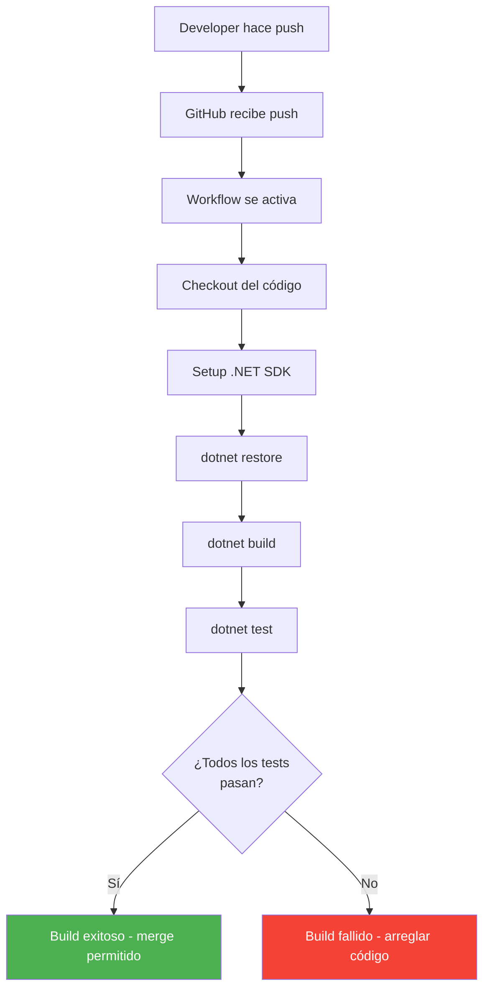

## 4.5. Issues y Projects

> 💡 **Metáfora: Issues como "la lista de la compra del proyecto"**
> Imagina que vas al supermercado. Si no llevas lista, te olvidas de cosas, compras de más y vuelves con la bolsa medio vacía. Pero si llevas una **lista de la compra** bien organizada — *"leche, pan, huevos, tomates"* — sabes exactamente qué necesitas, qué ya tienes y qué te falta. **Las Issues son la lista de la compra de tu proyecto**: cada bug es un artículo, cada nueva funcionalidad es otro, y el tablero de Projects es la lista organizada por secciones (dairy, panadería, verduras...).

📌 **Ejemplo real:** Cuando encuentras un bug en una app como Spotify, puedes ir a su repositorio de GitHub y crear un Issue: *"El botón de play no responde en Safari"*. Los desarrolladores lo revisan, lo clasifican (bug, feature, enhancement) y lo asignan a alguien del equipo.

### 4.5.1. Issues

Los **issues** son para rastrear tareas, bugs y mejoras.

```bash
# Crear issue con GitHub CLI
gh issue create --title "Bug en login" --body "Descripción..."

# Listar issues
gh issue list

# Ver issue específico
gh issue view [issue-number]
```

**Componentes de una Issue:**

| Elemento | Descripción |
|----------|-------------|
| **Título** | Resumen del problema o tarea |
| **Descripción** | Detalles del bug o funcionalidad solicitada |
| **Etiquetas** | `bug`, `feature`, `enhancement`, `help wanted` |
| **Asignado** | Persona responsable de resolverla |
| **Milestone** | Versión o sprint al que pertenece |
| **Comentarios** | Debate entre el reporter y los desarrolladores |

**Ventajas de las Issues:**

| Ventaja | Descripción |
|---------|-------------|
| **Registro centralizado** | Todos los bugs y tareas están en un solo sitio |
| **Colaboración** | Cualquiera puede reportar bugs o sugerir mejoras |
| **Organización** | Las etiquetas y milestones ayudan a priorizar |
| **Trazabilidad** | Puedes vincular issues con PRs para ver qué las resolvió |
| **Transparencia** | En open source, el público puede ver el progreso |

**Inconvenientes de las Issues:**

| Inconveniente | Descripción |
|---------------|-------------|
| **Ruido** | En proyectos grandes, hay muchas issues irrelevantes o duplicadas |
| **Mantenimiento** | Si nadie las cierra, se acumulan como basura |
| **Difícil de priorizar** | Sin un proceso claro, todas parecen urgentes |
| **No sustituyen la comunicación** | Algunos problemas se resuelven mejor hablando directamente |

### 4.5.2. Vincular Issues con PRs

Una de las funciones más útiles de GitHub es **cerrar automáticamente una Issue** cuando se mergea una PR que la resuelve. Para ello, usa palabras clave en la descripción de la PR o en el mensaje de commit:

| Palabra clave | Ejemplo | Resultado |
|---------------|---------|-----------|
| `Fixes #123` | `Fixes #42` | Cierra la Issue #42 al mergear |
| `Closes #123` | `Closes #15` | Cierra la Issue #15 al mergear |
| `Resolves #123` | `Resolves #8` | Cierra la Issue #8 al mergear |

```bash
# En el mensaje de commit
git commit -m "fix(auth): resolve token refresh bug. Fixes #42"

# En la descripción de la PR
## Descripción
Implementa refresh token automático.
Fixes #42
```

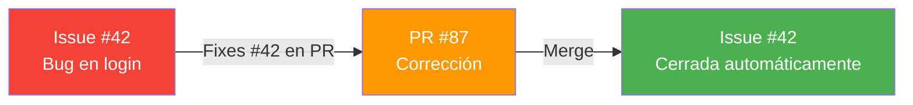

📌 **Ejemplo real:** En el repositorio de C# de Netflix, cada PR que corrige un bug tiene `Fixes #X` en la descripción. Cuando se mergea, la Issue se cierra automáticamente y el equipo sabe exactamente qué PR resolvió qué problema.

> 💡 **Consejo:** Usa `Fixes` en commits y PRs. Es la forma más limpia de mantener Issues y código sincronizados.

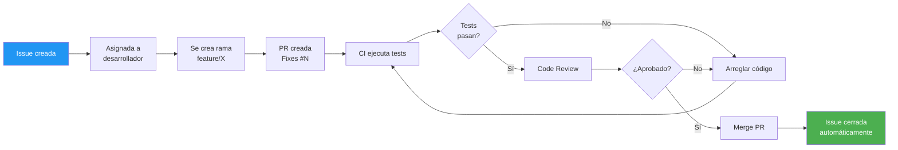

### 4.5.3. Projects

**GitHub Projects** es un tablero kanban para gestionar trabajo.

> 💡 **Metáfora ampliada: Projects como "tablero de recetas de la cocina"**
> Imagina que tienes una cocina profesional. En la pared hay un tablero con tarjetas: "Preparar masa" → "Hornear pastel" → "Decorar". Cada tarjeta es una tarea, y se mueve de izquierda a derecha a medida que avanza. **GitHub Projects es ese tablero de cocina**: cada Issue o PR es una tarjeta que se mueve por las columnas hasta completarse.

**Cómo crear un Project:**

1. En tu repositorio → **Projects** → **New project**
2. Elegir tipo: **Board** (kanban) o **Table** (vista tabla)
3. Añadir columnas: `To Do`, `In Progress`, `Review`, `Done`
4. Añadir Issues y PRs como tarjetas

**Características principales:**

| Característica | Descripción |
|----------------|-------------|
| **Board view** | Vista kanban con columnas arrastrables |
| **Table view** | Vista de tabla con campos personalizados |
| **Roadmap** | Vista de timeline para planificación |
| **Custom fields** | Prioridad, Sprint, Estimación, Iteración |
| **Automation** | Mover tarjetas automáticamente al cerrar Issue o mergear PR |

**Comandos CLI para Projects:**

```bash
# Listar proyectos del repositorio
gh project list

# Crear un proyecto
gh project create --title "Sprint 1" --owner @me

# Añadir una Issue a un proyecto
gh project item-add [project-number] --url [issue-url]
```

📌 **Ejemplo real:** En equipos de desarrollo de Telefónica, cada sprint se gestiona con GitHub Projects. Las Issues se mueven automáticamente a "Done" cuando el PR asociado se mergea.

## 4.6. Convenciones de Mensajes

> 💡 **Metáfora: Conventional Commits como "etiquetas en las cajas de una tienda"**
> Imagina que vas a un supermercado y todas las cajas son idénticas, sin etiquetas. No sabes cuál contiene leche, cuál contiene cereales y cuál contiene detergentes. Tendrías que abrir cada caja para saber qué hay dentro. **¡Un caos!** Ahora imagina que cada caja tiene una etiqueta clara: 🥛 "Leche", 🥣 "Cereales", 🧴 "Detergente". **Los convencional commits son esas etiquetas**: cada commit lleva una etiqueta que indica qué tipo de cambio es (`feat`, `fix`, `docs`...), para que al mirar el historial sepas exactamente qué hace cada commit sin tener que leer el código completo.

📌 **Ejemplo real:** En proyectos como Angular, Vue o NestJS, los commits siguen estrictamente esta convención. Si abres el historial de commits de NestJS, verás algo como:
```
feat(auth): add JWT token validation
fix(core): resolve null reference in controller
docs(readme): update installation guide
```
Esto permite generar changelogs automáticos y saber en qué versión se introdujo cada cambio.

### 4.6.1. Formato Convencional

```
<tipo>(<ámbito>): <descripción>

[cuerpo opcional]

[pie opcional]
```

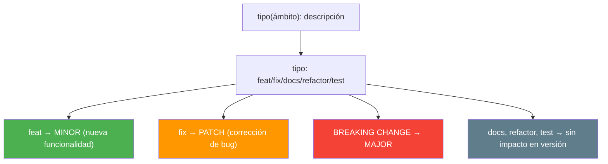

### 4.6.2. Tipos Comunes

| Tipo | Descripción | Ejemplo |
|------|-------------|---------|
| **feat** | Nueva funcionalidad | `feat(auth): add login` |
| **fix** | Corrección de bug | `fix(api): resolve 500 error` |
| **docs** | Solo documentación | `docs: update README` |
| **style** | Formato, sin cambio de código | `style: format code` |
| **refactor** | Reestructuración | `refactor: simplify logic` |
| **test** | Añadir tests | `test: add unit tests` |
| **chore** | Tareas de mantenimiento | `chore: update deps` |

### 4.6.3. Ejemplos

```bash
# ❌ Malos mensajes
git commit -m "fix"
git commit -m "cambios"
git commit -m "wip"

# ✅ Buenos mensajes
git commit -m "feat(user): add email verification"
git commit -m "fix(auth): resolve token refresh bug"
git commit -m "docs(api): add endpoint documentation"
```

**Ventajas de las Convenciones de Mensajes:**

| Ventaja | Descripción |
|---------|-------------|
| **Historial legible** | Puedes entender el historial sin leer cada diff |
| **Changelogs automáticos** | Herramientas como `standard-version` generan changelogs a partir de los commits |
| **Semantic Versioning** | Sabes si un commit es un `fix` (patch), `feat` (minor) o `breaking change` (major) |
| **Filtrado** | Puedes buscar solo commits de tipo `fix` o `feat` |
| **Consistencia** | Todo el equipo usa el mismo formato, no hay "cambios" sueltos |

**Inconvenientes de las Convenciones de Mensajes:**

| Inconveniente | Descripción |
|---------------|-------------|
| **Rigidez** | Al principio cuesta acostumbrarse al formato estricto |
| **Overhead** | Para commits rápidos, escribir `feat(auth): add login` puede parecer excesivo |
| **Discusiones** | El equipo puede debatir eternamente sobre qué tipo usar |
| **No siempre encaja** | Algunos cambios no encajan limpiamente en una sola categoría |

> ⚠️ **Errores comunes en mensajes de commit:**
>
> 1. **Descripciones vagas**: `"fix bug"` no dice qué bug. Mejor: `"fix(auth): resolve token expiration when user is inactive"`.
>
> 2. **Mezclar tipos en un commit**: No hagas un commit que sea a la vez `feat` y `fix`. Sepáralo en dos commits.
>
> 3. **Olvidar el ámbito**: El ámbito (`auth`, `api`, `ui`) ayuda a saber qué parte del código se afectó.
>
> 4. **Descripciones en inglés malo**: Si el equipo habla español, usa español. Pero si es open source, el inglés es estándar.

## 4.7. Resumen de Colaboración

```bash
# Pull Request
git checkout -b feature/nova
git push -u origin feature/nova
# → Ir a GitHub y crear PR

# Fork
git remote add upstream original-repo-url
git fetch upstream
git merge upstream/main

# GitHub CLI
gh pr create              # Crear PR
gh pr list                # Listar PRs
gh pr checkout [PR]       # Cambiar a rama de PR
gh issue create           # Crear issue
gh run list               # Ver workflows
```

**Resumen del punto:**

| Concepto | Descripción |
|----------|-------------|
| **Pull Request** | Propuesta de cambios para revisar antes de fusionar |
| **Fork** | Copia personal de un repositorio de otro usuario |
| **Code Review** | Revisión sistemática de código por otros desarrolladores |
| **CI/CD** | Integración y despliegue continuo con GitHub Actions |
| **Issues** | Sistema de seguimiento de errores y tareas |
| **Projects** | Tableros Kanban para organizar el trabajo |
| **Convenciones** | Formato estándar para mensajes de commit |

> 💡 **¿Qué viene después?** En la **UD05: Herramientas de Desarrollo** aprenderás a usar clientes gráficos de Git, extensiones de VS Code, terminales especializadas y otras herramientas que potenciarán tu productividad como desarrollador.

## Ejercicio Rápido: La Cafetería Colaborativa

> 📝 **Escenario:** Tienes el repositorio `cafeteria-web` en GitHub. Tu compañero quiere añadir una nueva sección de "Bebidas del día" y tú quieres corregir un error en el menú. Usaréis el flujo completo de colaboración.

**Pasos:**

1. **Crear una rama y hacer cambios (tú):**
   ```bash
   git checkout -b fix/corregir-precio-cafe
   # Editar el archivo menu.html (corregir precio)
   git add menu.html
   git commit -m "fix(menu): corregir precio del café de 1.50 a 1.80"
   git push -u origin fix/corregir-precio-cafe
   gh pr create --title "fix(menu): corregir precio del café" --body "Corrijo el precio que estaba desactualizado"
   ```

2. **Revisar la PR (tu compañero):**
   ```bash
   gh pr list                    # Ver PRs pendientes
   gh pr diff 1                  # Ver los cambios
   gh pr review 1 --approve      # Aprobar si todo está bien
   ```

3. **Fusionar y sincronizar:**
   ```bash
   gh pr merge 1 --squash        # Fusionar la PR
   git checkout main
   git pull origin main          # Traer los cambios
   ```

4. **Añadir funcionalidad nueva (tu compañero):**
   ```bash
   git checkout -b feature/bebidas-del-dia
   # Crear archivo bebidas.html
   git add bebidas.html
   git commit -m "feat: añadir sección de bebidas del día"
   git push -u origin feature/bebidas-del-dia
   gh pr create --title "feat: añadir bebidas del día" --body "Nueva sección con las bebidas estacionales"
   ```

> 💡 **Consejo:** Practica el flujo completo: rama → commit → push → PR → review → merge. Es el día a día de cualquier desarrollador profesional.
