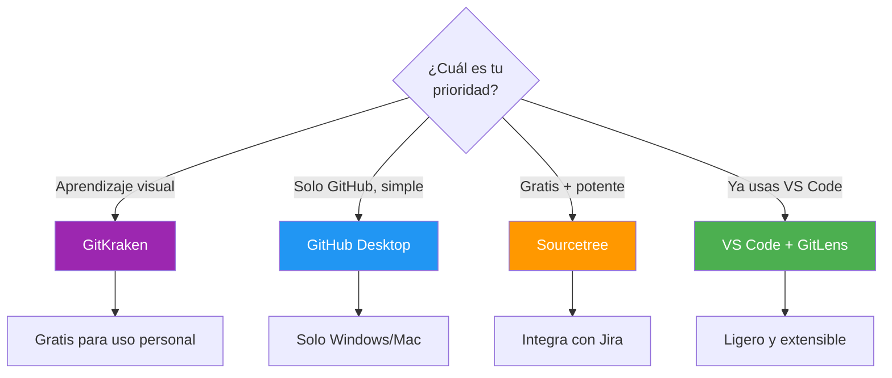
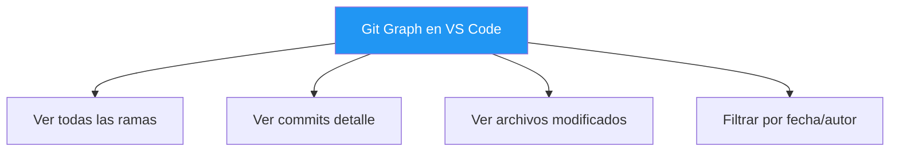
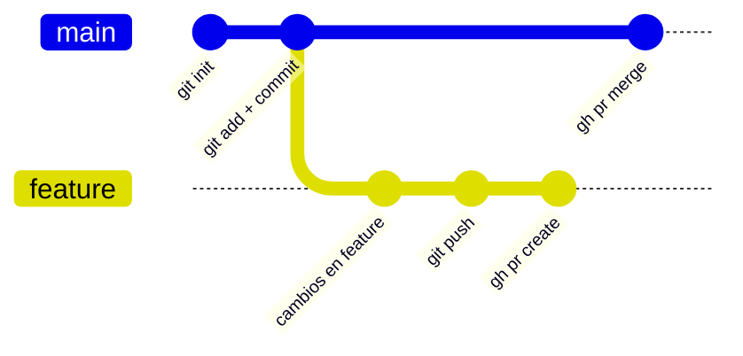
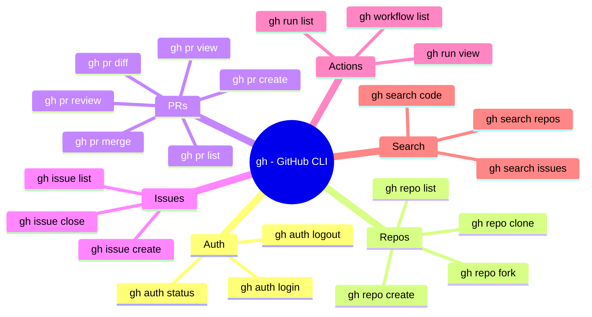
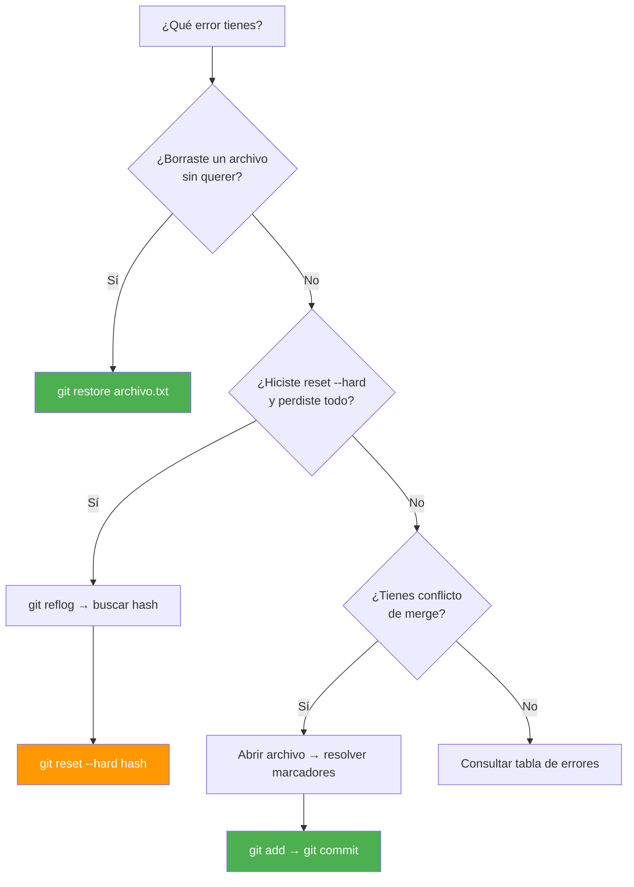

- [5. Herramientas y Recursos](#5-herramientas-y-recursos)
  - [5.1. Clientes Gráficos (GUI)](#51-clientes-gráficos-gui)
    - [5.1.1. GitKraken](#511-gitkraken)
    - [5.1.2. GitHub Desktop](#512-github-desktop)
    - [5.1.3. Sourcetree](#513-sourcetree)
    - [5.1.4. VS Code + Git](#514-vs-code--git)
    - [5.1.5. Comparativa de GUIs](#515-comparativa-de-guis)
  - [5.2. Extensiones VS Code para Git](#52-extensiones-vs-code-para-git)
    - [5.2.1. GitLens](#521-gitlens)
    - [5.2.2. Git Graph](#522-git-graph)
    - [5.2.3. Otras Extensiones Útiles](#523-otras-extensiones-útiles)
  - [5.3. GitHub CLI](#53-github-cli)
    - [5.3.1. Instalación](#531-instalación)
    - [5.3.2. Comandos Principales](#532-comandos-principales)
    - [5.3.3. Ejemplo Flujo Completo](#533-ejemplo-flujo-completo)
  - [5.4. Recursos de Aprendizaje](#54-recursos-de-aprendizaje)
    - [5.4.1. Tutoriales Interactivos](#541-tutoriales-interactivos)
    - [5.4.2. Documentación Oficial](#542-documentación-oficial)
    - [5.4.3. Cheat Sheets](#543-cheat-sheets)
    - [5.4.4. Juegos y Gamificación](#544-juegos-y-gamificación)
  - [5.5. Configuración Avanzada](#55-configuración-avanzada)
  - [5.6. Errores Comunes y Soluciones](#56-errores-comunes-y-soluciones)
    - [5.6.1. Errores Típicos](#561-errores-típicos)
    - [5.6.2. Recuperación de Errores](#562-recuperación-de-errores)
    - [5.6.3. Comandos de Emergencia](#563-comandos-de-emergencia)
  - [5.7. Personalizar la Terminal: Oh My Posh y Nerd Fonts](#57-personalizar-la-terminal-oh-my-posh-y-nerd-fonts)


# 5. Herramientas y Recursos

> 💡 **Punto de partida:** ¿Te imaginas construir un edificio sin herramientas? Podrías, pero tardarías una eternidad. Las herramientas de Git son como tener una grúa, un soldador y un robot: cada una hace un trabajo específico mucho más rápido.

> 💡 **¿Por qué me importa?**
> Dominar las herramientas correctas multiplica tu productividad. Un cliente gráfico te ayuda a visualizar el historial, una extensión de VS Code te ahorra comandos, y GitHub CLI te permite automatizar tareas repetitivas.
> 
> 🔗 **Conexión con otros puntos:** El Punto 04 viste Pull Requests, Forks y colaboración. Este punto verás las herramientas que facilitan todo ese trabajo: clientes gráficos, extensiones, CLI y recursos de aprendizaje.

En el Punto 04 vimos Pull Requests, Forks, Code Review y GitHub Actions. Ahora veremos las herramientas y recursos para Git: clientes gráficos, extensiones de VS Code, terminal Git y trucos para potenciar tu productividad.

**Objetivos de aprendizaje:**

- Conocer los clientes gráficos más populares (GitKraken, GitHub Desktop, Sourcetree)
- Instalar y usar extensiones de VS Code para Git
- Dominar GitHub CLI para automatizar tareas
- Resolver errores comunes de forma rápida

## Qué instalar primero

> 📝 **Recomendación del profesor:** Antes de explorar todas las herramientas, instala estas tres. Con ellas tendrás todo lo necesario para el curso.

| Herramienta | Para qué la necesitas | Cómo instalarla |
|-------------|----------------------|-----------------|
| **VS Code** | Editor principal con Git integrado | [code.visualstudio.com](https://code.visualstudio.com) |
| **Git** | Control de versiones en línea de comandos | [git-scm.com](https://git-scm.com) |
| **GitHub CLI (`gh`)** | Gestionar repos, PRs e issues desde terminal | `scoop install gh` (Windows) o `brew install gh` (Mac) |

**Extensiones imprescindibles en VS Code:**

| Extensión | Qué hace |
|-----------|----------|
| **GitLens** | Ver quién cambió cada línea, historial detallado |
| **Git Graph** | Visualizar ramas y commits como un grafo |
| **GitHub Pull Requests** | Gestionar PRs directamente desde VS Code |

> 💡 **Consejo:** Con VS Code + GitLens + GitHub CLI tienes las herramientas profesionales más usadas en la industria. No necesitas más para empezar.

## 5.1. Clientes Gráficos (GUI)

Los clientes gráficos facilitan el uso de Git para quienes prefieren interfaces visuales.

### 5.1.1. GitKraken

| Característica | Descripción |
|----------------|-------------|
| **Plataforma** | Windows, Mac, Linux |
| **Licencia** | Freemium (gratis para uso personal) |
| **Puntos fuertes** | Mejor GUI, integra GitFlow, aprendizaje visual |
| **Integración** | GitHub, GitLab, Bitbucket, Enterprise |

> 💡 **Ideal para:** Principiantes que quieren entender visualmente cómo funciona Git.

### 5.1.2. GitHub Desktop

| Característica | Descripción |
|----------------|-------------|
| **Plataforma** | Windows, Mac |
| **Licencia** | Gratis |
| **Puntos fuertes** | Integración nativa GitHub, simple |
| **Limitaciones** | Solo GitHub, menos features |

### 5.1.3. Sourcetree

| Característica | Descripción |
|----------------|-------------|
| **Plataforma** | Windows, Mac |
| **Licencia** | Gratis |
| **Puntos fuertes** | Completo, gratuito |
| **Puntos débiles** | Interfaz anticuada |

### 5.1.4. VS Code + Git

| Característica | Descripción |
|----------------|-------------|
| **Plataforma** | Multiplataforma |
| **Licencia** | Gratis |
| **Puntos fuertes** | Ligero, integración nativa, extensible |

**Características Git integradas en VS Code:**

| Característica | Cómo acceder |
|----------------|--------------|
| **Source Control panel** | Ctrl+Shift+G → Vista lateral con cambios |
| **Commit visual** | Escribes el mensaje y clic en ✓ (checkmark) |
| **Diff inline** | Modificaciones resaltadas línea por línea |
| **Merge conflicts UI** | Botones "Accept Current", "Accept Incoming", "Accept Both" |
| **Branch management** | Selector en la barra inferior izquierda |
| **Stash operations** | Click derecho en los cambios → Stash |
| **Timeline view** | Historial de cambios por archivo |
| **Blame annotations** | Click derecho → "Open Timeline" o extensión GitLens |

**Comandos desde la terminal integrada (Ctrl+`):**

```bash
# Todo se puede hacer desde la terminal de VS Code
git status
git add .
git commit -m "feat: añadir login"
git push origin main
git pull --rebase
git stash push -m "WIP: refactorizando"
```

> 💡 **Ventaja:** VS Code combina la comodidad de una GUI con el poder de la terminal. Puedes usar el panel visual para commits rápidos y la terminal para operaciones complejas.

📌 **Ejemplo real:** Spotify, Netflix y miles de empresas usan VS Code como editor estándar. Su integración nativa con Git permite hacer commits, ver diffs y resolver conflictos sin salir del editor. Muchos desarrolladores profesionales ni siquiera abren otra herramienta para gestionar Git.

> 🔗 **Conexión:** Las extensiones GitLens y Git Graph (que verás en la sección 5.2) amplían enormemente las capacidades Git de VS Code.

### 5.1.5. Comparativa de GUIs

| Herramienta | Facilidad | Features | Integración | Precio |
|-------------|-----------|----------|-------------|--------|
| GitKraken | ⭐⭐⭐⭐⭐ | ⭐⭐⭐⭐⭐ | ⭐⭐⭐⭐⭐ | Freemium |
| GitHub Desktop | ⭐⭐⭐⭐⭐ | ⭐⭐⭐ | ⭐⭐⭐⭐⭐ | Gratis |
| Sourcetree | ⭐⭐⭐ | ⭐⭐⭐⭐ | ⭐⭐⭐ | Gratis |
| VS Code + Git | ⭐⭐⭐⭐ | ⭐⭐⭐⭐ | ⭐⭐⭐⭐ | Gratis |



## 5.2. Extensiones VS Code para Git

### 5.2.1. GitLens

| Característica | Descripción |
|----------------|-------------|
| **Función** | Ver blame, historial, comparar commits |
| **Atajo** | `Alt+Shift+A` para blame rápido |

**Features principales:**
- Blame en línea
- Historial de archivos
- Comparar commits
- Buscar en historial
- Visualizar ramas

### 5.2.2. Git Graph

| Característica | Descripción |
|----------------|-------------|
| **Función** | Visualizar historial como grafo |



### 5.2.3. Otras Extensiones Útiles

| Extensión | Función |
|-----------|---------|
| **Gitmoji** | Usar emojis en commits |
| **Git History** | Ver historial detallado de archivos |
| **GitLab Workflow** | Integración GitLab |
| **GitHub Pull Requests** | Gestionar PRs desde VS Code |
| **Remote Repositories** | Editar repositorios remotos directamente |

## 5.3. GitHub CLI

**GitHub CLI** (`gh`) permite gestionar GitHub desde la terminal.

### 5.3.1. Instalación

```bash
# Windows (scoop)
scoop install gh

# Windows (chocolatey)
choco install gh

# macOS
brew install gh

# Linux (Debian/Ubuntu)
sudo apt install gh

# Linux (Fedora)
sudo dnf install gh

# Linux (Arch)
pacman -S github-cli
```

### 5.3.2. Comandos Principales

```bash
# Autenticarse
gh auth login                    # Login interactivo (HTTPS o SSH)
gh auth status                   # Ver estado de autenticación
gh auth logout                   # Cerrar sesión
gh auth setup-git                # Configurar git para usar gh como credential helper

# Repositorios
gh repo create [nombre] --public     # Crear repo público
gh repo create [nombre] --private    # Crear repo privado
gh repo list                         # Listar tus repos
gh repo view                         # Ver info del repo actual
gh repo clone [usuario/repo]         # Clonar repo

# Pull Requests
gh pr list                    # Listar PRs
gh pr view [PR]               # Ver PR
gh pr create --title "feat: login" --body "Descripción"  # Crear PR con opciones
gh pr create --draft          # Crear PR como borrador
gh pr checkout [PR]           # Cambiar a rama de PR
gh pr merge [PR]              # Fusionar PR (merge commit)
gh pr merge [PR] --squash     # Squash and merge
gh pr merge [PR] --rebase     # Rebase and merge
gh pr review [PR] --approve   # Aprobar PR
gh pr diff [PR]               # Ver diff de la PR
gh pr checks [PR]             # Ver estado de CI/CD

# Issues
gh issue list                 # Listar issues
gh issue view [issue]         # Ver issue
gh issue create --title "Bug: login" --label "bug, P0"  # Crear issue con opciones
gh issue close [issue]        # Cerrar issue
gh issue reopen [issue]       # Reabrir issue

# GitHub Actions (CI/CD)
gh workflow list              # Listar workflows
gh workflow run [workflow]    # Ejecutar workflow
gh run list                  # Ver ejecuciones recientes
gh run view [run-id]         # Ver detalle de una ejecución
gh run watch [run-id]        # Ver ejecución en tiempo real
gh run cancel [run-id]       # Cancelar ejecución

# Búsqueda
gh search repos [query]      # Buscar repositorios
gh search issues [query]     # Buscar issues
gh search code [query]       # Buscar en código

# API personalizada
gh api repos/{owner}/{repo}/actions/runs  # Llamada API directa

# Releases y Gist
gh release list               # Listar releases
gh release create v1.0.0      # Crear release
gh gist list                  # Listar gists
gh gist create archivo.cs     # Crear gist desde archivo

# Configuración
gh alias set prs 'pr list --state open'  # Crear alias personalizado
gh config set editor code                 # Configurar editor por defecto
```

# Repository
gh repo view                  # Ver repo
gh repo clone [repo]          # Clonar repo
gh repo fork [repo]           # Fork repo
```

### 5.3.3. Ejemplo Flujo Completo

```bash
# Clonar repo
gh repo clone usuario/repo

# Crear rama
git checkout -b feature/nueva

# Trabajar y commit
git add .
git commit -m "feat: nueva funcionalidad"

# Subir y crear PR
git push -u origin feature/nueva
gh pr create --title "feat: nueva funcionalidad" --body "Descripción..."

# Ver estado de PR
gh pr view

# Aprobar PR (como revisor)
gh pr review --approve

# Fusionar PR
gh pr merge --merge
```





## 5.4. Recursos de Aprendizaje

### 5.4.1. Tutoriales Interactivos

| Recurso | Descripción | Nivel |
|---------|-------------|-------|
| [Learn Git Branching](https://learngitbranching.js.org) | Tutorial interactivo visual | Principiante |
| [Git Immersion](https://gitimmersion.com) | Tutorial paso a paso | Principiante |
| [GitKatas](https://github.com/praqma-training/git-katas) | Ejercicios prácticos | Todos |
| [GitHub Learning Lab](https://lab.github.com) | Cursos de GitHub | Principiante |

### 5.4.2. Documentación Oficial

| Recurso | Descripción |
|---------|-------------|
| [Git Documentation](https://git-scm.com/doc) | Documentación oficial |
| [Git Pro Book](https://git-scm.com/book/es/v2) | Libro completo de Git |
| [GitHub Docs](https://docs.github.com) | Documentación GitHub |
| [GitLab Docs](https://docs.gitlab.com) | Documentación GitLab |

### 5.4.3. Cheat Sheets

| Recurso | Descripción |
|---------|-------------|
| [Git Cheat Sheet](https://education.github.com/git-cheat-sheet-education.pdf) | Sheet oficial de GitHub |
| [Git Cheatsheet](https://ndpsoftware.com/git-cheatsheet.html) | Visual interactivo |
| [Git Command Explorer](https://git-cheatsheet.com) | Búsqueda por comando |

### 5.4.4. Juegos y Gamificación

| Recurso | Descripción |
|---------|-------------|
| [Oh My Git!](https://ohmygit.org) | Juego para aprender Git |
| [Git Tower Game](https://www.git-tower.com/learn/git/commands/game) | Juego de comandos |
| [Learning Git with Jupyter](https://github.com/jupyterlab/jupyterlab-git) | Git en Jupyter |

## 5.5. Configuración Avanzada

> 💡 **Solo lo esencial:** Estos son los ajustes más útiles. No necesitas memorizarlos todos — usa esta sección como referencia rápida.

**Alias útiles (configurar con `git config --global`):**

```bash
git config --global alias.st status
git config --global alias.co checkout
git config --global alias.br branch
git config --global alias.ci commit
git config --global alias.df diff
git config --global alias.lg "log --oneline --graph --all"
```

**El ajuste más importante:** Configurar VS Code como editor por defecto:

```bash
git config --global core.editor "code --wait"
```

> 📝 **Nota:** Los alias son como atajos de teclado: en lugar de escribir `git status`, puedes escribir `git st`. Útiles cuando escribes muchos comandos al día.

## 5.6. Errores Comunes y Soluciones

### 5.6.1. ❌ Errores Típicos

| Error | Causa | Solución |
|-------|-------|----------|
| "fatal: not a git repository" | No estás en un repo Git | `git init` o `git clone` |
| "nothing to commit, working tree clean" | No hay cambios | Modifica archivos |
| "changes not staged for commit" | Cambios sin preparar | `git add` |
| "commit nothing to commit" | Todo ya commiteado | Crea nueva rama |
| "failed to push some refs" | El remoto tiene cambios nuevos | `git pull` primero |
| "merge conflict" | Dos personas modificaron lo mismo | Resolver conflictos |
| "detached HEAD" | Checkout a commit, no rama | `git checkout rama` |

### 5.6.2. ⚠️ Recuperación de Errores

```bash
# Recuperar cambios después de reset --hard
git reflog                    # Ver historial
git reset --hard HEAD@{n}     # Restaurar

# Recuperar archivo eliminado
git restore archivo.txt

# Recuperar commit eliminado
git reflog
git cherry-pick [commit-hash]

# Deshacer último commit (soft)
git reset --soft HEAD~1

# Ver qué commit eliminó algo
git log --all --full-history -- archivo.txt
```

### 5.6.3. 🆘 Comandos de Emergencia

```bash
# Ver todo el historial (incluido resets)
git reflog

# Buscar commit por mensaje
git log --all --grep="mensaje"

# Buscar commit que modificó una línea
git log -S "texto buscado"

# Recuperar archivo de cualquier commit
git checkout [commit-hash] -- archivo.txt

# Ver todos los commits de todas las ramas
git log --all --oneline --graph

# Encontrar "perdido" commit
git fsck --lost-found
```



**Resumen del punto:**

| Herramienta | Descripción |
|-------------|-------------|
| **GitKraken** | Cliente gráfico multiplataforma, visual intuitivo |
| **GitHub Desktop** | Cliente oficial de GitHub, simple y limpio |
| **Sourcetree** | Cliente gratuito de Atlassian, potente |
| **GitLens** | Extensión VS Code con blame, historial y annotations |
| **Git Graph** | Extensión VS Code para visualizar ramas como gráfico |
| **GitHub CLI** | Terminal para gestionar GitHub directamente |
| **gitref.com** | Referencia rápida de comandos |
| **Oh My Zsh** | Framework de terminal con plugins de Git |
| **Oh My Posh** | Temas para la terminal con iconos y colores |

En el Resumen consolidaremos todo lo aprendido en la unidad: conceptos, comandos, flujos de trabajo y herramientas.

---

## Ejercicio Rápido: Configurar tu Estación de Desarrollo

> 📝 **Escenario:** Vas a montar tu entorno de desarrollo completo para trabajar en `cafeteria-web`. Instalarás las herramientas y configurarás VS Code.

**Pasos:**

1. **Instalar las herramientas básicas:**
   - Instala [VS Code](https://code.visualstudio.com) si no lo tienes
   - Instala [Git for Windows](https://git-scm.com) (durante la instalación, acepta las opciones por defecto)
   - Instala GitHub CLI: `scoop install gh` (necesitas [scoop](https://scoop.sh) previamente) o descárgalo desde [cli.github.com](https://cli.github.com)

2. **Configurar Git:**
   ```bash
   git config --global user.name "Tu Nombre"
   git config --global user.email "tu.email@ejemplo.com"
   git config --global core.editor "code --wait"
   ```

3. **Instalar extensiones en VS Code:**
   - Abre VS Code → Extensionses (Ctrl+Shift+X)
   - Busca e instala: **GitLens**, **Git Graph**, **GitHub Pull Requests**

4. **Autenticarse en GitHub CLI:**
   ```bash
   gh auth login
   # Seleccionar: GitHub.com → HTTPS → Login con navegador
   gh auth status  # Verificar que funciona
   ```

5. **Probar que todo funciona:**
   ```bash
   # Crear un repositorio de prueba
   mkdir cafeteria-web-test
   cd cafeteria-web-test
   git init
   echo "# Menú de la cafetería" > README.md
   git add .
   git commit -m "feat: archivo inicial"
   gh repo create cafeteria-web-test --public --source=. --push
   ```

> 💡 **Consejo:** Si `gh auth status` muestra "Logged in", todo está configurado correctamente. Ya puedes usar GitHub desde la terminal sin abrir el navegador.

## 5.7. Personalizar la Terminal: Oh My Posh y Nerd Fonts

**Oh My Posh** es un motor de temas para la terminal que muestra iconos, colores e información útil como la rama de Git actual, el directorio, el estado de los archivos, etc.

Para que los iconos se vean correctamente necesitas una **fuente Nerd Font**. Las Nerd Fonts son fuentes programadas con miles de iconos extra (git, Docker, flechas, carpetas, etc.) que Oh My Posh usa para decorar la terminal.

**Instalación en Windows:**

```bash
# Instalar Oh My Posh con scoop
scoop install oh-my-posh

# Instalar una Nerd Font (por ejemplo, FiraCode)
scoop install FiraCode-NF
```

**Instalación en macOS:**

```bash
# Instalar Oh My Posh con brew
brew install oh-my-posh

# Instalar una Nerd Font
brew install --cask font-fira-code-nerd-font
```

**Instalación en Linux (Ubuntu/Debian):**

```bash
# Descargar e instalar Oh My Posh
curl -s https://ohmyposh.dev/install.sh | bash

# Descargar una Nerd Font desde https://www.nerdfonts.com/font-downloads
# Elige la fuente que prefieras (FiraCode, JetBrainsMono, Cascadia Code, etc.)
mkdir -p ~/.local/share/fonts
cd ~/.local/share/fonts
curl -fLO https://github.com/ryanoasis/nerd-fonts/raw/latest/FiraCode.zip
unzip FiraCode.zip
rm FiraCode.zip
fc-cache -fv
```

**Configurar la fuente en tu terminal:**

- **Windows Terminal:** Ve a Configuración → Perfil → Apariencia → Fuente → selecciona "FiraCode Nerd Font"
- **VS Code:** Añade en `settings.json`:
  ```json
  "terminal.integrated.fontFamily": "FiraCode Nerd Font"
  ```
- **PowerShell:** Ve a Propiedades → Fuente → selecciona "FiraCode Nerd Font"

> ⚠️ **Sin la Nerd Font**, Oh My Posh mostrará caracteres raros o cuadros en lugar de iconos. Siempre instala primero la fuente y luego configúrala en la terminal.

> 💡 **Consejo:** Descarga las fuentes desde [nerdfonts.com](https://www.nerdfonts.com/font-downloads). Otras Nerd Fonts populares son **JetBrainsMono Nerd Font**, **Cascadia Code Nerd Font** y **Hack Nerd Font**. Elige la que más te guste.
