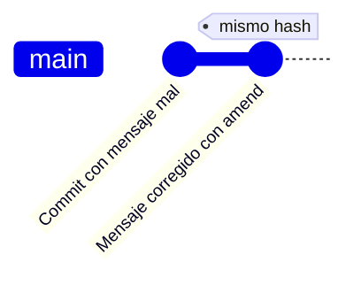
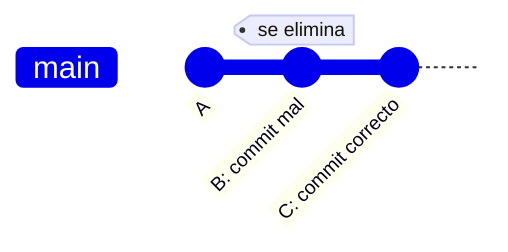
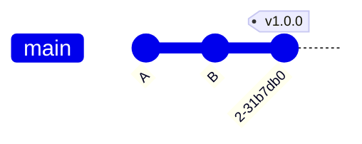
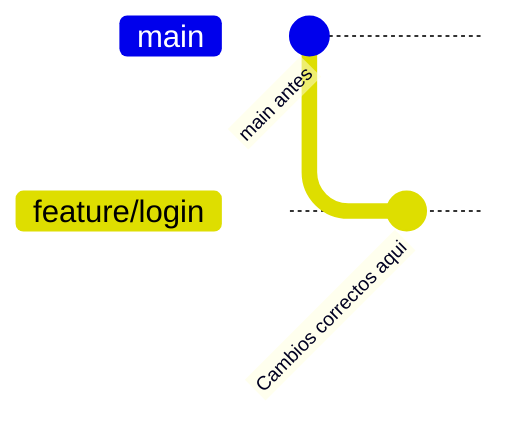
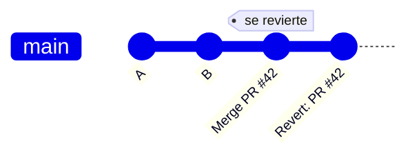

- [6. Guía de Emergencia Git](#6-guía-de-emergencia-git)
  - [6.1. La Regla de Oro](#61-la-regla-de-oro)
  - [6.2. Diagrama de Decisión](#62-diagrama-de-decisión)
  - [6.3. Niveles de Dificultad](#63-niveles-de-dificultad)
  - [6.4. Escenario 1: Mensaje de commit mal](#64-escenario-1-mensaje-de-commit-mal)
  - [6.5. Escenario 2: Commit con contenido mal](#65-escenario-2-commit-con-contenido-mal)
  - [6.6. Escenario 3: Etiqueta mal creada (local)](#66-escenario-3-etiqueta-mal-creada-local)
  - [6.7. Escenario 4: Trabajaste en rama equivocada](#67-escenario-4-trabajaste-en-rama-equivocada)
  - [6.8. Escenario 5: Etiqueta mal creada (remota)](#68-escenario-5-etiqueta-mal-creada-remota)
  - [6.9. Escenario 6: Fusión por error (local)](#69-escenario-6-fusión-por-error-local)
  - [6.10. Escenario 7: Push con datos equivocados](#610-escenario-7-push-con-datos-equivocados)
  - [6.11. Escenario 8: Fusión por error (remota)](#611-escenario-8-fusión-por-error-remota)
  - [6.12. Escenario 9: PR aceptada por error](#612-escenario-9-pr-aceptada-por-error)


# 6. Guía de Emergencia Git

> 💡 **Punto de partida:** "¡He hecho algo mal en Git! ¿Qué hago?" Esta guía te dice exactamente qué comando ejecutar según QUÉ has hecho mal y DÓNDE está el error. Siempre de más fácil a más difícil.

> 🔗 **Conexión:** Esta guía usa los conceptos vistos en los Puntos 01-05. Si no entiendes un comando, vuelve al punto donde se explicó.

**Objetivos de aprendizaje:**

- Identificar el nivel de error según dónde se haya propagado
- Elegir el comando correcto para deshacer cada tipo de error
- Entender por qué cuanto más se propaga, más difícil es solucionarlo

## 6.1. La Regla de Oro

> ⚠️ **Cuanto más tarde en darte cuenta del error y más se propague hacia arriba, más difícil es solucionarlo.**

Piensa en Git como una escalera. Cada paso que subes (add → commit → push → PR → merge) es más difícil de bajar:


> 💡 **¿Por qué?** Porque cada paso propaga el error a mas personas y sistemas. En el nivel 1, solo tu sabes que has hecho algo mal. En el nivel 6, todo el equipo y los clientes ven tu error.

## 6.2. Diagrama de Decision

¿Que hacer segun donde este el error?


## 6.3. Niveles de Dificultad

| Nivel | Nivel de fallo | Donde esta el error | Herramienta | Dificultad |
|-------|----------------|---------------------|-------------|------------|
| 1 | Minimo | Working Tree (sin add) | `git restore` | Trivial |
| 2 | Minimo | Staging (sin commit) | `git restore --staged` | Trivial |
| 3 | Bajo | Commit local (sin push) | `git reset` | Facil |
| 4 | Medio | Push local (sin merge) | `git push --force-with-lease` | Media |
| 5 | Alto | Push compartido (sin merge) | `git revert` | Alta |
| 6 | Muy alto | Mergeado en main | `git revert` | Alta |
| 7 | Critico | Desplegado en produccion | `git revert` + hotfix | Muy alta |

> 💡 **Consejo:** Si descubres el error en el **nivel 1-3** (trabajo local), la solucion es facil y segura. Si llegas al **nivel 4-7** (compartido), necesitas `git revert` y paciencia.

## 6.4. Escenario 1: Mensaje de commit mal

**Nivel de fallo:** Minimo 💩

**Que paso:** Pusiste un mensaje que no toca ("fix", "asdf", "test").
**Donde estas:** Commit local.

**Por que estos pasos:** `git commit --amend` modifica el ultimo commit SIN crear uno nuevo. Es la forma mas limpia de corregir un mensaje porque no ensucia el historial con commits de "correccion".

**Solucion:**
```bash
git commit --amend -m "feat: anadir menu de cafeteria"
```



> 💡 **Si ya lo subiste:** `git push --force-with-lease` (solo si no hay otros trabajando en esa rama).

## 6.5. Escenario 2: Commit con contenido mal

**Nivel de fallo:** Bajo 💩💩

**Que paso:** Commiteaste un archivo que no tocaba o con cambios erroneos.
**Donde estas:** Commit local, sin push.

**Por que estos pasos:** `git reset --soft HEAD~1` mueve el puntero HEAD un commit atras PERO mantiene los cambios en staging. Asi puedes corregir y re-commitar sin perder nada. Es como si el commit nunca hubiera existido.

**Solucion:**
```bash
# Opcion A: Mantener cambios en staging (recomendado)
git reset --soft HEAD~1
# Corregir el archivo
git add .
git commit -m "feat: archivo correcto"

# Opcion B: Descartar cambios y volver al commit anterior
git reset --hard HEAD~1
```



## 6.6. Escenario 3: Etiqueta mal creada (local)

**Nivel de fallo:** Minimo 💩

**Que paso:** Creaste un tag `v1.0` en vez de `v1.0.0`.
**Donde estas:** Tag local, sin push.

**Por que estos pasos:** Los tags locales se borran con `git tag -d` (seguro). Si no lo has subido, es como si nunca hubiera existido.

**Solucion:**
```bash
git tag -d v1.0
git tag -a v1.0.0 -m "Version 1.0.0 estable"
```



## 6.7. Escenario 4: Trabajaste en rama equivocada

**Nivel de fallo:** Bajo 💩💩

**Que paso:** Hiciste commits en `main` en vez de `feature/login`.
**Donde estas:** Commits en rama incorrecta.

**Por que estos pasos:** `git stash` guarda temporalmente tus cambios sin commit. Luego cambias de rama y los recuperas con `git stash pop`. Es como meter los papeles en un cajon temporal mientras ordenas la mesa.

**Solucion:**
```bash
# Guardar cambios temporalmente
git stash push -m "Cambios que van a feature/login"

# Cambiar a la rama correcta
git checkout feature/login

# Recuperar cambios
git stash pop

# Ahora si, commit
git add .
git commit -m "feat: login"
```



> 💡 **Si los commits ya estan en `main`:** Usa `git cherry-pick <hash>` en la rama correcta, luego `git reset --hard HEAD~N` en `main` para quitarlos.

## 6.8. Escenario 5: Etiqueta mal creada (remota)

**Nivel de fallo:** Medio 💩💩💩

**Que paso:** Subiste un tag erroneo a GitHub.
**Donde estas:** Tag en GitHub.

**Por que estos pasos:** Primero borras el local (`git tag -d`), luego lo borras del remoto (`git push --delete`). Si solo borras el local, el remoto sigue ahi. Es como borrar una foto de tu movil pero no de Instagram.

**Solucion:**
```bash
# Borrar tag local
git tag -d v1.0

# Borrar tag del remoto
git push origin --delete v1.0

# Crear el correcto
git tag -a v1.0.0 -m "Version 1.0.0"
git push origin v1.0.0
```

## 6.9. Escenario 6: Fusion por error (local)

**Nivel de fallo:** Medio 💩💩💩

**Que paso:** Fusionaste `feature/X` en `main` sin querer, sin push.
**Donde estas:** Merge local.

**Por que estos pasos:** `git reset --hard HEAD~1` mueve el puntero HEAD un commit atras y borra todo. Es destructivo pero seguro SI NO LO HAS SUBIDO. Como el merge es un solo commit, borrarlo es como si nunca hubiera pasado.

**Solucion:**
```bash
# Deshacer el ultimo commit de merge
git reset --hard HEAD~1
```

> ⚠️ **Cuidado:** Si usaste `git merge --no-ff`, `HEAD~1` es el commit de merge. Si fue fast-forward, necesitas identificar el hash anterior con `git log --oneline`.

## 6.10. Escenario 7: Push con datos equivocados

**Nivel de fallo:** Alto 💩💩💩💩

**Que paso:** Subiste commits que no corresponden a esa rama.
**Donde estas:** Push a GitHub.

**Por que estos pasos:** Si nadie mas ha hecho pull de esos commits, puedes usar `git push --force-with-lease` para sobrescribir el remoto. Si alguien ya los tiene, necesitas `git revert` para crear commits inversos. `--force-with-lease` es mas seguro que `--force` porque verifica que nadie mas ha subido cambios.

**Solucion local (sin merge):**
```bash
git reset --hard HEAD~N   # N = numero de commits a deshacer
git push --force-with-lease
```

**Solucion compartida:**
```bash
# Para cada commit malo
git revert <hash-del-commit>
git push
```

## 6.11. Escenario 8: Fusion por error (remota)

**Nivel de fallo:** Muy alto 💩💩💩💩💩

**Que paso:** Ya subiste el merge a GitHub.
**Donde estas:** Merge compartido.

**Por que estos pasos:** `git revert -m 1` crea un commit que deshace el merge SIN BORRAR el historial. Es la UNICA forma segura de deshacer un merge compartido. `git reset` borraría commits que otros tienen, rompiendo su trabajo.

**Solucion:**
```bash
# Revertir el merge (MANTENER el historial)
git revert -m 1 <hash-del-merge>
git push
```

> ⚠️ **NUNCA uses `git reset` en codigo compartido.** Solo `git revert` es seguro.

## 6.12. Escenario 9: PR aceptada por error

**Nivel de fallo:** Critico 💩💩💩💩💩

**Que paso:** Fusionaste un PR que no debias en `main`.
**Donde estas:** Merge en GitHub.

**Por que estos pasos:** Es igual al escenario 8. `git revert -m 1` crea un commit inverso. En GitHub, el propio boton "Revert" hace esto automaticamente creando un PR de revert.

**Solucion:**
```bash
# Revertir el merge
git revert -m 1 <hash-del-merge>
git push
```



> 💡 **En GitHub:** Ve al commit de merge → "Revert" button → crea automaticamente un PR de revert.

> 💡 **Buenas Prácticas:**
> - **Siempre usa `git revert` en código compartido**, nunca `git reset`. `revert` crea un commit inverso sin romper el historial de otros.
> - **Aprende a leer el nivel de error antes de actuar.** Si estás en nivel 1-3 (local), la solución es fácil y segura. Si llegaste al nivel 4-7, necesitas planificar.
> - **Usa `--force-with-lease` en vez de `--force`.** Verifica que nadie más ha subido cambios antes de sobrescribir.
> - **Practica los escenarios de error** en un repositorio temporal. Saber qué hacer bajo presión es clave para el examen y para la vida real.

📌 **Ejemplo real:** En equipos de desarrollo profesional, los errores de merge compartido o PR aceptada por error son habituales. GitHub incluso tiene un botón "Revert" en la interfaz que ejecuta `git revert -m 1` automáticamente, creando un PR de reversión. Empresas como Spotify o Amazon usan esta práctica como parte de su proceso de release management.

**Resumen del punto:**

| Error | Nivel de fallo | Local | Compartido en GitHub |
|-------|----------------|-------|----------------------|
| Mensaje mal | Minimo 💩 | `git commit --amend` | `git commit --amend` + `--force-with-lease` |
| Contenido mal | Bajo 💩💩 | `git reset --soft/--hard` | `git revert` |
| Tag mal | Minimo 💩 | `git tag -d` | `git tag -d` + `git push --delete` |
| Fusión por error | Medio 💩💩💩 | `git reset --hard HEAD~1` | `git revert -m 1` |
| Rama equivocada | Bajo 💩💩 | `git stash` + `git checkout` | `git cherry-pick` + `git reset` |
| Push equivocado | Alto 💩💩💩💩 | `git reset --hard` + `--force-with-lease` | `git revert` |
| PR aceptada por error | Critico 💩💩💩💩💩 | `git revert` | `git revert -m 1` |

**¿Qué viene después?**

En la **UD04: Diseño Orientado a Objetos: Diagrama de Clases** aprenderás a modelar sistemas con diagramas UML. Los conceptos de ramas y merges serán útiles para versionar diferentes iteraciones de tus diseños.

| Tema de la UD actual | Se usa en la siguiente UD para |
|----------------------|-------------------------------|
| Deshacer errores | Recuperar versiones de diagramas borrados |
| Ramas y merges | Explorar alternativas de diseño en paralelo |
| Revert vs reset | Mantener historial limpio de diseño |
