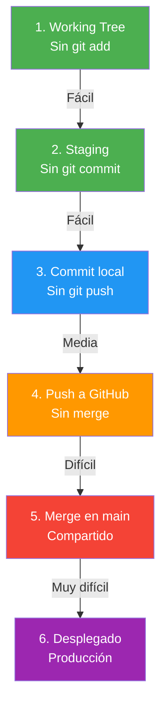
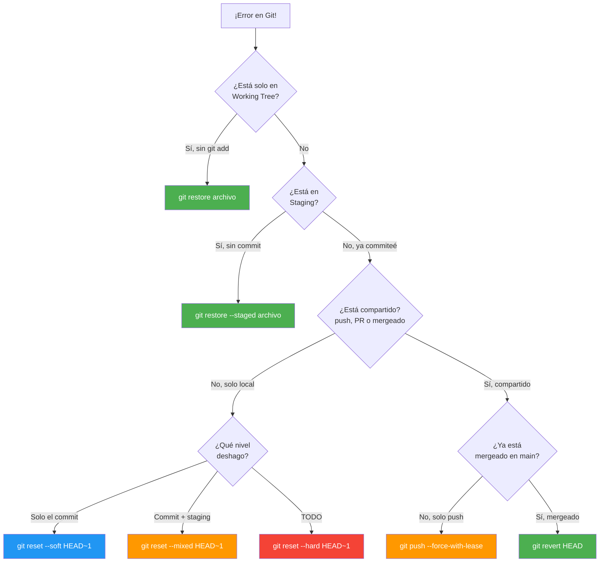
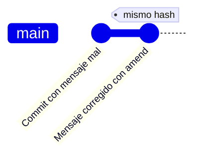
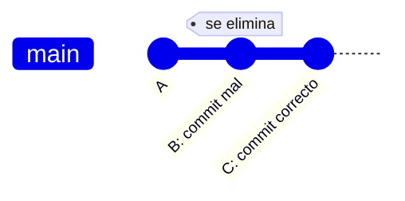
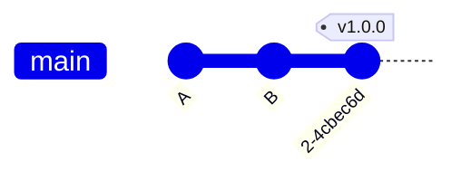
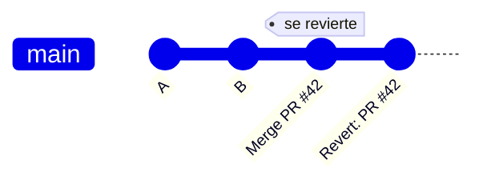

# Guía de Emergencia Git: Qué hacer según el error

- [Guía de Emergencia Git: Qué hacer según el error](#guía-de-emergencia-git-qué-hacer-según-el-error)
  - [1. La Regla de Oro](#1-la-regla-de-oro)
  - [2. Diagrama de Decisión](#2-diagrama-de-decisión)
  - [3. Niveles de Dificultad](#3-niveles-de-dificultad)
  - [4. Escenario 1: Mensaje de commit mal](#4-escenario-1-mensaje-de-commit-mal)
  - [5. Escenario 2: Commit con contenido mal (local)](#5-escenario-2-commit-con-contenido-mal-local)
  - [6. Escenario 3: Etiqueta mal creada (local)](#6-escenario-3-etiqueta-mal-creada-local)
  - [7. Escenario 4: Trabajaste en rama equivocada](#7-escenario-4-trabajaste-en-rama-equivocada)
  - [8. Escenario 5: Etiqueta mal creada (remota)](#8-escenario-5-etiqueta-mal-creada-remota)
  - [9. Escenario 6: Fusión por error (local)](#9-escenario-6-fusión-por-error-local)
  - [10. Escenario 7: Push con datos equivocados](#10-escenario-7-push-con-datos-equivocados)
  - [11. Escenario 8: Fusión por error (remota)](#11-escenario-8-fusión-por-error-remota)
  - [12. Escenario 9: PR aceptada por error](#12-escenario-9-pr-aceptada-por-error)
  - [13. Resumen: ¿Qué comando según el error?](#13-resumen-qué-comando-según-el-error)


# Guía de Emergencia Git: Qué hacer según el error

> 💡 **Punto de partida:** "¡He hecho algo mal en Git! ¿Qué hago?" Esta guía te dice exactamente qué comando ejecutar según QUÉ has hecho mal y DÓNDE está el error. Siempre de más fácil a más difícil.

> 🔗 **Conexión:** Esta guía usa los conceptos vistos en los Puntos 01-05. Si no entiendes un comando, vuelve al punto donde se explicó.

## La Regla de Oro

> ⚠️ **Cuanto más tarde en darte cuenta del error y más se propague hacia arriba, más difícil es solucionarlo.**

Piensa en Git como una escalera. Cada paso que subes (add → commit → push → PR → merge) es más difícil de bajar:



> 💡 **¿Por qué?** Porque cada paso propaga el error a más personas y sistemas. En el nivel 1, solo tú sabes que has hecho algo mal. En el nivel 6, todo el equipo y los clientes ven tu error.

## Diagrama de Decisión

¿Qué hacer según dónde esté el error?



## Niveles de Dificultad

| Nivel | 💩 | ¿Dónde está el error? | Herramienta | Dificultad |
|-------|-----|------------------------|-------------|------------|
| 1 | 💩 | Working Tree (sin add) | `git restore` | Trivial |
| 2 | 💩 | Staging (sin commit) | `git restore --staged` | Trivial |
| 3 | 💩💩 | Commit local (sin push) | `git reset` | Fácil |
| 4 | 💩💩💩 | Push local (sin merge) | `git push --force-with-lease` | Media |
| 5 | 💩💩💩💩 | Push compartido (sin merge) | `git revert` | Alta |
| 6 | 💩💩💩💩 | Mergeado en main | `git revert` | Alta |
| 7 | 💩💩💩💩💩 | Desplegado en producción | `git revert` + hotfix | Muy alta |

> 💡 **Consejo:** Si descubres el error en el **nivel 1-3** (trabajo local), la solución es fácil y segura. Si llegas al **nivel 4-7** (compartido), necesitas `git revert` y paciencia.

---

## Escenario 1: Mensaje de commit mal 💩

**Qué pasó:** Pusiste un mensaje que no toca ("fix", "asdf", "test").
**Dónde estás:** Commit local.

**Por qué estos pasos:** `git commit --amend` modifica el último commit SIN crear uno nuevo. Es la forma más limpia de corregir un mensaje porque no ensucia el historial con commits de "corrección".

**Solución:**
```bash
git commit --amend -m "feat: añadir menú de cafetería"
```

**gitGraph:**


> 💡 **Si ya lo subiste:** `git push --force-with-lease` (solo si no hay otros trabajando en esa rama).

---

## Escenario 2: Commit con contenido mal (local) 💩💩

**Qué pasó:** Commiteaste un archivo que no tocaba o con cambios erróneos.
**Dónde estás:** Commit local, sin push.

**Por qué estos pasos:** `git reset --soft HEAD~1` mueve el puntero HEAD un commit atrás PERO mantiene los cambios en staging. Así puedes corregir y re-commitar sin perder nada. Es como si el commit nunca hubiera existido.

**Solución:**
```bash
# Opción A: Mantener cambios en staging (recomendado)
git reset --soft HEAD~1
# Corregir el archivo
git add .
git commit -m "feat: archivo correcto"

# Opción B: Descartar cambios y volver al commit anterior
git reset --hard HEAD~1
```

**gitGraph:**


---

## Escenario 3: Etiqueta mal creada (local) 💩

**Qué pasó:** Creaste un tag `v1.0` en vez de `v1.0.0`.
**Dónde estás:** Tag local, sin push.

**Por qué estos pasos:** Los tags locales se borran con `git tag -d` (seguro). Si no lo has subido, es como si nunca hubiera existido.

**Solución:**
```bash
git tag -d v1.0
git tag -a v1.0.0 -m "Versión 1.0.0 estable"
```

**gitGraph:**


---

## Escenario 4: Trabajaste en rama equivocada 💩💩

**Qué pasó:** Hiciste commits en `main` en vez de `feature/login`.
**Dónde estás:** Commits en rama incorrecta.

**Por qué estos pasos:** `git stash` guarda temporalmente tus cambios sin commit. Luego cambias de rama y los recuperas con `git stash pop`. Es como meter los papeles en un cajón temporal mientras ordenas la mesa.

**Solución:**
```bash
# Guardar cambios temporalmente
git stash push -m "Cambios que van a feature/login"

# Cambiar a la rama correcta
git checkout feature/login

# Recuperar cambios
git stash pop

# Ahora sí, commit
git add .
git commit -m "feat: login"
```

**gitGraph:**


> 💡 **Si los commits ya están en `main`:** Usa `git cherry-pick <hash>` en la rama correcta, luego `git reset --hard HEAD~N` en `main` para quitarlos.

---

## Escenario 5: Etiqueta mal creada (remota) 💩💩

**Qué pasó:** Subiste un tag erróneo a GitHub.
**Dónde estás:** Tag en GitHub.

**Por qué estos pasos:** Primero borras el local (`git tag -d`), luego lo borras del remoto (`git push --delete`). Si solo borras el local, el remoto sigue ahí. Es como borrar una foto de tu móvil pero no de Instagram.

**Solución:**
```bash
# Borrar tag local
git tag -d v1.0

# Borrar tag del remoto
git push origin --delete v1.0

# Crear el correcto
git tag -a v1.0.0 -m "Versión 1.0.0"
git push origin v1.0.0
```

---

## Escenario 6: Fusión por error (local) 💩💩💩

**Qué pasó:** Fusionaste `feature/X` en `main` sin querer, sin push.
**Dónde estás:** Merge local.

**Por qué estos pasos:** `git reset --hard HEAD~1` mueve el puntero HEAD un commit atrás y borra todo. Es destructivo pero seguro SI NO LO HAS SUBIDO. Como el merge es un solo commit, borrarlo es como si nunca hubiera pasado.

**Solución:**
```bash
# Deshacer el último commit de merge
git reset --hard HEAD~1
```

> ⚠️ **Cuidado:** Si usaste `git merge --no-ff`, `HEAD~1` es el commit de merge. Si fue fast-forward, necesitas identificar el hash anterior con `git log --oneline`.

---

## Escenario 7: Push con datos equivocados 💩💩💩💩

**Qué pasó:** Subiste commits que no corresponden a esa rama.
**Dónde estás:** Push a GitHub.

**Por qué estos pasos:** Si nadie más ha hecho pull de esos commits, puedes usar `git push --force-with-lease` para sobrescribir el remoto. Si alguien ya los tiene, necesitas `git revert` para crear commits inversos. `--force-with-lease` es más seguro que `--force` porque verifica que nadie más ha subido cambios.

**Solución local (sin merge):**
```bash
git reset --hard HEAD~N   # N = número de commits a deshacer
git push --force-with-lease
```

**Solución compartida:**
```bash
# Para cada commit malo
git revert <hash-del-commit>
git push
```

---

## Escenario 8: Fusión por error (remota) 💩💩💩💩💩

**Qué pasó:** Ya subiste el merge a GitHub.
**Dónde estás:** Merge compartido.

**Por qué estos pasos:** `git revert -m 1` crea un commit que deshace el merge SIN BORRAR el historial. Es la ÚNICA forma segura de deshacer un merge compartido. `git reset` borraría commits que otros tienen, rompiendo su trabajo.

**Solución:**
```bash
# Revertir el merge (MANTENER el historial)
git revert -m 1 <hash-del-merge>
git push
```

> ⚠️ **NUNCA uses `git reset` en código compartido.** Solo `git revert` es seguro.

---

## Escenario 9: PR aceptada por error 💩💩💩💩💩

**Qué pasó:** Fusionaste un PR que no debías en `main`.
**Dónde estás:** Merge en GitHub.

**Por qué estos pasos:** Es igual al escenario 8. `git revert -m 1` crea un commit inverso. En GitHub, el propio botón "Revert" hace esto automáticamente creando un PR de revert.

**Solución:**
```bash
# Revertir el merge
git revert -m 1 <hash-del-merge>
git push
```

**gitGraph:**


> 💡 **En GitHub:** Ve al commit de merge → "Revert" button → crea automáticamente un PR de revert.

---

## Resumen: ¿Qué comando según el error?

| Error | 💩 Solo local | 💩💩💩 Compartido |
|-------|----------------|---------------------|
| Mensaje mal | `git commit --amend` | `git commit --amend` + `--force-with-lease` |
| Contenido mal | `git reset --soft/--hard` | `git revert` |
| Tag mal | `git tag -d` | `git tag -d` + `git push --delete` |
| Fusión por error | `git reset --hard HEAD~1` | `git revert -m 1` |
| Rama equivocada | `git stash` + `git checkout` | `git cherry-pick` + `git reset` |
| Push equivocado | `git reset --hard` + `--force-with-lease` | `git revert` |
| PR aceptada por error | `git revert` | `git revert -m 1` |
