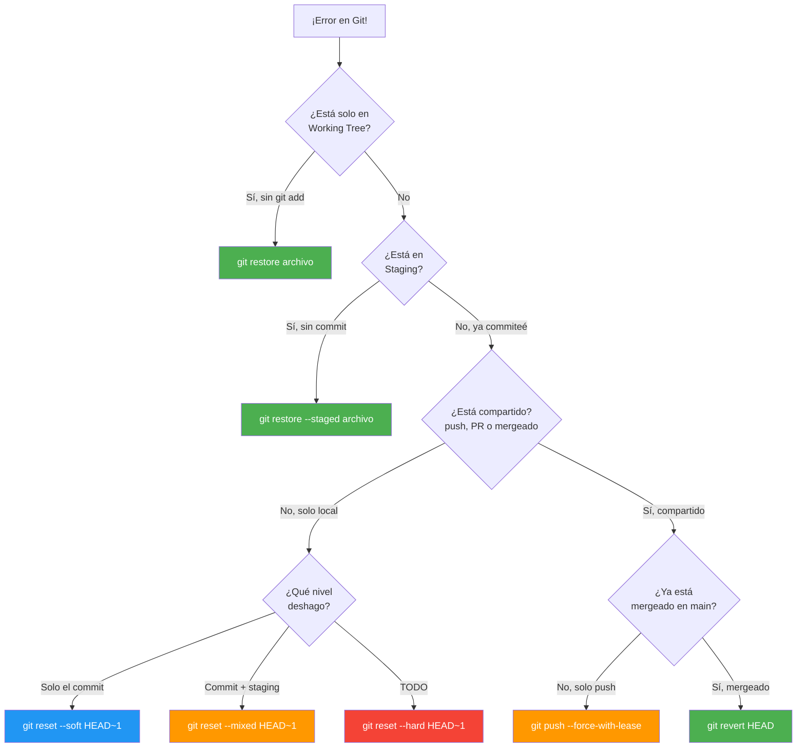
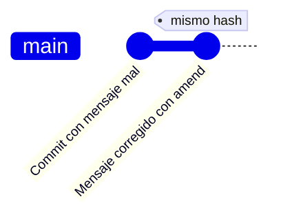
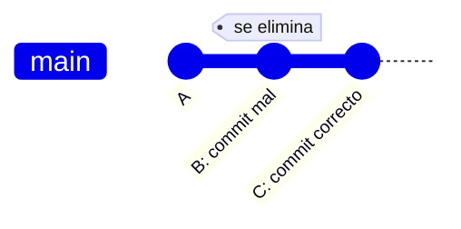
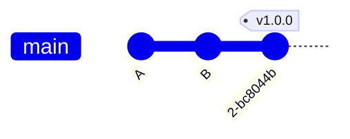
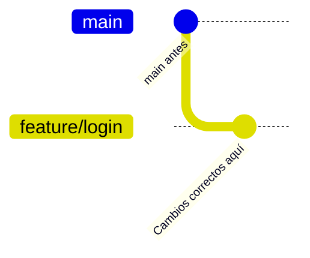
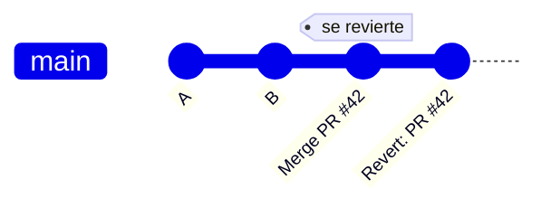

- [6. Resumen y Conclusiones](#6-resumen-y-conclusiones)
  - [6.1. Mapa Conceptual de la Unidad](#61-mapa-conceptual-de-la-unidad)
  - [6.2. Conceptos Clave](#62-conceptos-clave)
    - [Git Inicial](#git-inicial)
    - [Git Avanzado](#git-avanzado)
    - [Git Remoto](#git-remoto)
    - [Colaboración](#colaboración)
  - [6.3. Herramientas y Perfiles](#63-herramientas-y-perfiles)
    - [Clientes Gráficos (GUI)](#clientes-gráficos-gui)
    - [Extensiones VS Code](#extensiones-vs-code)
    - [GitHub CLI y Terminal](#github-cli-y-terminal)
    - [Recursos de Aprendizaje](#recursos-de-aprendizaje)
  - [6.4. Errores Comunes a Evitar](#64-errores-comunes-a-evitar)
  - [6.5. Checklist de Supervivencia](#65-checklist-de-supervivencia)
  - [6.6. Glosario de Términos](#66-glosario-de-términos)
  - [6.7. Ejercicios de Repaso](#67-ejercicios-de-repaso)
  - [6.8. Guía de Emergencia: Qué hacer según el error](#68-guía-de-emergencia-qué-hacer-según-el-error)
  - [6.9. ¿Qué viene después?](#69-qué-viene-después)
  - [6.10. Mapa de Conexiones entre Temas](#610-mapa-de-conexiones-entre-temas)


# 6. Resumen y Conclusiones

> 💡 **Punto de partida:** Has aprendido los comandos, las ramas, los remotos y la colaboración. Ahora es momento de consolidar todo: como un músico que repasa la partitura antes del concierto.

El control de versiones con Git es una habilidad fundamental para cualquier desarrollador. Dominar los conceptos básicos de commits, ramas y remotos te permitirá:

- **Trabajar en equipo** sin conflictos
- **Mantener un historial** de tu código
- **Experimentar** con nuevas funcionalidades de forma segura
- **Recuperar** versiones anteriores si algo sale mal

**Objetivos de aprendizaje:**

- Repasar los conceptos fundamentales de la unidad
- Consolidar el vocabulario técnico de Git
- Tener una referencia rápida para el examen

> 💡 **Consejo final:** La práctica es clave. Crea un repositorio personal y experimenta con todos los comandos. Los errores son la mejor forma de aprender.


## 6.1. Mapa Conceptual de la Unidad

```mermaid
graph TD
    UD03[UD03: Control de Versiones] --> GINI[Git Inicial]
    UD03 --> GAV[Git Avanzado]
    UD03 --> GRE[Git Remoto]
    UD03 --> COL[Colaboración]
    UD03 --> HERR[Herramientas]

    GINI --> GINI1[Conceptos básicos]
    GINI --> GINI2[Ciclo de vida]
    GINI --> GINI3[Comandos esenciales]
    GINI --> GINI4[Estados de archivos]
    GINI --> GINI5[Deshacer cambios]
    GINI --> GINI6[Stash y Tags]

    GAV --> GAV1[Ramas]
    GAV --> GAV2[Merge]
    GAV --> GAV3[Cherry-Pick]
    GAV --> GAV4[Rebase]
    GAV --> GAV5[Conflictos]
    GAV --> GAV6[GitHub Flow]
    GAV --> GAV7[GitFlow]

    GRE --> GRE1[GitHub]
    GRE --> GRE2[Remote]
    GRE --> GRE3[Push/Pull/Fetch]
    GRE --> GRE4[Tags y versiones]
    GRE --> GRE5[SSH Keys]

    COL --> COL1[Pull Requests]
    COL --> COL2[Fork]
    COL --> COL3[Code Review]
    COL --> COL4[GitHub Actions]
    COL --> COL5[Conventional Commits]

    HERR --> HERR1[GUIs]
    HERR --> HERR2[VS Code]
    HERR --> HERR3[GitHub CLI]
    HERR --> HERR4[Recursos]
    HERR --> HERR5[Errores comunes]

    style UD03 fill:#2196F3,color:#fff
    style GINI fill:#4CAF50,color:#fff
    style GAV fill:#FF9800,color:#fff
    style GRE fill:#9C27B0,color:#fff
    style COL fill:#f44336,color:#fff
    style HERR fill:#607D8B,color:#fff
```




## 6.2. Conceptos Clave

### Git Inicial

| Concepto | Descripción |
|----------|-------------|
| **Repositorio** | Base de datos con todo el historial de cambios |
| **Commit** | Instantánea guardada con hash SHA-1, autor, fecha y mensaje |
| **Staging Area** | Zona intermedia antes del commit |
| **Working Directory** | Copia local donde trabajas |
| **HEAD** | Puntero al commit actual |
| **.gitignore** | Archivo que dice a Git qué ignorar |

📌 **Ejemplo real:** GitHub usa repositorios para almacenar millones de proyectos. Cada commit es una línea de tiempo que puedes navegar.

### Git Avanzado

| Concepto | Descripción |
|----------|-------------|
| **Rama** | Línea de desarrollo independiente |
| **Merge** | Fusionar cambios de ramas |
| **Rebase** | Reaplicar commits sobre otra base |
| **Conflicto** | Cuando dos desarrolladores modificaron las mismas líneas |
| **Cherry-Pick** | Copiar un commit específico a otra rama |
| **GitHub Flow** | Flujo simple con main + features |
| **GitFlow** | Flujo estructurado con develop/release/hotfix |

📌 **Ejemplo real:** Netflix usa ramas feature para desarrollar nuevas funcionalidades sin afectar la versión estable de su aplicación.

### Git Remoto

| Concepto | Descripción |
|----------|-------------|
| **Origin** | Nombre del remoto por defecto |
| **Push** | Subir commits al remoto |
| **Pull** | Traer y fusionar del remoto |
| **Fetch** | Traer sin fusionar |
| **Tag** | Marca de versión (v1.0.0) |
| **SSH** | Protocolo de autenticación segura |

📌 **Ejemplo real:** Cada release de Android se gestiona con tags en repositorios Git para rastrear versiones exactas.

### Colaboración

| Concepto | Descripción |
|----------|-------------|
| **Pull Request** | Solicitud de incorporar cambios |
| **Fork** | Copia de un repositorio ajeno |
| **Code Review** | Revisión de código por pares |
| **GitHub Actions** | CI/CD automatizado |
| **Issues** | Sistema de seguimiento de errores y tareas |

📌 **Ejemplo real:** Las empresas como Google o Microsoft usan Pull Requests y Code Review para garantizar la calidad de su código antes de producción.


## 6.3. Herramientas y Perfiles

### Clientes Gráficos (GUI)

| Herramienta | Plataforma | Ideal para |
|-------------|------------|------------|
| **GitKraken** | Multiplataforma | Visual intuitivo, gratuito |
| **GitHub Desktop** | Windows/Mac | Usuarios de GitHub, simple |
| **Sourcetree** | Windows/Mac | Atlassian, potente |
| **VS Code + Git** | Multiplataforma | Desarrolladores VS Code |

### Extensiones VS Code

| Extensión | Función |
|-----------|---------|
| **GitLens** | Blame, historial, annotations |
| **Git Graph** | Visualizar ramas como gráfico |
| **Git History** | Ver historial de archivos |
| **Git Indicators** | Indicadores de estado en el editor |

### GitHub CLI y Terminal

| Comando CLI | Descripción |
|-------------|-------------|
| `gh pr create` | Crear Pull Request |
| `gh pr list` | Listar Pull Requests |
| `gh issue create` | Crear Issue |
| `gh run list` | Ver workflows de CI/CD |

### Recursos de Aprendizaje

| Recurso | URL | Tipo |
|---------|-----|------|
| **Git Documentation** | git-scm.com/doc | Documentación oficial |
| **GitHub Docs** | docs.github.com | Documentación oficial |
| **Learn Git Branching** | learngitbranching.js.org | Tutorial interactivo |
| **Git Immersion** | gitimmersion.com | Tutorial guiado |
| **Git Cheat Sheet** | education.github.com | Referencia rápida |


## 6.4. Errores Comunes a Evitar

| Error | Por qué está mal | Cómo evitarlo |
|-------|------------------|---------------|
| `git push` sin `git pull` primero | El remoto tiene cambios nuevos que chocan con los tuyos | Siempre haz `git pull` antes de `git push` |
| `git reset --hard` sin pensar | Borra cambios de forma irreversible | Usa `--soft` o `--mixed` primero; solo `--hard` si estás seguro |
| Commit sin mensaje claro | "fix" o "update" no explican nada | Usa mensajes descriptivos: `fix(auth): resolve token refresh bug` |
| Ignorar `.gitignore` | Archivos sensibles o de sistema se suben al repo | Configura `.gitignore` desde el inicio del proyecto |
| No hacer commits frecuentes | Si pierdes días de trabajo, no hay puntos intermedios | Haz commits pequeños y frecuentes (cada funcionalidad o fix) |
| Mezclar features en una rama | Una rama debería tener un propósito claro | Crea ramas separadas para cada feature o fix |
| No usar ramas en equipo | Si todos trabajan en main, los conflictos son inevitables | Usa ramas feature y Pull Requests para todo cambio |
| Cherry-pick sin entender | Puedes romper el historial si lo usas mal | Usa cherry-pick solo para hotfixes puntuales |
| `git add .` sin revisar | Puede meter `.env`, `bin/`, credenciales | Revisa `git status` antes de cada `git add` |
| Commitear archivos sensibles | Contraseñas y `.env` quedan en el historial para siempre | Usa `git filter-repo` o BFG para limpiar; nunca commitees secrets |
| `push --force` en ramas compartidas | Destruye el trabajo de otros desarrolladores | Usa `--force-with-lease` que verifica que nadie más ha subido |
| Commits demasiado grandes | 50 archivos a la vez → imposible hacer revert limpio | Un commit = un cambio lógico |
| No hacer `git add` después de resolver conflictos | Los conflictos quedan sin marcar como resueltos | Siempre `git add` + `git commit` después de resolver |
| No probar tras resolver conflictos | Puedes introducir bugs sin darte cuenta | Ejecuta el proyecto completo después de cada merge |


## 6.5. Checklist de Supervivencia

Antes de dar por cerrado el tema, asegúrate de poder responder **SÍ**:

### Git Inicial
- [ ] ¿Entiendo la diferencia entre Git y GitHub?
- [ ] ¿Puedo configurar Git con mi nombre y email?
- [ ] ¿Sé usar `git add`, `git commit` y `git status`?
- [ ] ¿Entiendo el concepto de área de staging?
- [ ] ¿Puedo configurar `.gitignore` correctamente?
- [ ] ¿Sé usar `git stash` para guardar cambios temporalmente?
- [ ] ¿Conozco `git reflog` para recuperar commits perdidos?
- [ ] ¿Sé usar `git commit --amend` para corregir el último commit?

### Git Avanzado
- [ ] ¿Puedo crear, cambiar y eliminar ramas?
- [ ] ¿Sé resolver un merge básico?
- [ ] ¿Conozco la diferencia entre `reset` y `revert`?
- [ ] ¿Entiendo qué es un conflicto y cómo resolverlo?
- [ ] ¿Conozco GitHub Flow y GitFlow?
- [ ] ¿Entiendo la diferencia entre `fast-forward` y `merge commit`?
- [ ] ¿Sé usar `git rebase` de forma segura?

### Git Remoto
- [ ] ¿Puedo usar `git push` y `git pull`?
- [ ] ¿Sé la diferencia entre `fetch` y `pull`?
- [ ] ¿Puedo crear y subir tags?
- [ ] ¿Sé configurar SSH keys y clonar por SSH?
- [ ] ¿Entiendo el flujo de trabajo con `upstream` para forks?

### Colaboración
- [ ] ¿Entiendo qué es una Pull Request?
- [ ] ¿Sé la diferencia entre Fork y Clone?
- [ ] ¿Conozco el proceso de code review?
- [ ] ¿Sé crear y gestionar Issues?
- [ ] ¿Conozco GitHub Actions y CI/CD básico?
- [ ] ¿Conozco las convenciones de mensajes de commit?

### Herramientas
- [ ] ¿Puedo usar un cliente GUI básico?
- [ ] ¿Sé usar recursos online para consultar comandos?
- [ ] ¿Puedo configurar alias y personalizar Git?


## 6.6. Glosario de Términos

| Término | Definición |
|---------|------------|
| **Repository (Repositorio)** | Carpeta que Git vigila para controlar cambios |
| **Commit** | Instantánea guardada con autor, fecha y mensaje |
| **Branch (Rama)** | Línea de desarrollo independiente |
| **Merge** | Fusión de una rama en otra |
| **Rebase** | Reescribir commits sobre otra base |
| **HEAD** | Puntero al último commit de la rama actual |
| **Staging Area** | Zona de preparación antes del commit |
| **Working Directory** | Directorio de trabajo local |
| **Remote (Remoto)** | Repositorio en un servidor (GitHub, GitLab) |
| **Origin** | Nombre por defecto del repositorio remoto |
| **Push** | Subir commits del local al remoto |
| **Pull** | Descargar y fusionar cambios del remoto |
| **Fetch** | Descargar cambios sin fusionarlos |
| **Fork** | Copia personal de un repositorio de otro usuario |
| **Pull Request** | Propuesta de cambios para revisar antes de fusionar |
| **Tag** | Marcador para versiones (v1.0.0, v2.1.3) |
| **Cherry-pick** | Copiar un commit específico a otra rama |
| **Conflict** | Cuando dos ramas modifican las mismas líneas |
| **Clone** | Copia completa de un repositorio remoto |
| **CI/CD** | Integración y despliegue continuo |
| **Stash** | Guardar cambios temporalmente sin commit |
| **Amend** | Modificar el último commit (mensaje o contenido) |
| **Reflog** | Registro de movimientos de HEAD (90 días de historial) |
| **Fast-Forward** | Fusión lineal sin commit de merge |
| **Merge Commit** | Fusión con commit que une dos historiales |
| **Upstream** | Repositorio original del que se hizo fork |
| **Workflow** | Flujo de trabajo con Git y GitHub |
| **Conventional Commits** | Formato de mensajes: `tipo(ámbito): descripción` |
| **Alias** | Atajo personalizado para comandos Git |
| **Detached HEAD** | Estado donde HEAD apunta a un commit, no a una rama |


## 6.7. Ejercicios de Repaso

> 📝 **Escenario:** Estás desarrollando la web de una cafetería (`cafeteria-web`). Usa el escenario de la cafetería para practicar cada ejercicio.

1. **Ejercicio 1 — Primer commit:** Crea un repositorio local `cafeteria-web`, añade un archivo `index.html` con el menú básico y un `style.css`, haz commits por separado y consulta el historial con `git log --oneline`.

2. **Ejercicio 2 — Organizar con ramas:** Crea una rama `feature/bebidas` para añadir una sección de bebidas y otra `feature/postres` para los postres. Fusiona ambas en `main` y resuelve cualquier conflicto si aparece.

3. **Ejercicio 3 — Guardar a mitad de camino:** Estás editando el menú y necesitas cambiar de rama urgentemente. Usa `git stash` para guardar los cambios, cambia de rama, y vuelve con `git stash pop`.

4. **Ejercicio 4 — Subir a la nube:** Crea un repositorio en GitHub llamado `cafeteria-web`, conéctalo a tu repositorio local y sube los cambios con `git push -u origin main`.

5. **Ejercicio 5 — Colaborar con un compañero:** Pide a un compañero que haga un fork de tu repositorio, corrija un precio en el menú y envíe una Pull Request. Tú revísala y fúsionala.

6. **Ejercicio 6 — Deshacer errores:** Añade un archivo con un error a propósito, commítalo, y luego usa `git revert` para deshacerlo. Compara con `git reset --soft` para otro commit local.

7. **Ejercicio 7 — Personalizar Git:** Configura un alias personalizado (`git st` para `git status`, `git lg` para el log con grafo) y úsalos en tu flujo de trabajo con `cafeteria-web`.

8. **Ejercicio 8 — Limpiar historial:** Usa `git rebase -i HEAD~3` para hacer squash de 3 commits de prueba en uno solo. Observa cómo cambia el historial.

9. **Ejercicio 9 — SSH:** Configura SSH keys, clona tu repositorio `cafeteria-web` por SSH y verifica la conexión con `ssh -T git@github.com`.

10. **Ejercicio 10 — Versionado:** Crea una semantic version tag (`v1.0.0`) para la primera versión estable de `cafeteria-web` y súbela a GitHub con `git push --tags`.

11. **Ejercicio 11 — Seguimiento de errores:** Crea un Issue en GitHub con etiqueta `bug` titulado "Precio del café incorrecto", luego enlázalo a un PR con `Fixes #1` en la descripción.

12. **Ejercicio 12 — Automatización:** Configura un workflow de GitHub Actions que ejecute `dotnet build` y `dotnet test` automáticamente en cada push a `main` de `cafeteria-web`.

> 🔧 **Truco:** Para practicar sin miedo, crea un repositorio temporal, haz commits con errores a propósito, y entrena a recuperarlos con `git reflog` y `git reset`.

> 📌 **Ejemplo real:** En entrevistas técnicas de empresas como Telefónica o Accenture, es habitual preguntar "¿qué diferencia hay entre `git merge` y `git rebase`?" y "¿cómo deshaces un commit compartido?". Estos ejercicios te preparan para esas preguntas.


## 6.8. Guía de Emergencia: Qué hacer según el error

> ⚠️ **La regla de oro:** Cuanto más tarde en darte cuenta del error y más se propague hacia arriba (Working Tree → Staging → Commit → Push → PR → Merge), más difícil y peligroso es solucionarlo.

### Diagrama de Decisión



### Tabla de Niveles de Dificultad

| Nivel | ¿Dónde está el error? | Herramienta | Dificultad |
|-------|------------------------|-------------|------------|
| 1 | Working Tree (sin add) | `git restore` | ★☆☆☆☆ Trivial |
| 2 | Staging (sin commit) | `git restore --staged` | ★☆☆☆☆ Trivial |
| 3 | Commit local (sin push) | `git reset` | ★★☆☆☆ Fácil |
| 4 | Push local (sin merge) | `git push --force-with-lease` | ★★★☆☆ Media |
| 5 | Push compartido (sin merge) | `git revert` | ★★★★☆ Alta |
| 6 | Mergeado en main | `git revert` | ★★★★☆ Alta |
| 7 | Desplegado en producción | `git revert` + hotfix | ★★★★★ Muy alta |

> 💡 **Consejo:** Si descubres el error en el **nivel 1-3** (trabajo local), la solución es fácil y segura. Si llegas al **nivel 4-7** (compartido), necesitas `git revert` y paciencia.

### Escenario 1: Mensaje de commit mal

**Qué pasó:** Pusiste un mensaje que no toca ("fix", "asdf", "test").
**Dónde estás:** Commit local.
**Solución:**
```bash
git commit --amend -m "feat: añadir menú de cafetería"
```
**gitGraph:**

> 💡 **Si ya lo subiste:** `git push --force-with-lease` (solo si no hay otros trabajando en esa rama).

---

### Escenario 2: Commit con contenido mal (local)

**Qué pasó:** Commiteaste un archivo que no tocaba o con cambios erróneos.
**Dónde estás:** Commit local, sin push.
**Solución:**
```bash
# Opción A: Mantener cambios en staging (recomendado)
git reset --soft HEAD~1
# Corregir el archivo
git add .
git commit -m "feat: archivo correcto"

# Opción B: Descartar cambios y volver al commit anterior
git reset --hard HEAD~1
```
**gitGraph:**


---

### Escenario 3: Etiqueta mal creada (local)

**Qué pasó:** Creaste un tag `v1.0` en vez de `v1.0.0`.
**Dónde estás:** Tag local, sin push.
**Solución:**
```bash
git tag -d v1.0
git tag -a v1.0.0 -m "Versión 1.0.0 estable"
```
**gitGraph:**


---

### Escenario 4: Etiqueta mal creada (remota)

**Qué pasó:** Subiste un tag erróneo a GitHub.
**Dónde estás:** Tag en GitHub.
**Solución:**
```bash
# Borrar tag local
git tag -d v1.0

# Borrar tag del remoto
git push origin --delete v1.0

# Crear el correcto
git tag -a v1.0.0 -m "Versión 1.0.0"
git push origin v1.0.0
```

---

### Escenario 5: Trabajaste en rama equivocada

**Qué pasó:** Hiciste commits en `main` en vez de `feature/login`.
**Dónde estás:** Commits en rama incorrecta.
**Solución:**
```bash
# Guardar cambios temporalmente
git stash push -m "Cambios que van a feature/login"

# Cambiar a la rama correcta
git checkout feature/login

# Recuperar cambios
git stash pop

# Ahora sí, commit
git add .
git commit -m "feat: login"
```
**gitGraph:**

> 💡 **Si los commits ya están en `main`:** Usa `git cherry-pick <hash>` en la rama correcta, luego `git reset --hard HEAD~N` en `main` para quitarlos.

---

### Escenario 6: Fusión por error (local)

**Qué pasó:** Fusionaste `feature/X` en `main` sin querer, sin push.
**Dónde estás:** Merge local.
**Solución:**
```bash
# Deshacer el último commit de merge
git reset --hard HEAD~1
```
> ⚠️ **Cuidado:** Si usaste `git merge --no-ff`, `HEAD~1` es el commit de merge. Si fue fast-forward, necesitas identificar el hash anterior con `git log --oneline`.

---

### Escenario 7: Fusión por error (remota)

**Qué pasó:** Ya subiste el merge a GitHub.
**Dónde estás:** Merge compartido.
**Solución:**
```bash
# Revertir el merge (MANTENER el historial)
git revert -m 1 <hash-del-merge>
git push
```
> ⠛ **NUNCA uses `git reset` en código compartido.** Solo `git revert` es seguro.

---

### Escenario 8: Push con datos equivocados

**Qué pasó:** Subiste commits que no corresponden a esa rama.
**Solución local:**
```bash
git reset --hard HEAD~N   # N = número de commits a deshacer
git push --force-with-lease
```
**Solución compartida:**
```bash
# Para cada commit malo
git revert <hash-del-commit>
git push
```

---

### Escenario 9: PR aceptada por error

**Qué pasó:** Fusionaste un PR que no debías en `main`.
**Dónde estás:** Merge en GitHub.
**Solución:**
```bash
# Revertir el merge
git revert -m 1 <hash-del-merge>
git push
```
**gitGraph:**


> 💡 **En GitHub:** Ve al commit de merge → "Revert" button → crea automáticamente un PR de revert.

---

### Resumen: ¿Qué comando según el error?

| Error | Solo local | Compartido en GitHub |
|-------|------------|----------------------|
| Mensaje mal | `git commit --amend` | `git commit --amend` + `--force-with-lease` |
| Contenido mal | `git reset --soft/--hard` | `git revert` |
| Tag mal | `git tag -d` | `git tag -d` + `git push --delete` |
| Fusión por error | `git reset --hard HEAD~1` | `git revert -m 1` |
| Rama equivocada | `git stash` + `git checkout` | `git cherry-pick` + `git reset` |
| Push equivocado | `git reset --hard` + `--force-with-lease` | `git revert` |
| PR aceptada por error | `git revert` | `git revert -m 1` |

---

## 6.9. ¿Qué viene después?

En la **UD04: Diseño Orientado a Objetos: Diagrama de Clases** aprenderás a modelar sistemas complejos con diagramas UML. Git seguirá siendo tu aliado para versionar cada diagrama y iteración del diseño.

| Tema de la UD actual | Se usa en la siguiente UD para |
|----------------------|-------------------------------|
| Repositorios y commits | Versionar cada diagrama y evolución del diseño |
| Ramas y merges | Explorar alternativas de diseño en paralelo |
| GitHub y PRs | Revisar diagramas con el equipo |
| Colaboración | Trabajar en equipo en el modelado del sistema |


## 6.10. Mapa de Conexiones entre Temas

```mermaid
graph LR
    UD01[UD01: Desarrollo de Software] --> UD02[UD02: Entornos de Desarrollo de Software]
    UD02 --> UD03[UD03: Sistema de Control de Versiones]
    UD03 --> UD04[UD04: Diseño OO: Diagrama de Clases]
    UD04 --> UD05[UD05: Diseño OO: Diagramas de Comportamiento]
    UD05 --> UD06[UD06: Optimización y Refactorización]
    UD06 --> UD07[UD07: Diseño y Realización de Pruebas]

    UD03 -.->|Git para controlar código| UD02
    UD03 -.->|Versionar diseños| UD04
    UD03 -.->|Colaboración en equipo| UD06

    style UD01 fill:#4CAF50,color:#fff
    style UD02 fill:#2196F3,color:#fff
    style UD03 fill:#FF9800,color:#fff
    style UD04 fill:#9C27B0,color:#fff
    style UD05 fill:#f44336,color:#fff
    style UD06 fill:#607D8B,color:#fff
    style UD07 fill:#4CAF50,color:#fff
```


