- [6. Resumen y Conclusiones](#6-resumen-y-conclusiones)
  - [6.1. Mapa Conceptual de la Unidad](#61-mapa-conceptual-de-la-unidad)
  - [6.2. Conceptos Clave](#62-conceptos-clave)
    - [Git Inicial](#git-inicial)
    - [Git Avanzado](#git-avanzado)
    - [Git Remoto](#git-remoto)
    - [Colaboración](#colaboración)
  - [6.3. Herramientas y Perfiles](#63-herramientas-y-perfiles)
    - [Clientes Gráficos (GUI)](#clientes-gráficos-gui)
    - [Extensiones VS Code](#extensiones-vs-code)
    - [GitHub CLI y Terminal](#github-cli-y-terminal)
    - [Recursos de Aprendizaje](#recursos-de-aprendizaje)
  - [6.4. Checklist de Supervivencia](#64-checklist-de-supervivencia)
  - [6.5. Errores Comunes a Evitar](#65-errores-comunes-a-evitar)
  - [6.6. Glosario de Términos](#66-glosario-de-términos)
  - [6.7. Ejercicios de Repaso](#67-ejercicios-de-repaso)
  - [6.8. ¿Qué viene después?](#68-qué-viene-después)
  - [6.9. Mapa de Conexiones entre Temas](#69-mapa-de-conexiones-entre-temas)

# 6. Resumen y Conclusiones

> 💡 **Punto de partida:** Has aprendido los comandos, las ramas, los remotos y la colaboración. Ahora es momento de consolidar todo: como un músico que repasa la partitura antes del concierto.

El control de versiones con Git es una habilidad fundamental para cualquier desarrollador. Dominar los conceptos básicos de commits, ramas y remotos te permitirá:

- **Trabajar en equipo** sin conflictos
- **Mantener un historial** de tu código
- **Experimentar** con nuevas funcionalidades de forma segura
- **Recuperar** versiones anteriores si algo sale mal

**Objetivos de aprendizaje:**

- Repasar los conceptos fundamentales de la unidad
- Consolidar el vocabulario técnico de Git
- Tener una referencia rápida para el examen

> 💡 **Consejo final:** La práctica es clave. Crea un repositorio personal y experimenta con todos los comandos. Los errores son la mejor forma de aprender.

## 6.1. Mapa Conceptual de la Unidad

```mermaid
graph TD
    UD03[UD03: Control de Versiones] --> GINI[Git Inicial]
    UD03 --> GAV[Git Avanzado]
    UD03 --> GRE[Git Remoto]
    UD03 --> COL[Colaboración]
    UD03 --> HERR[Herramientas]

    GINI --> GINI1[Conceptos básicos]
    GINI --> GINI2[Ciclo de vida]
    GINI --> GINI3[Comandos esenciales]
    GINI --> GINI4[Estados de archivos]
    GINI --> GINI5[Deshacer cambios]
    GINI --> GINI6[Stash y Tags]

    GAV --> GAV1[Ramas]
    GAV --> GAV2[Merge]
    GAV --> GAV3[Cherry-Pick]
    GAV --> GAV4[Rebase]
    GAV --> GAV5[Conflictos]
    GAV --> GAV6[GitHub Flow]
    GAV --> GAV7[GitFlow]

    GRE --> GRE1[GitHub]
    GRE --> GRE2[Remote]
    GRE --> GRE3[Push/Pull/Fetch]
    GRE --> GRE4[Tags y versiones]
    GRE --> GRE5[SSH Keys]

    COL --> COL1[Pull Requests]
    COL --> COL2[Fork]
    COL --> COL3[Code Review]
    COL --> COL4[GitHub Actions]
    COL --> COL5[Conventional Commits]

    HERR --> HERR1[GUIs]
    HERR --> HERR2[VS Code]
    HERR --> HERR3[GitHub CLI]
    HERR --> HERR4[Recursos]
    HERR --> HERR5[Errores comunes]

    style UD03 fill:#2196F3,color:#fff
    style GINI fill:#4CAF50,color:#fff
    style GAV fill:#FF9800,color:#fff
    style GRE fill:#9C27B0,color:#fff
    style COL fill:#f44336,color:#fff
    style HERR fill:#607D8B,color:#fff
```

## 6.2. Conceptos Clave

### Git Inicial

| Concepto | Descripción |
|----------|-------------|
| **Repositorio** | Base de datos con todo el historial de cambios |
| **Commit** | Instantánea guardada con hash SHA-1, autor, fecha y mensaje |
| **Staging Area** | Zona intermedia antes del commit |
| **Working Directory** | Copia local donde trabajas |
| **HEAD** | Puntero al commit actual |
| **.gitignore** | Archivo que dice a Git qué ignorar |

📌 **Ejemplo real:** GitHub usa repositorios para almacenar millones de proyectos. Cada commit es una línea de tiempo que puedes navegar.

### Git Avanzado

| Concepto | Descripción |
|----------|-------------|
| **Rama** | Línea de desarrollo independiente |
| **Merge** | Fusionar cambios de ramas |
| **Rebase** | Reaplicar commits sobre otra base |
| **Conflicto** | Cuando dos desarrolladores modificaron las mismas líneas |
| **Cherry-Pick** | Copiar un commit específico a otra rama |
| **GitHub Flow** | Flujo simple con main + features |
| **GitFlow** | Flujo estructurado con develop/release/hotfix |

📌 **Ejemplo real:** Netflix usa ramas feature para desarrollar nuevas funcionalidades sin afectar la versión estable de su aplicación.

### Git Remoto

| Concepto | Descripción |
|----------|-------------|
| **Origin** | Nombre del remoto por defecto |
| **Push** | Subir commits al remoto |
| **Pull** | Traer y fusionar del remoto |
| **Fetch** | Traer sin fusionar |
| **Tag** | Marca de versión (v1.0.0) |
| **SSH** | Protocolo de autenticación segura |

📌 **Ejemplo real:** Cada release de Android se gestiona con tags en repositorios Git para rastrear versiones exactas.

### Colaboración

| Concepto | Descripción |
|----------|-------------|
| **Pull Request** | Solicitud de incorporar cambios |
| **Fork** | Copia de un repositorio ajeno |
| **Code Review** | Revisión de código por pares |
| **GitHub Actions** | CI/CD automatizado |
| **Issues** | Sistema de seguimiento de errores y tareas |

📌 **Ejemplo real:** Las empresas como Google o Microsoft usan Pull Requests y Code Review para garantizar la calidad de su código antes de production.

## 6.3. Herramientas y Perfiles

### Clientes Gráficos (GUI)

| Herramienta | Plataforma | Ideal para |
|-------------|------------|------------|
| **GitKraken** | Multiplataforma | Visual intuitivo, gratuito |
| **GitHub Desktop** | Windows/Mac | Usuarios de GitHub, simple |
| **Sourcetree** | Windows/Mac | Atlassian, potente |
| **VS Code + Git** | Multiplataforma | Desarrolladores VS Code |

### Extensiones VS Code

| Extensión | Función |
|-----------|---------|
| **GitLens** | Blame, historial, annotations |
| **Git Graph** | Visualizar ramas como gráfico |
| **Git History** | Ver historial de archivos |
| **Git Indicators** | Indicadores de estado en el editor |

### GitHub CLI y Terminal

| Comando CLI | Descripción |
|-------------|-------------|
| `gh pr create` | Crear Pull Request |
| `gh pr list` | Listar Pull Requests |
| `gh issue create` | Crear Issue |
| `gh run list` | Ver workflows de CI/CD |

### Recursos de Aprendizaje

| Recurso | URL | Tipo |
|---------|-----|------|
| **Git Documentation** | git-scm.com/doc | Documentación oficial |
| **GitHub Docs** | docs.github.com | Documentación oficial |
| **Learn Git Branching** | learngitbranching.js.org | Tutorial interactivo |
| **Git Immersion** | gitimmersion.com | Tutorial guiado |
| **Git Cheat Sheet** | education.github.com | Referencia rápida |

## 6.4. Checklist de Supervivencia

Antes de dar por cerrado el tema, asegúrate de poder responder **SÍ**:

### Git Inicial
- [ ] ¿Entiendo la diferencia entre Git y GitHub?
- [ ] ¿Puedo configurar Git con mi nombre y email?
- [ ] ¿Sé usar `git add`, `git commit` y `git status`?
- [ ] ¿Entiendo el concepto de área de staging?
- [ ] ¿Puedo configurar `.gitignore` correctamente?

### Git Avanzado
- [ ] ¿Puedo crear, cambiar y eliminar ramas?
- [ ] ¿Sé resolver un merge básico?
- [ ] ¿Conozco la diferencia entre `reset` y `revert`?
- [ ] ¿Entiendo qué es un conflicto y cómo resolverlo?
- [ ] ¿Conozco GitHub Flow y GitFlow?

### Git Remoto
- [ ] ¿Puedo usar `git push` y `git pull`?
- [ ] ¿Sé la diferencia entre `fetch` y `pull`?
- [ ] ¿Puedo crear y subir tags?

### Colaboración
- [ ] ¿Entiendo qué es una Pull Request?
- [ ] ¿Sé la diferencia entre Fork y Clone?
- [ ] ¿Conozco el proceso de code review?

### Herramientas
- [ ] ¿Puedo usar un cliente GUI básico?
- [ ] ¿Sé usar recursos online para consultar comandos?

> 🔧 **Truco:** Imprime este checklist y marca cada punto cuando lo domines. Es tu mapa de progreso.

## 6.5. Errores Comunes a Evitar

| Error | Por qué está mal | Cómo evitarlo |
|-------|------------------|---------------|
| `git push` sin `git pull` primero | El remoto tiene cambios nuevos que chocan con los tuyos | Siempre haz `git pull` antes de `git push` |
| `git reset --hard` sin pensar | Borra cambios de forma irreversible | Usa `--soft` o `--mixed` primero; solo `--hard` si estás seguro |
| Commit sin mensaje claro | "fix" o "update" no explican nada | Usa mensajes descriptivos: `fix(auth): resolve token refresh bug` |
| Ignorar `.gitignore` | Archivos sensibles o de sistema se suben al repo | Configura `.gitignore` desde el inicio del proyecto |
| No hacer commits frecuentes | Si pierdes días de trabajo, no hay puntos intermedios | Haz commits pequeños y frecuentes (cada funcionalidad o fix) |
| Mezclar features en una rama | Una rama debería tener un propósito claro | Crea ramas separadas para cada feature o fix |
| No usar ramas en equipo | Si todos trabajan en main, los conflictos son inevitables | Usa ramas feature y Pull Requests para todo cambio |
| Cherry-pick sin entender | Puedes romper el historial si lo usas mal | Usa cherry-pick solo para hotfixes puntuales |

## 6.6. Glosario de Términos

| Término | Definición |
|---------|------------|
| **Repository (Repositorio)** | Carpeta que Git vigila para controlar cambios |
| **Commit** | Instantánea guardada con autor, fecha y mensaje |
| **Branch (Rama)** | Línea de desarrollo independiente |
| **Merge** | Fusión de una rama en otra |
| **Rebase** | Reescribir commits sobre otra base |
| **HEAD** | Puntero al último commit de la rama actual |
| **Staging Area** | Zona de preparación antes del commit |
| **Working Directory** | Directorio de trabajo local |
| **Remote (Remoto)** | Repositorio en un servidor (GitHub, GitLab) |
| **Origin** | Nombre por defecto del repositorio remoto |
| **Push** | Subir commits del local al remoto |
| **Pull** | Descargar y fusionar cambios del remoto |
| **Fetch** | Descargar cambios sin fusionarlos |
| **Fork** | Copia personal de un repositorio de otro usuario |
| **Pull Request** | Propuesta de cambios para revisar antes de fusionar |
| **Tag** | Marcador para versiones (v1.0.0, v2.1.3) |
| **Cherry-pick** | Copiar un commit específico a otra rama |
| **Conflict** | Cuando dos ramas modifican las mismas líneas |
| **Clone** | Copia completa de un repositorio remoto |
| **CI/CD** | Integración y despliegue continuo |

## 6.7. Ejercicios de Repaso

1. **Ejercicio 1:** Crea un repositorio local, añade 3 archivos con commits diferentes y consulta el historial con `git log --oneline`.

2. **Ejercicio 2:** Crea una rama `feature/ejercicio`, añade un archivo, haz commit y fusiónala con `main`. Resuelve cualquier conflicto si aparece.

3. **Ejercicio 3:** Usa `git stash` para guardar cambios temporalmente, cambia de rama y aplica el stash con `git stash pop`.

4. **Ejercicio 4:** Crea un repositorio en GitHub, conéctalo a tu repositorio local y sube los cambios con `git push`.

5. **Ejercicio 5:** Crea una Pull Request en GitHub, pide revisión a un compañero y融合ala después de la revisión.

6. **Ejercicio 6:** Usa `git revert` para deshacer un commit compartido y `git reset --soft` para deshacer uno local. Compara los resultados.

7. **Ejercicio 7:** Configura un alias personalizado en Git (por ejemplo, `git st` para `git status`) y úsalo en tu flujo de trabajo diario.

## 6.8. ¿Qué viene después?

En la **UD 04: Desarrollo Web Frontend** aprenderás a crear interfaces de usuario con HTML, CSS y JavaScript. Git será tu aliado para versionar cada componente y funcionalidad.

| Tema de la UD actual | Se usa en la siguiente UD para |
|----------------------|-------------------------------|
| Repositorios y commits | Versionar cada ejercicio y proyecto práctico |
| Ramas y merges | Desarrollar componentes frontend en paralelo |
| GitHub y PRs | Compartir tu portfolio de proyectos web |
| Colaboración | Trabajar en equipo en proyectos frontend |

## 6.9. Mapa de Conexiones entre Temas

